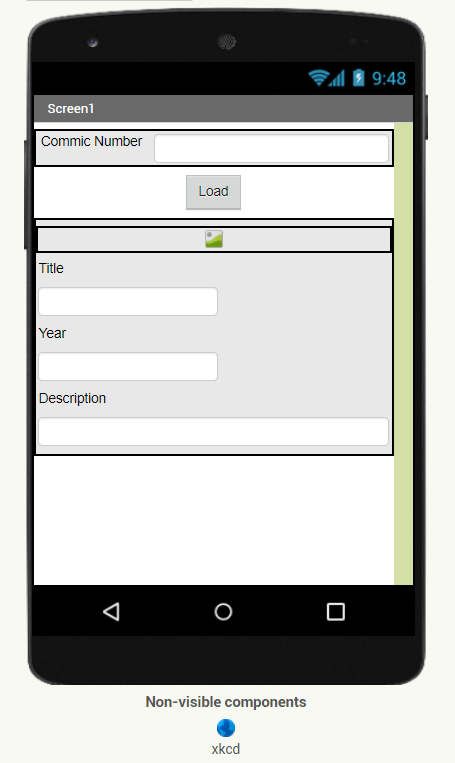
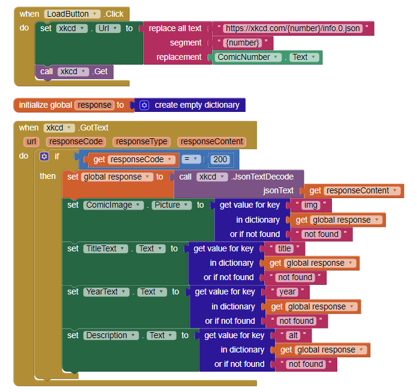

# Aluno
* `Fábio Fernandes Domingues`
>
# Lab de Componentização e Reúso de Software 03/09/2022
>
> * Tela - representação da interface
> 
> 
> * Lógica - lógica implementada para a busca dos dados conforme especificado
> 
> 
>
> Link para o arquivo do aplicativo exportado a partir do MIT App Inventor em formato `aia`. Ele estará dentro da pasta `app`.
> 
>
