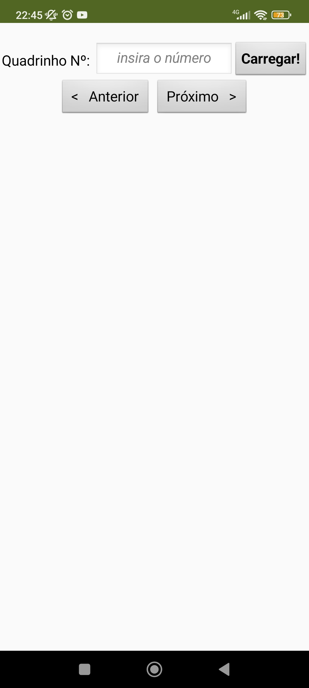
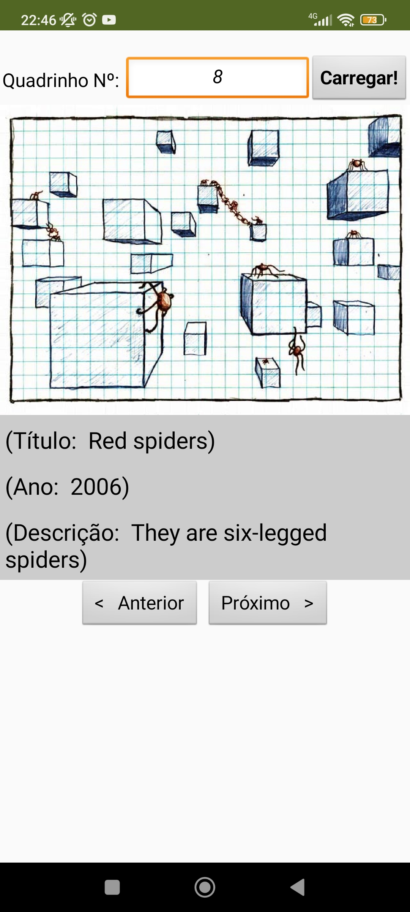
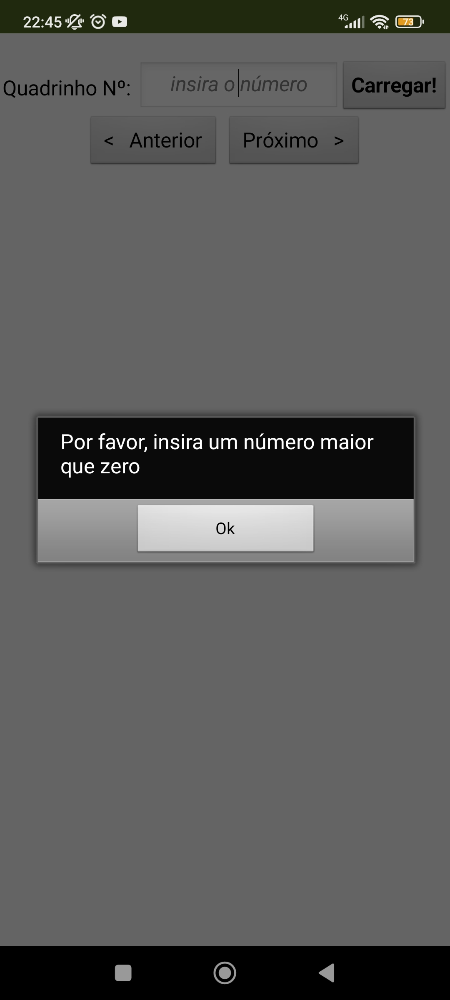
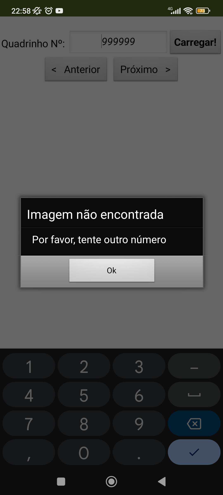
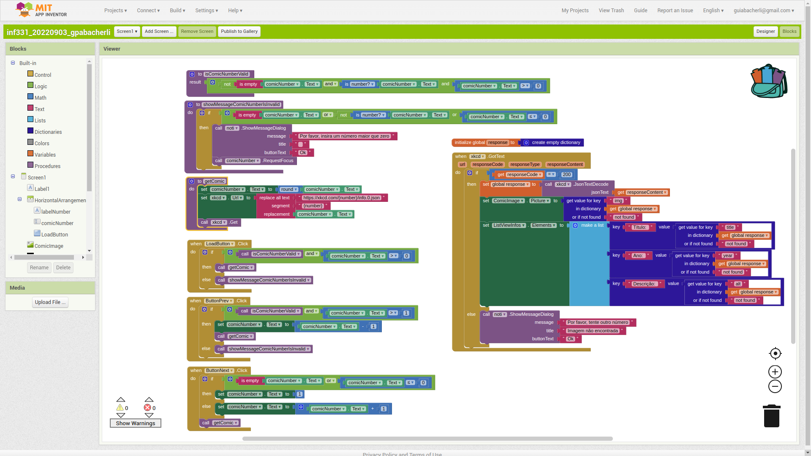

# Lab05 - Composição Multinível, Serviços e REST

Estrutura de pastas:

~~~
├── README.md  <- arquivo apresentando a tarefa
│
├── images     <- arquivos de imagens usadas no documento
│
└── app        <- apps do MIT App Inventor exportados em formato `aia`
~~~

# Aluno
* `Guilherme Pedrozo Abacherli`

# Tarefa

Lab de Componentização e Reúso de Software 03/09/2022

Elabore um protótipo de uma interface gráfica com um usuário no MIT App Inventor no qual:
- ou se digite o nome de um romance e o aplicativo mostre dados desse romance recuperados da DBPedia;
- ou se digite o número do quadrinho e o aplicativo mostre dados sobre ele do xkcd.

Serão considerados pontos de qualidade:
- se a app mostrar a imagem do romance (DBPedia)
- se aceitar com espaços e converter para underscore (DBPedia)
- se houver tratamento de erros

No caso da DBPedia, o usuário não deve digitar o .json. No caso do xkcd, não é suficiente mostrar a imagem dos quadrinhos, porque isso foi feito em sala. Devem ser mostrados outros dados, como título, ano de publicação etc.

> Coloque as imagens PNG da captura de seis telas do seu aplicativo:

> * tela 1 - captura da tela completa de design de interface
> 

> * tela 2 - captura de tela do app com nenhum quadrinho
> 

> * tela 3 - captura de tela do app exibindo quadrinho com outras informações
> 

> * tela 4 - captura de tela do app com validação do número
> 

> * tela 5 - captura de tela do app com mensagem de erro quando não encontra quadrinho
> 

> * tela 6 - diagrama de blocos do aplicativo
> 

>
> Link para o arquivo do aplicativo exportado a partir do MIT App Inventor em formato `aia`.\
> Está dentro da pasta `app`: [inf331_lab5_gpabacherli.aia](app/inf331_lab5_gpabacherli.aia)
