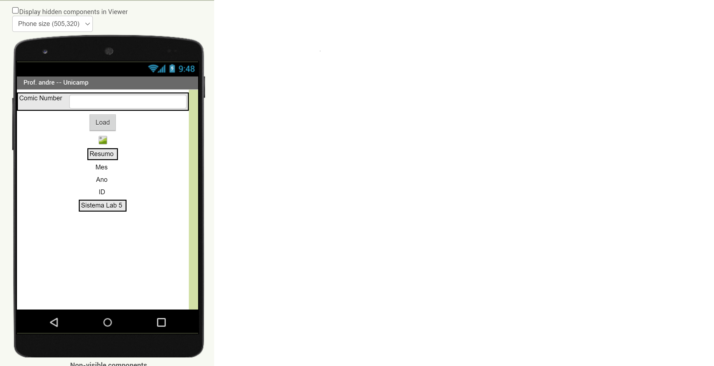
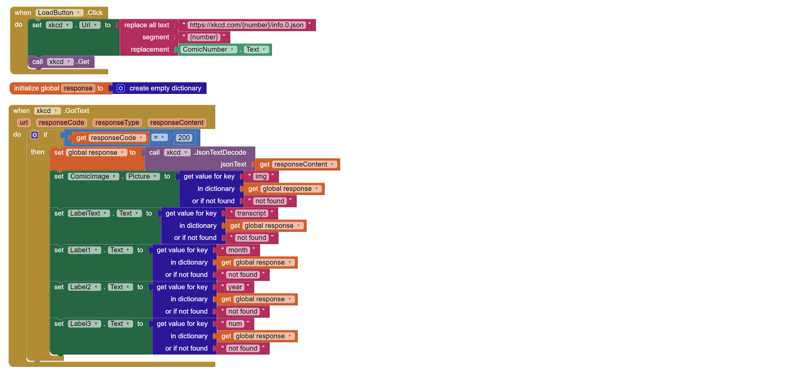
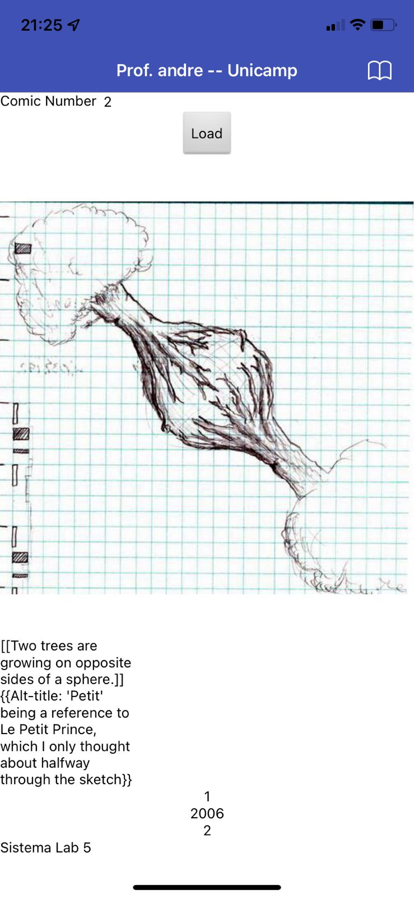

Nome do Aluno Richardson Guedes Pinheiro

# Composição Multinível, Serviços e REST
*Lab de Componentização e Reúso de Software 03/09/2022*

Elabore um protótipo de uma interface gráfica com um usuário no MIT App Inventor no qual:
* ou se digite o nome de um romance e o aplicativo mostre dados desse romance recuperados da DBPedia;
* ou se digite o número do quadrinho e o aplicativo mostre dados sobre ele do xkcd.

Serão considerados pontos de qualidade:
* se a app mostrar a imagem do romance (DBPedia)
* se aceitar com espaços e converter para underscore (DBPedia)
* se houver tratamento de erros

No caso da DBPedia, o usuário não deve digitar o .json. No caso do xkcd, não é suficiente mostrar a imagem dos quadrinhos, porque isso foi feito em sala. Devem ser mostrados outros dados, como título, ano de publicação etc.

a) Design

b) Blocks

c) Rodando no celular

Link  para o arquivo
https://github.com/richardpinheiro89/component2learn/blob/master/labs/2022/05-multilevel/solucoes/unicamp-lab5.aia

