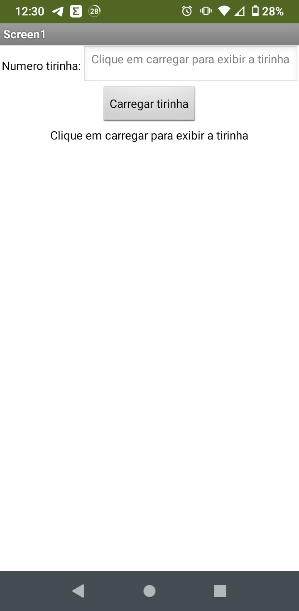
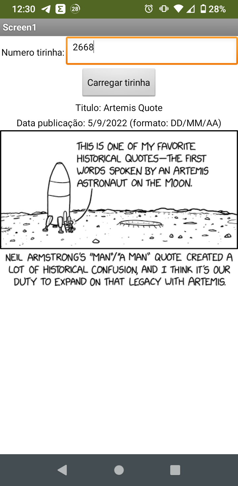
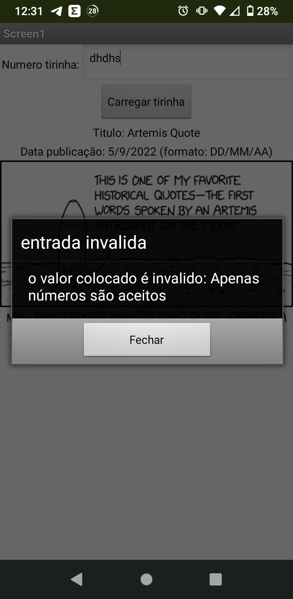
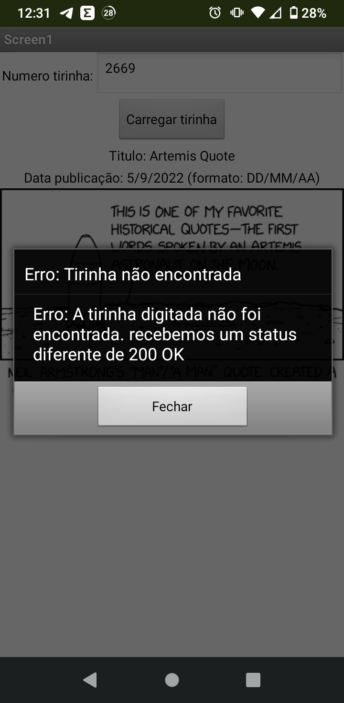

# Modelo para Apresentação do Lab05 - multilevel

Estrutura de pastas:

~~~
├── README.md  <- arquivo apresentando a tarefa
│
├── images     <- arquivos de imagens usadas no documento
│
└── app        <- apps do MIT App Inventor exportados em formato `aia`
~~~

# Aluno
* `Caio Volpato`

# Tarefa

> Coloque as imagens PNG da captura das seguintes telas do seu aplicativo:
> * tela 1 - captura da tela completa de design de interface 
> * tela 2 - captura de tela do app sem digitar romance 
> * tela 3 - captura de tela do app com romance digitado e resultado retornado 
> * tela 4 - (opcional) captura de tela do app quando acontece um erro (entrada invalida) 
> * tela 5 - (opcional) captura de tela do app quando acontece um erro (request nao sucedido) 
>
> Coloque um link para o arquivo do aplicativo exportado a partir do MIT App Inventor em formato `aia`. Ele estará dentro da pasta `app`.

