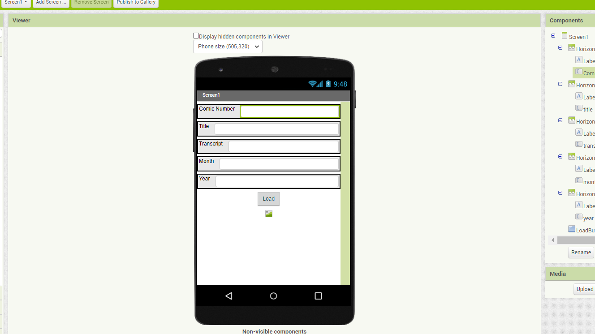
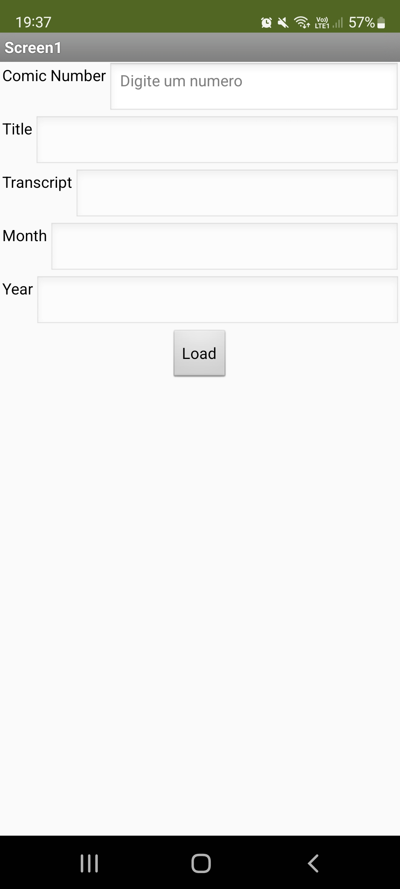
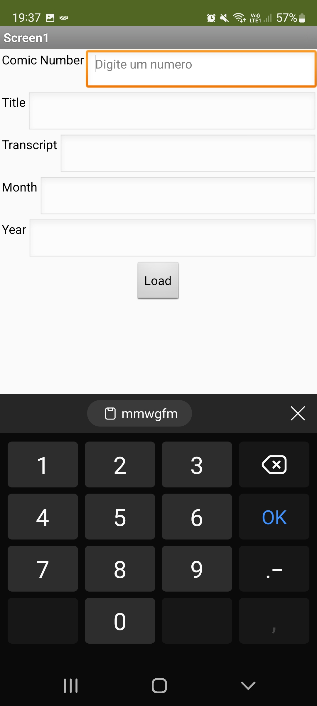
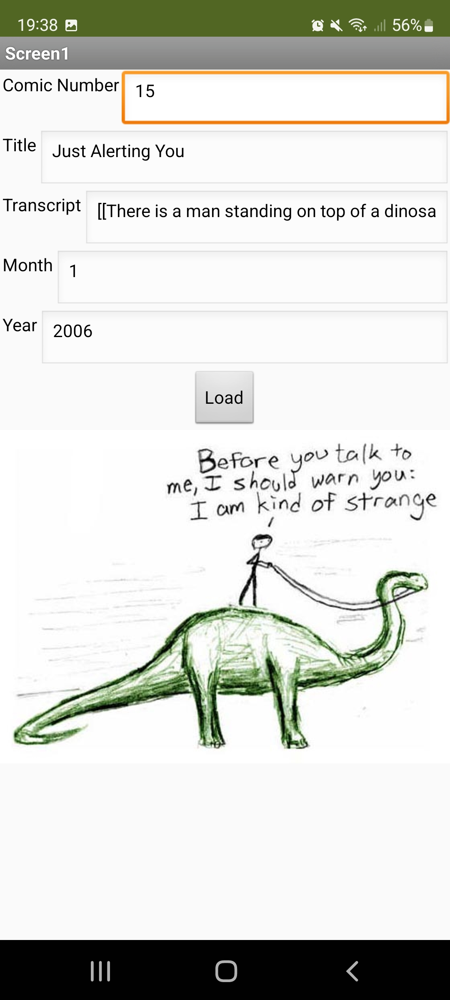
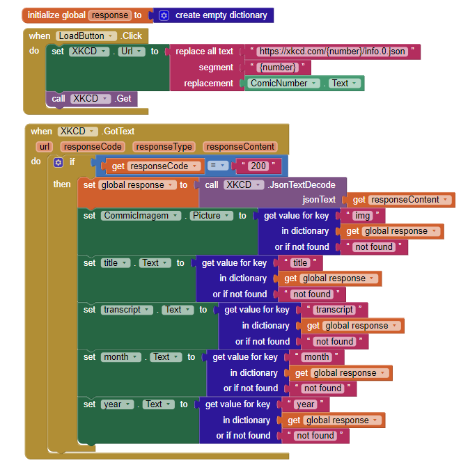

# Lab05

# Aluno
* `Gabriel Teixeira Callado - RG 45.022.276-7`

## App no MIT App Inventor
>
### tela 1 - captura da tela completa de design de interface

### tela 2 - captura de tela do app com nenhuma tirinha escolhida

### tela 3 - captura de tela do app com usuário escolhendo a primeira tirinha - mostrando que o campo só permite escrever números (tratativa para evitar erros)

### tela 4 - captura de tela do app com uma tirinha escolhida e os campos mostrando informações sobre ela

### tela 5 - captura de tela dos blocks:

