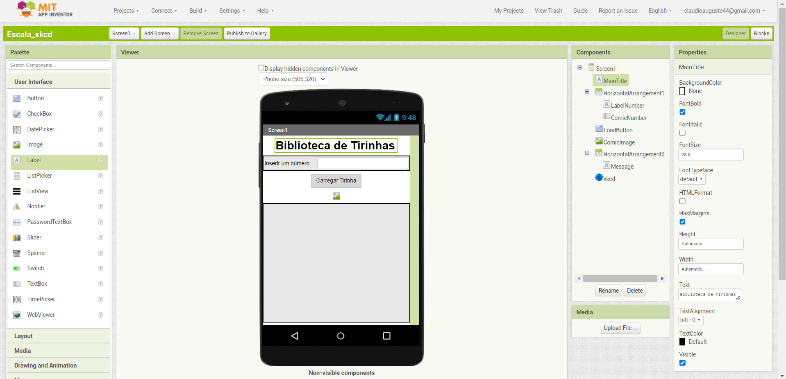
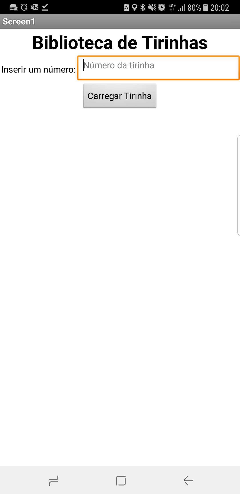
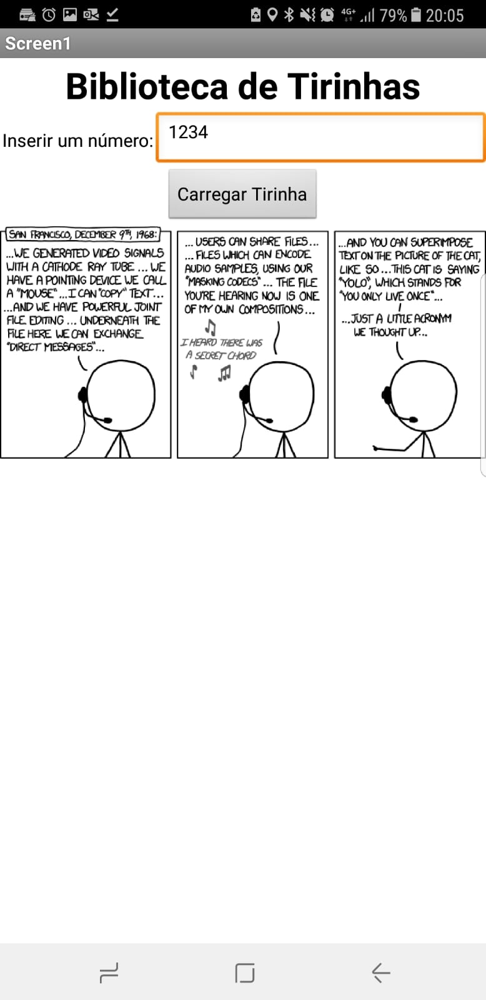
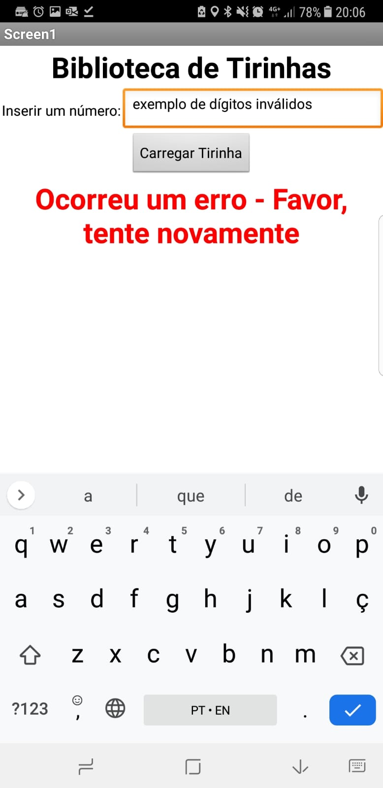

# Lab04 - MVC

# Aluno
* `Claudio Augusto Pereira Rolim`

# Tarefa

> Coloque as imagens PNG da captura das seguintes telas do seu aplicativo:
> * tela 1 - captura da tela completa de design de interface
>  
> * tela 2 - captura de tela do app sem digitar romance
>  
> * tela 3 - captura de tela do app com romance digitado e resultado retornado
>  
> * tela 4 - (opcional) captura de tela do app quando acontece um erro
>  
>
> Coloque um link para o arquivo do aplicativo exportado a partir do MIT App Inventor em formato `aia`. Ele estará dentro da pasta `app`.

> [link para o arquivo do aplicativo](app/app.aia) 