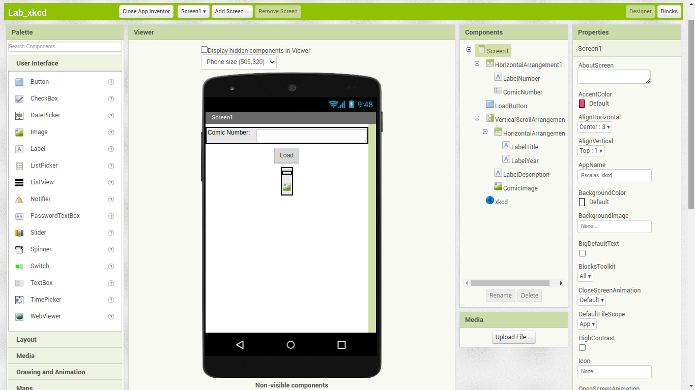
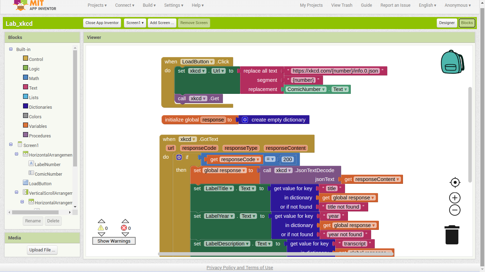
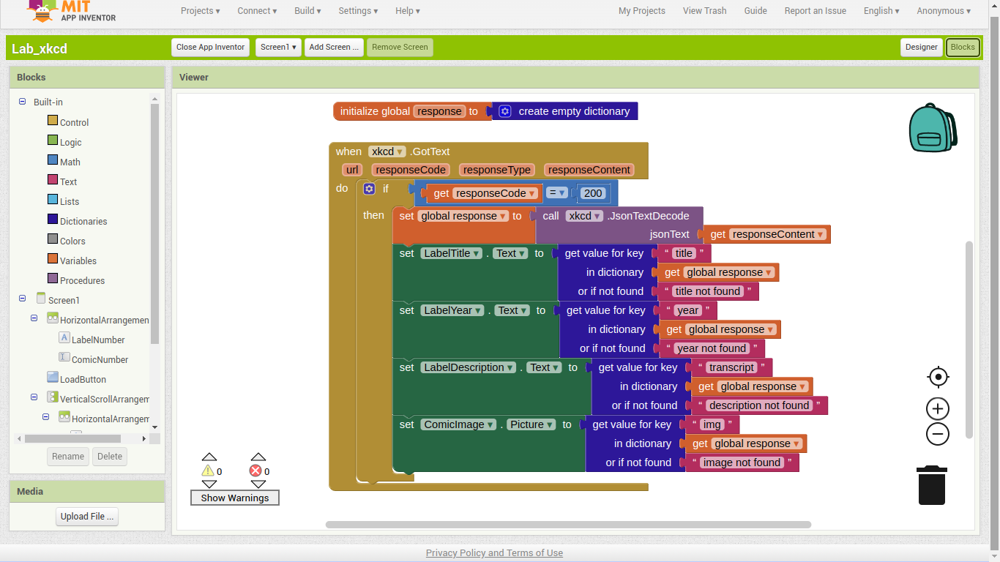
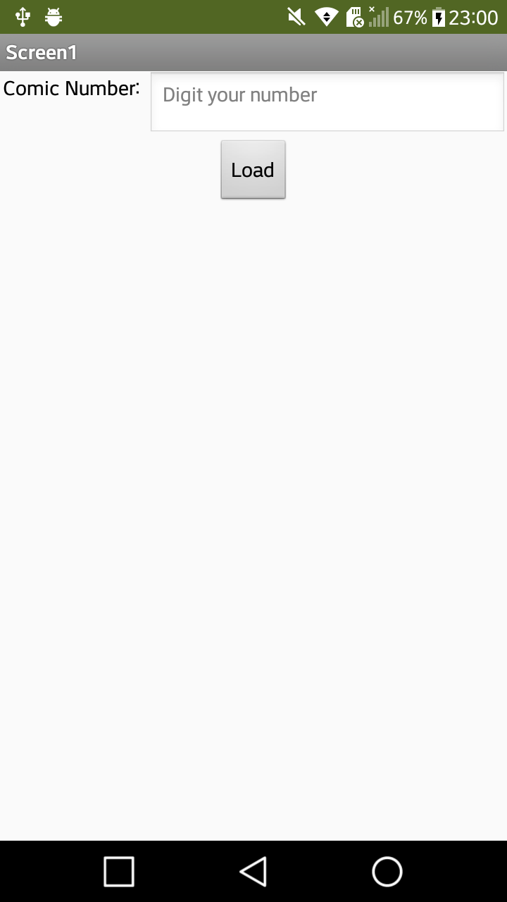
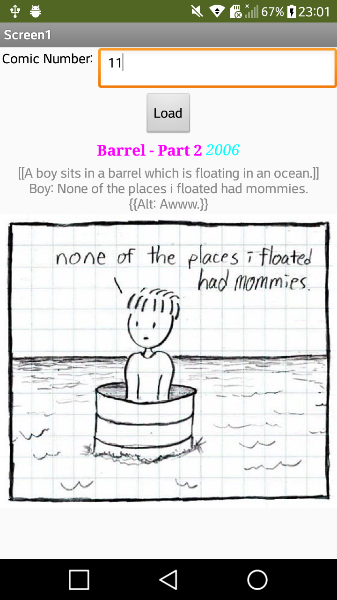

# Modelo para Apresentação do Lab05 - Composição Multinível, Serviços e REST

Estrutura de pastas:

~~~
├── README.md  <- arquivo apresentando a tarefa
│
├── images     <- arquivos de imagens usadas no documento
│
└── app        <- apps do MIT App Inventor exportados em formato `aia`
~~~

# Aluno
* `Daniel Salgado Costa`

# Tarefa

> 
> 
> 
> 
> 
