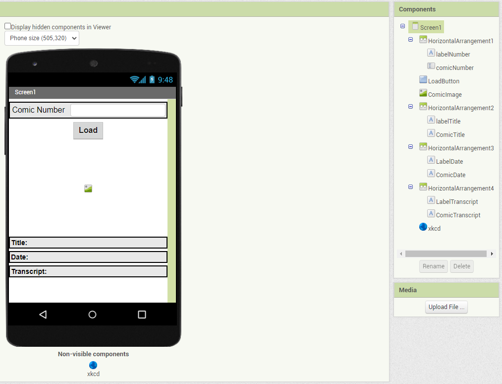
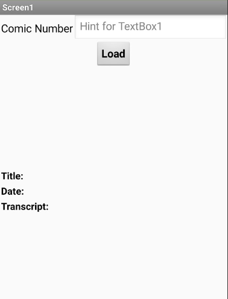
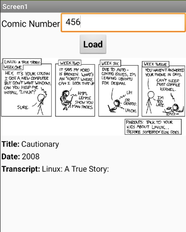
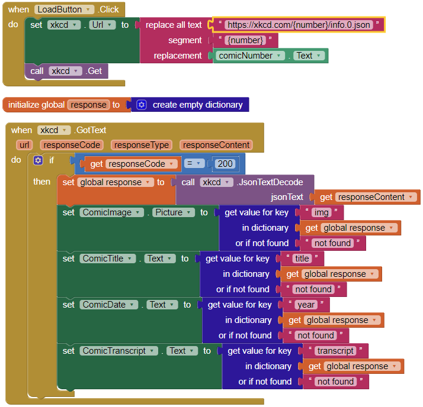

# Modelo para Apresentação do Lab05 - Composição Multinível, Serviços e REST

Estrutura de pastas:

~~~
├── README.md  <- arquivo apresentando a tarefa
│
├── images     <- arquivos de imagens usadas no documento
│
└── app        <- apps do MIT App Inventor exportados em formato `aia`
~~~

# Aluno
* `Daniel Francisco Ferreira Lopes`

# Detalhes do App

> * tela 1 - captura da tela completa de design de interface

> * tela 2 - captura de tela do app com nenhum quadrinho selecionado

> * tela 3 - captura de tela do app com um quadrinho selecionado

> * tela 4 - diagrama de blocos do aplicativo

> * [Aplicativo](app/lab5.aia)
