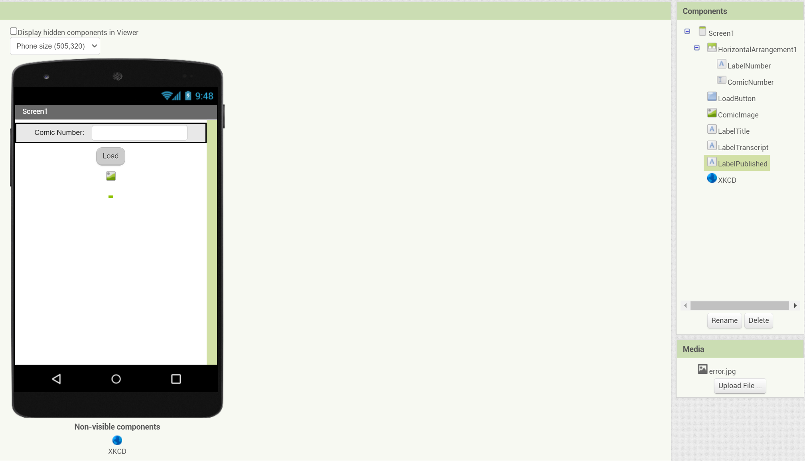
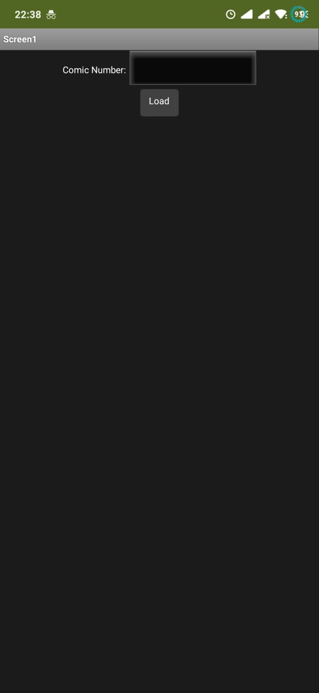
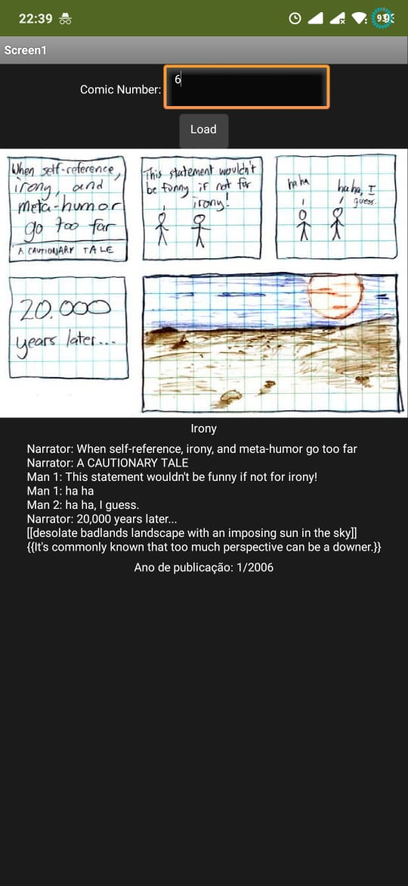
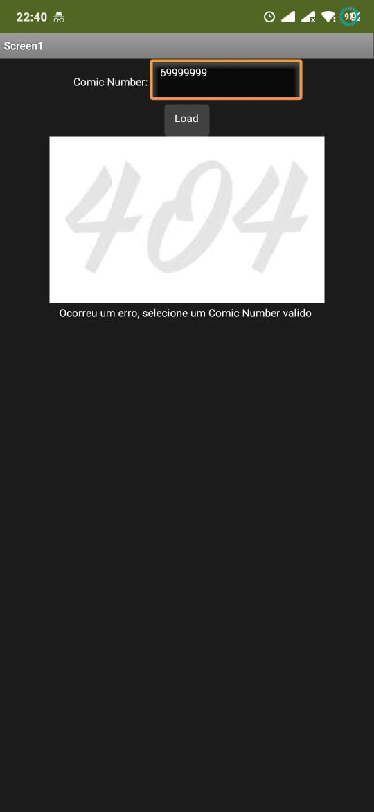
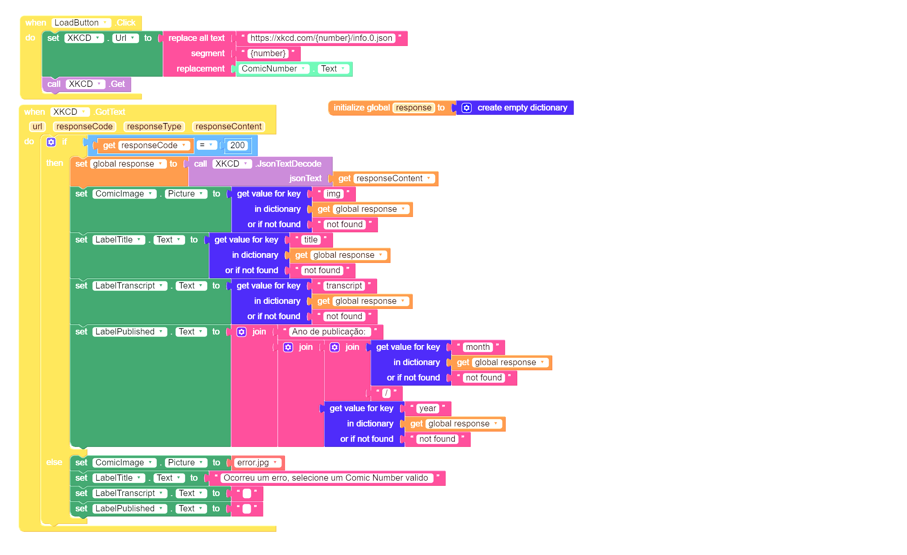

# Modelo para Apresentação do Lab04 - MVC

Estrutura de pastas:

~~~
├── README.md  <- arquivo apresentando a tarefa
│
├── images     <- arquivos de imagens usadas no documento
│
└── app        <- apps do MIT App Inventor exportados em formato `aia`
~~~

# Aluno
* `Estevan Luis Gregori`

# Tarefa - App no MIT App Inventor

> Coloque as imagens PNG da captura de seis telas do seu aplicativo:
> * tela 1 - captura da tela completa de design de interface
> 

> * tela 2 - captura de tela do app em seu estado inicial
> 

> * tela 3 - captura de tela do app com algum commic number selecionado
> 

> * tela 4 - captura de tela do app com msg de erro
> 

> * tela 5 - diagrama de blocos do aplicativo
> 

> Coloque um link para o arquivo do aplicativo exportado a partir do MIT App Inventor em formato `aia`. Ele estará dentro da pasta `app`.
> [Arquivo App](app/Aplicativo_xkcd.aia)