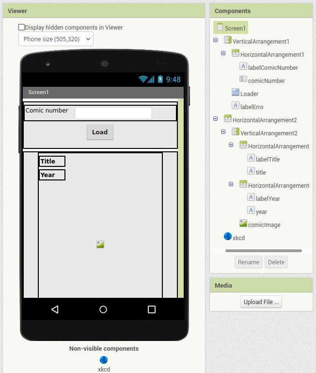
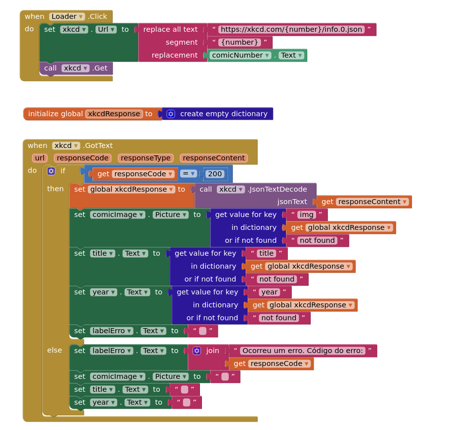
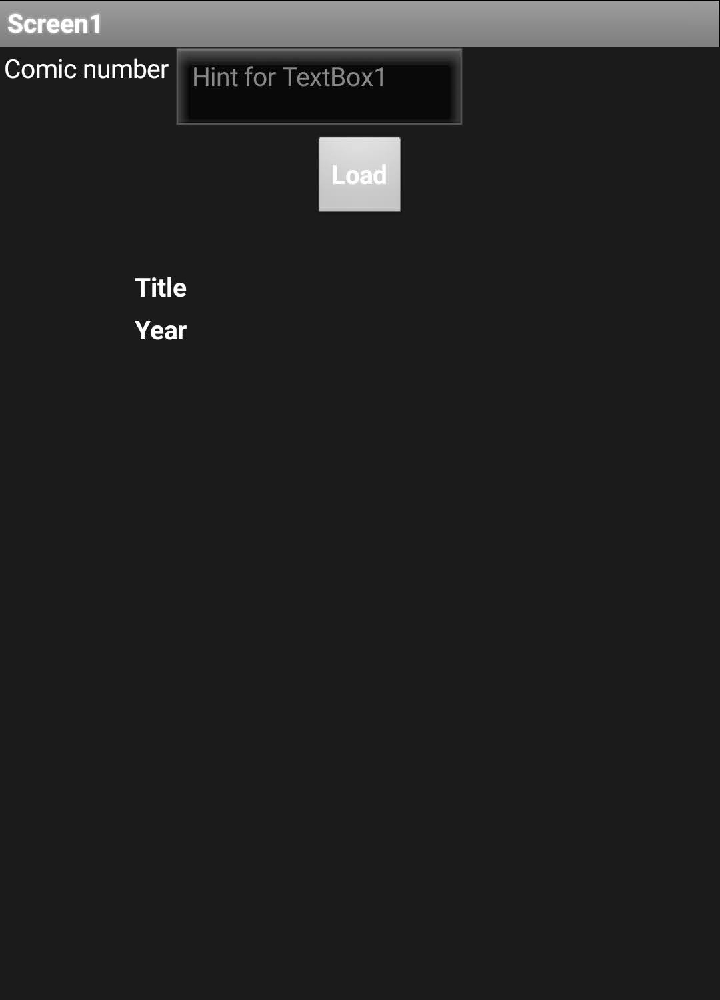
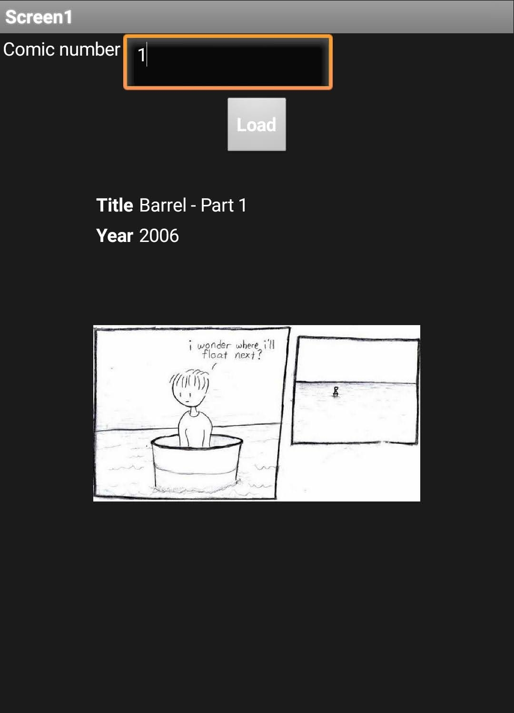
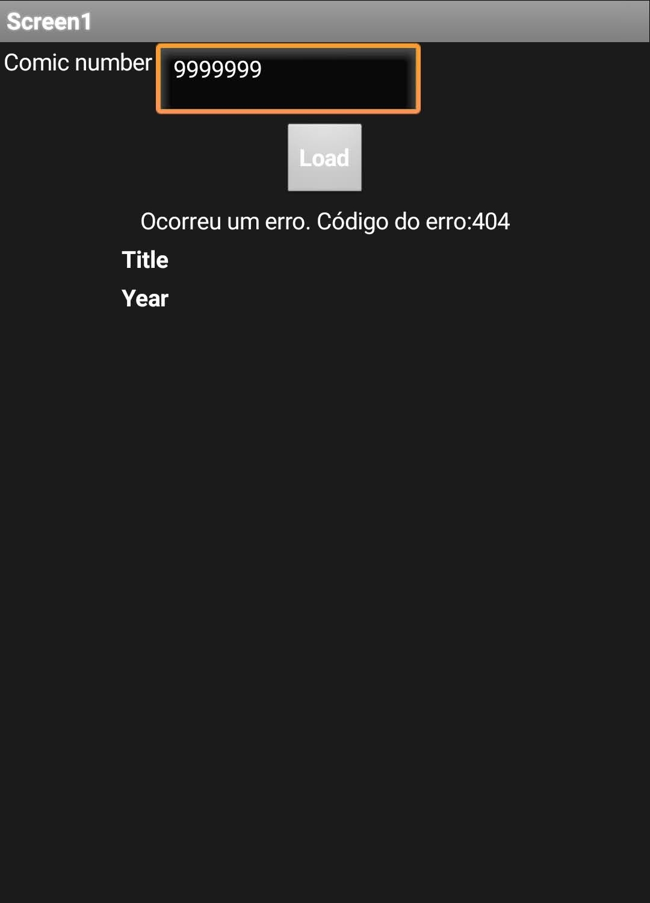

# Modelo para Apresentação do Lab05 - Multinível, Serviços e REST

# Aluno
* `Guilherme Cavassan - RA: 2022601122`

# Tarefa - App no MIT App Inventor

## Aplicativo e componentes:

## Eventos e ações

## Tela inicial:

## Tela de busca com sucesso:

## Tela de busca com tratamento de erro:

## Aplicativo AIA:

