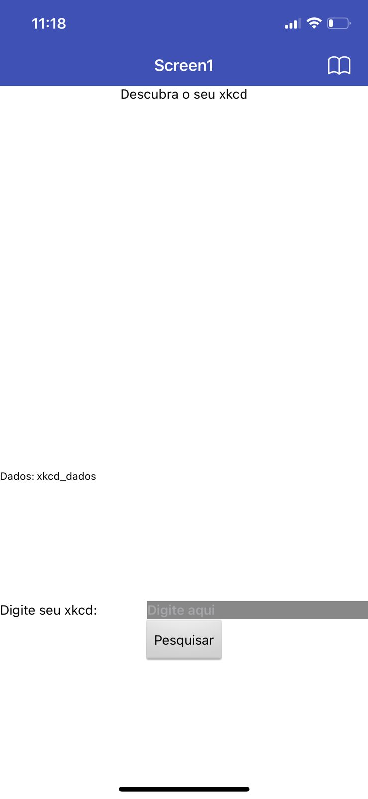
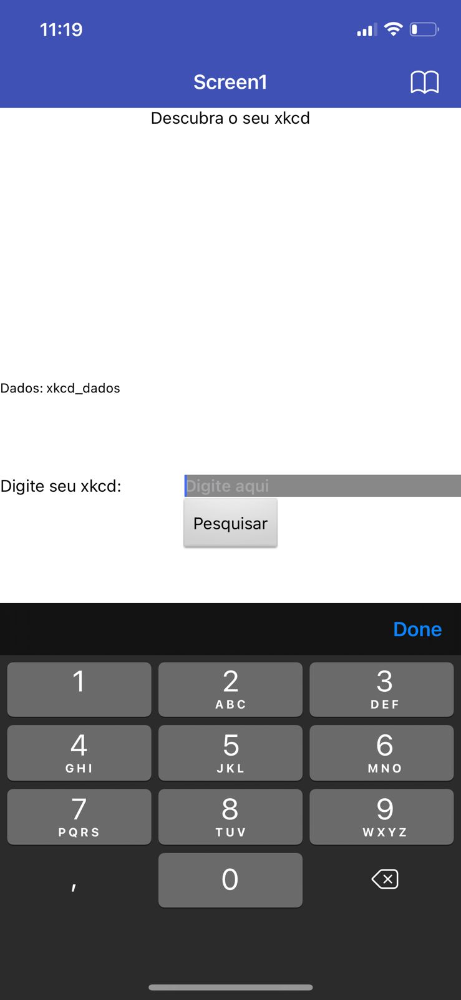
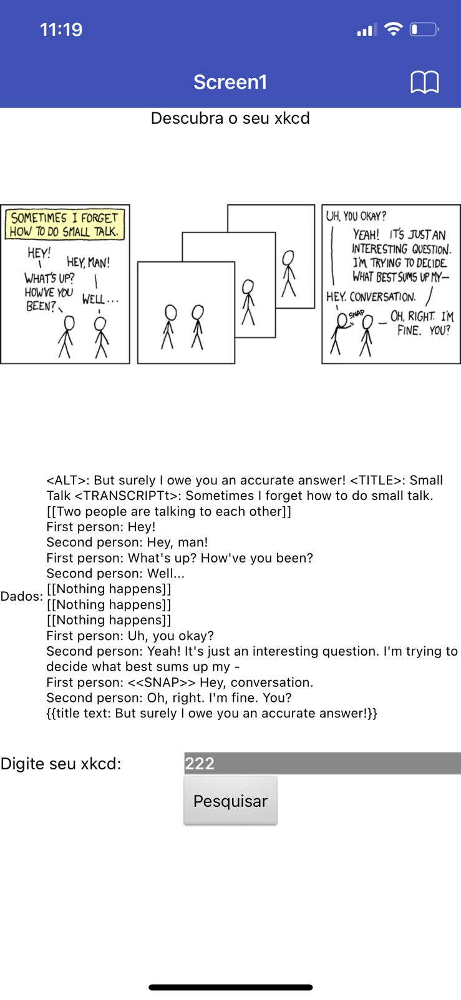
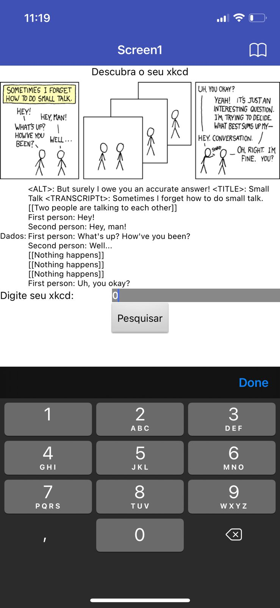

# Modelo para Apresentação do Lab05 - multilevel

# Aluno
* Leonardo Machado Moscardo. RA: EX161698

# Tarefa
* Tela 1 - Captura da tela completa de design de interface
* 
* Tela 2 - Captura de tela do app sem digitar romance
* 
* Tela 3 - Captura de tela do app com romance digitado e resultado retornado
* 
* Tela 3 - Captura de tela do app com romance digitado e resultado retornado
* 
* Tela 4 - (opcional) Captura de tela do app quando acontece um erro
* 
* Tela 4 - (opcional) Captura de tela do app quando acontece um erro
* 

* [App](app/multilevel.aia)
