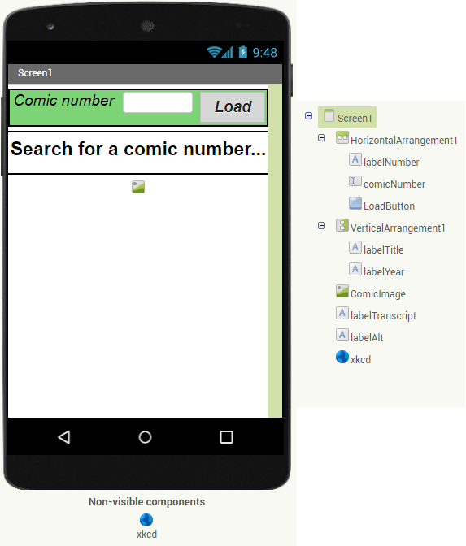
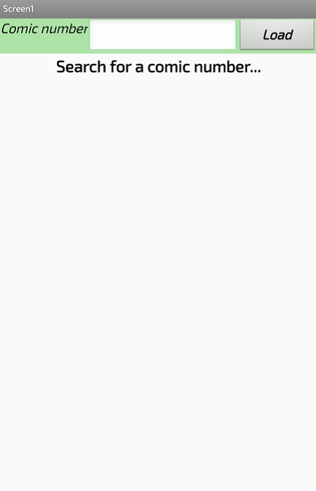
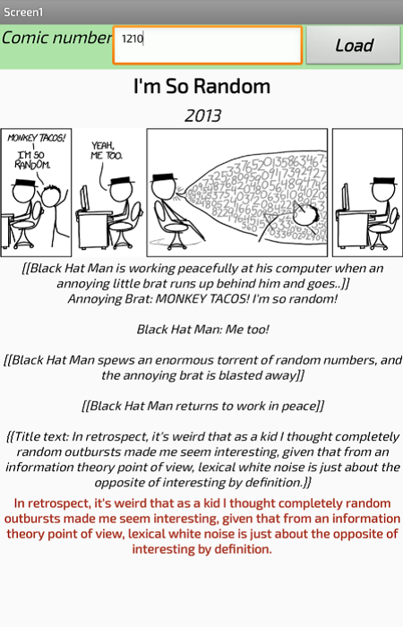
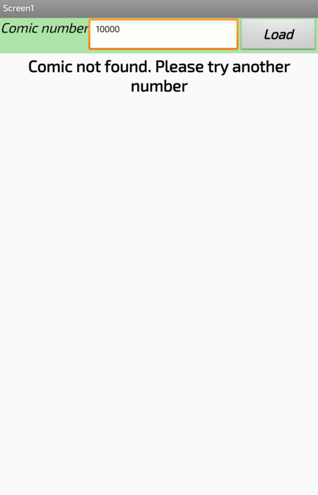
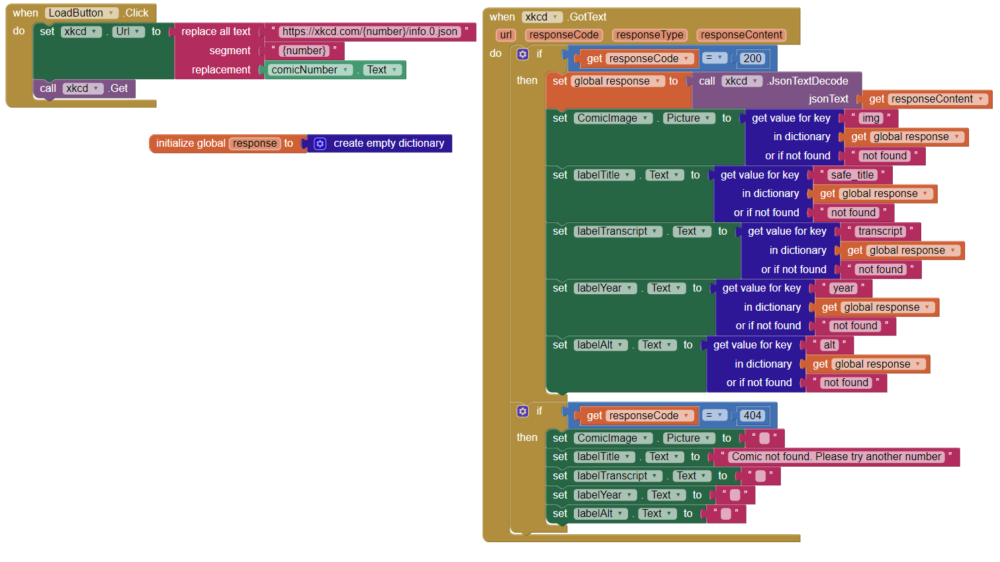

Estrutura de pastas:

~~~
├── README.md  <- arquivo apresentando a tarefa
│
├── images     <- arquivos de imagens usadas no documento
│
└── app        <- apps do MIT App Inventor exportados em formato `aia`
~~~

# Aluno
* `Raul Mendes de Souza`

# Composição Multinível, Serviços e REST

> * Tela 1 - Captura da tela completa de design de interface
> 
> 

> * Tela 2 - Captura de tela do app sem nenhum número pesquisado
> 
> 

> * Tela 3 - Captura de tela do app após pesquisar um número váido
>
> 

> * Tela 4 - Captura de tela do app após pesquisar um número inválido
> 
> 

> * Tela 5 - Diagrama de blocos do aplicativo
> 

> 
