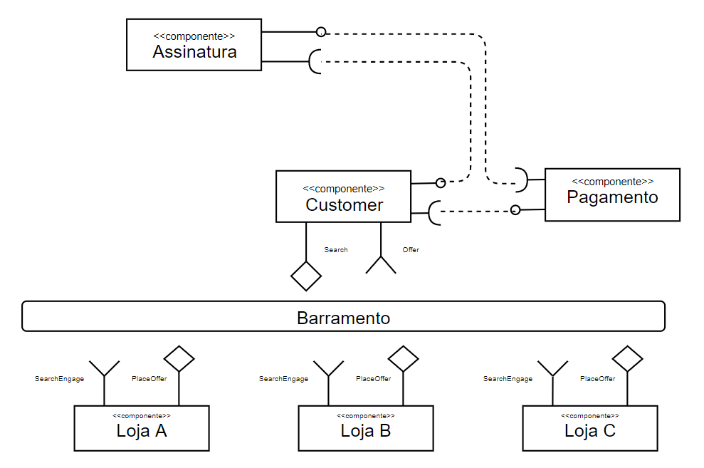
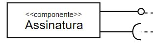
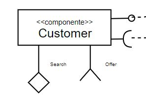
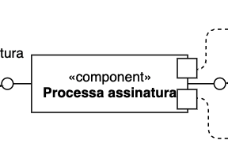
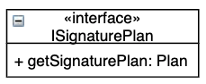
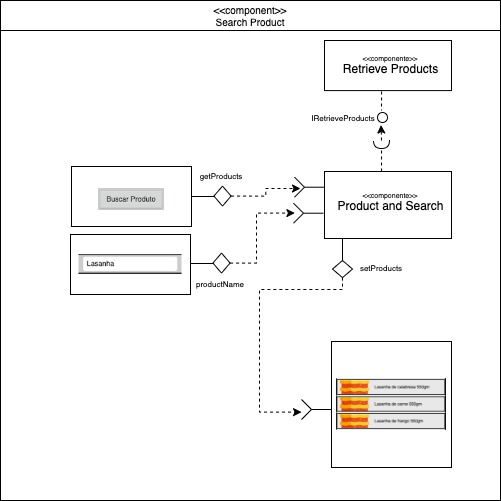

# Projeto `Componetização da Assinatura`

# Equipe 9  
    - Carlos Eduardo Araujo dos Santos 
    - Felipe Starling Medeiros 
    - Marcelo das Cruz Salvador 
    - Tiago Fernandes de Oliveira

# Diagrama do Nível 1 

### Detalhamento da interação de componentes

* O componente `Customer` inicia a busca de produto publicando no barramento a mensagem de tópico "`search/{product-name}`" através da interface `Search`.

* Os componentes Loja A, Loja B e Loja C assinam no barramento mensagens de tópico "`search/{productId}`" através da interface `SearchEngage`. Quando recebem a mensagem esses componentes realizam a busca e se houver produto disponível  publicam a mensagem de tópico "`offer/+/offer" através da interface `PlaceOffer`.

* O componente `Customer` assina no barramento mensagens de tópico "`offer/+`" através da interface `Offer`. Esse componente é responsável por exibir as ofertas para o cliente. Além disso, esse componente se comunica com o componente `Assinatura` que pode aplicar descontos especiais, caso elegível, conforme plano de assinatura do cliente.

* O componente `Customer` é ainda responsável por consolidar a compra do cliente e se comunica com o componente `Pagamento` onde é realizada a transação financeira, que por sua vez devolve para o componente `Customer` o status do pagamento.

## Detalhamento das Interfaces

### Interface `Assinatura`

> Interface de assinatura para ser acionada pelo usuário.

### Interface `Customer`

> Interface de Customer que faz pedido de assinatura e dispara pagamento.

### Interface `Pagamento`

> Interface de Pagamento pode conectar-se com Assinatura e Customer.

# Diagrama do Nível 2

> 

### Detalhamento da interação de componentes

* O componente `Assinatura` em sua camada de View, possui o sub-componente `Gerencia preenchimento`, responsável por validar o preenchimento necessários de assinatura pela sua interface.
  * O componente `Seleciona assinatura` interage com o usuário recebendo o plano de assinatura selecionado.
  * O componente `Periodo da assinatura` interage com o usuário recebendo o periodo desejado de duração do plano, e para identificar as possibilidades de periodos, ele interage com Seleciona assinatura para receber a assinatura selecionada.
* O componente `Gerencia preenchimento` fornece a camada de Controle os dados entrados pelo usuario.
* O componente `Gerencia assinatura` recebe esses dados do cliente atraves da interface e repassa a validacao ao componente `Processa assinatura` que faz as validações com Cliente e de Pagamento externos.

## Componente `Gerencia preenchimento`
> Valida o preenchimento necessários de assinatura

## Componente `Seleciona assinatura`
> Plano de assinatura selecionado

## Componente `Periodo da assinatura`
> Periodo do plano de assinatura selecionado

## Componente `Gerencia assinatura`
> Manipula os dados do cliente

## Componente `Processa assinatura`
> Expões os dados de assinatura para componentes externos e trata a validade dos dados

**Interfaces**
> Listagem das interfaces do componente.

As interfaces listadas são detalhadas a seguir:

## Detalhamento das Interfaces

### Interface `ISignaturePlan`

> Resumo do papel da interface.

Método | Objetivo
-------| --------
`getSignaturePlan: Plan` | `Recebe um objeto de plano de assinatura`

### Interface `ISignaturePeriod`

> Resumo do papel da interface.

Método | Objetivo
-------| --------
`getSignaturePeriod: Date` | `Recebe uma data de periodo de plano de assinatura`

### Interface `ISendSignatureData`

> Resumo do papel da interface.

Método | Objetivo
-------| --------
`sendData: Signature` | `Envia dados da assinatura selecionada`

### Interface `ISignatureValid`

> Resumo do papel da interface.

Método | Objetivo
-------| --------
`signature: Signature` | `Envia dados de assinatura validados para componente expor`

### Interface `IRequestSignaturePayment`

> Resumo do papel da interface.

Método | Objetivo
-------| --------
`requestPayment(Signature): void` | `Envia assinatura para pagamento`

### Interface `IRequestSignatureCustomer`

> Resumo do papel da interface.

Método | Objetivo
-------| --------
`requestCustomer(Signature): void` | `Envia assinatura para vincular a um cliente`

### Interface `ISignatureErrorHandler`

> Resumo do papel da interface.

Método | Objetivo
-------| --------
`genericError: Error` | `Recebe algum erro para tratar no componente de assinatura`

# Diagrama do Nível 3
### Imagens com captura de tela do protótipo feito no MIT App Inventor:

> * tela 1 - captura da tela completa de design de interface e seus componentes  

### Diagrama referente ao protótipo:

### Detalhamento da interação de componentes
> O componente Product and Search responde ao evento de clique do botão "Buscar Produto" da seguinte maneira:

	- O componente Retrieve Products irá responder a ação o botão "Buscar Produtos" e neste caso retornar o Produto de acordo com o valor que estiver no campo "productName".

	- O componente "Product and Search" irá retornar os valores encontrados para a Lista de Produtos da aplicação.