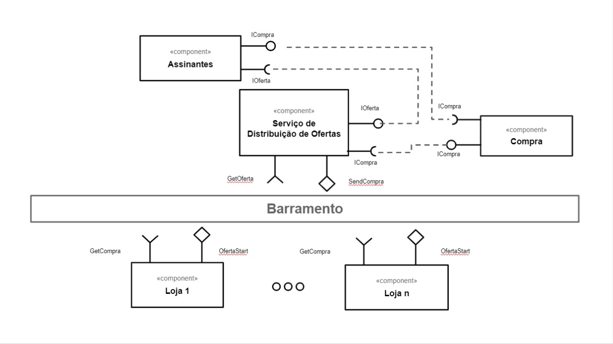
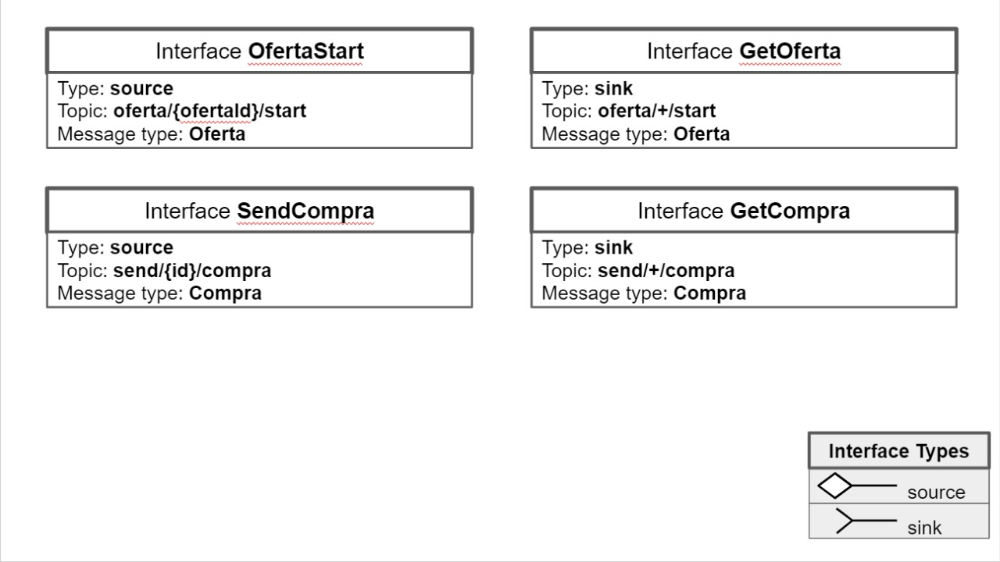
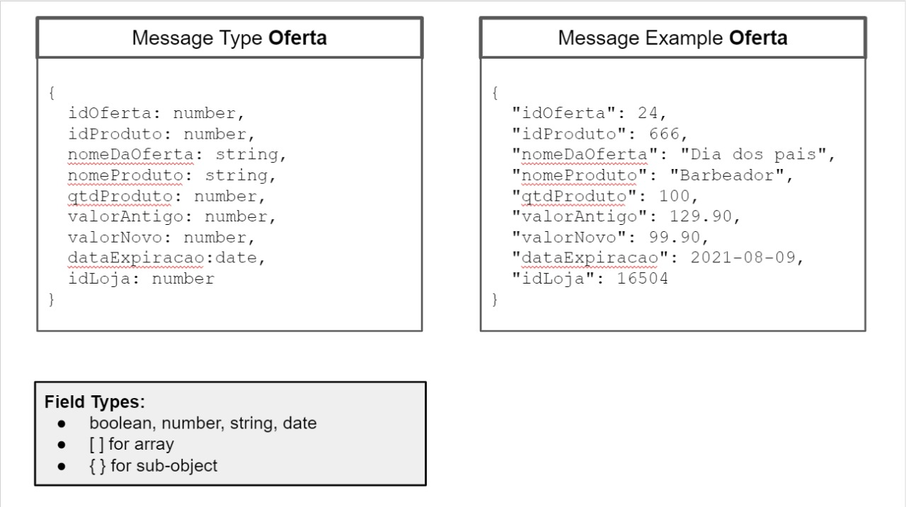
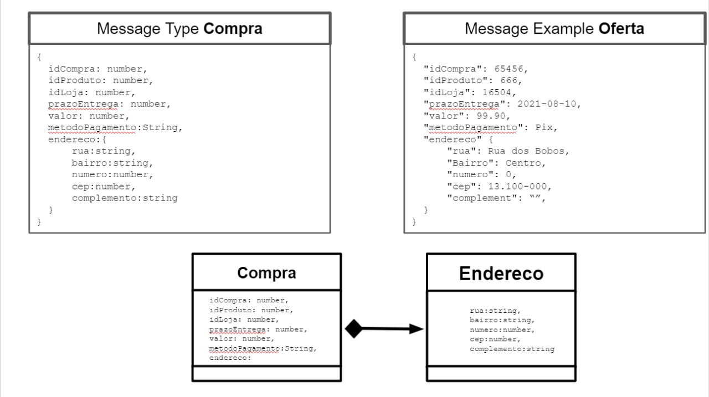

# Equipe 02
* Gustavo Henrique Souza Silva Doll 
* Isadora Mendonça de Oliveira
* Maximiliano Pires
* Ronaldo Monteiro Lopes

# Nível 1

## Diagrama Geral do Nível 1

### Detalhamento da interação de componentes

* O(s) componente(s) `Loja` iniciam a oferta publicando no barramento a mensagem de tópico tópico "`oferta/{ofertaId}/start`" através da interface `OfertaStart`, iniciando o processo de criação e publicação de uma oferta.
* O componente `Servico de distribuicao de ofertas` assina no barramento mensagens de tópico "`oferta/+/start`" através da interface `GetOferta` e após recebê-la, processa essa oferta e envia para o cliente através da interface IOferta.
* O cliente por sua vez seleciona o produto da oferta enviada e efetua sua compra através da interface ICompra. Após isso o componente `Compra` recebe essa interface e processa essa compra retornando seu status para o componente `Servico de distribuição de ofertas`.
* Uma vez com o status em mãos o componente `Servico de distribuicao de ofertas` publica no barramento uma mensagem com o tópico "`send/{id}/compra`". Assim o(s) componente(s) `Loja` assina no barramento mensagens do tipo "`send/+/compra`" finalizando assim o fluxo e validando se foi ou não efetuada a compra com sucesso.

## Componente `Servico de distribuicao de ofertas`
* Tem como principal função gerenciar as ofertas, assim como oferecer formas de validá-las, critérios de aceitação e formas de se adquiri-las. Ele também é responsável por dar o feedback para o componente `Loja` sobre a compra efetuada para aquela oferta.

## Componente `Assinantes`
* Componente básico para representar o usuario, tem como objetivo escolher uma oferta e "popular" a interface responsável pela compra (ICompra).

## Componente `Compra`
* Componente responsável por efetuar a compra em si, validar o método de pagamento e dar um retorno se aquele cliente já efetuou o pagamento ou não (tratativa realizada por uma variável na interface ICompra).

## Componente `Loja`
* Representa a Loja que está realizando a oferta, ela se comunica pelo barramento com o `Servico de distribuicao de ofertas` a fim de enviar a oferta criada e também receber um status sobre a compra realizada para então dar baixa ou não no estoque e realizar o procedimento de entrega do produto.

## Detalhamento das Interfaces

* As interfaces presentes no diagrama anterior foram necessárias para realizar a comunicação entre os principais componentes do diagrama `Compra` e `Servico de distribuicao de ofertas`, com elas conseguimos pegar os dados das ofertas e mostrá-los para os cliente, assim conseguimos obter os dados das compras feitas e enviá-los para as lojas para que elas possam realizar as tarefas necessárias para entrega e afins com os clientes.

> 

> 

> 

# Nível 2

> Apresente aqui o detalhamento do Nível 2 conforme detalhado na especificação com, no mínimo, as seguintes subseções:

## Diagrama do Nível 2

> Apresente um diagrama conforme o modelo a seguir:

> 

### Detalhamento da interação de componentes

> O detalhamento deve seguir um formato de acordo com o exemplo a seguir:

* O componente `Entrega Pedido Compra` assina no barramento mensagens de tópico "`pedido/+/entrega`" através da interface `Solicita Entrega`.
  * Ao receber uma mensagem de tópico "`pedido/+/entrega`", dispara o início da entrega de um conjunto de produtos.
* Os componentes `Solicita Estoque` e `Solicita Compra` se comunicam com componentes externos pelo barramento:
  * Para consultar o estoque, o componente `Solicita Estoque` publica no barramento uma mensagem de tópico "`produto/<id>/estoque/consulta`" através da interface `Consulta Estoque` e assina mensagens de tópico "`produto/<id>/estoque/status`" através da interface `Posição Estoque` que retorna a disponibilidade do produto.

> Para cada componente será apresentado um documento conforme o modelo a seguir:

## Componente `<Nome do Componente>`

> Resumo do papel do componente e serviços que ele oferece.

**Interfaces**
> Listagem das interfaces do componente.

As interfaces listadas são detalhadas a seguir:

## Detalhamento das Interfaces

### Interface `<nome da interface>`

> Resumo do papel da interface.

Método | Objetivo
-------| --------
`<id do método>` | `<objetivo do método e descrição dos parâmetros>`

## Exemplos:

### Interface `ITableProducer`

Interface provida por qualquer fonte de dados que os forneça na forma de uma tabela.

Método | Objetivo
-------| --------
`requestAttributes` | Retorna um vetor com o nome de todos os atributos (colunas) da tabela.
`requestInstances` | Retorna uma matriz em que cada linha representa uma instância e cada coluna o valor do respectivo atributo (a ordem dos atributos é a mesma daquela fornecida por `requestAttributes`.

### Interface `IDataSetProperties`

Define o recurso (usualmente o caminho para um arquivo em disco) que é a fonte de dados.

Método | Objetivo
-------| --------
`getDataSource` | Retorna o caminho da fonte de dados.
`setDataSource` | Define o caminho da fonte de dados, informado através do parâmetro `dataSource`.

## Diagrama do Nível 3

> Apresente uma imagem com a captura de tela de seu protótipo feito no MIT App Inventor, conforme modelo a seguir:

> Apresente o diagrama referente ao protótipo conforme o modelo a seguir:

### Detalhamento da interação de componentes

> O detalhamento deve seguir o mesmo formato usado no Nível 2.
