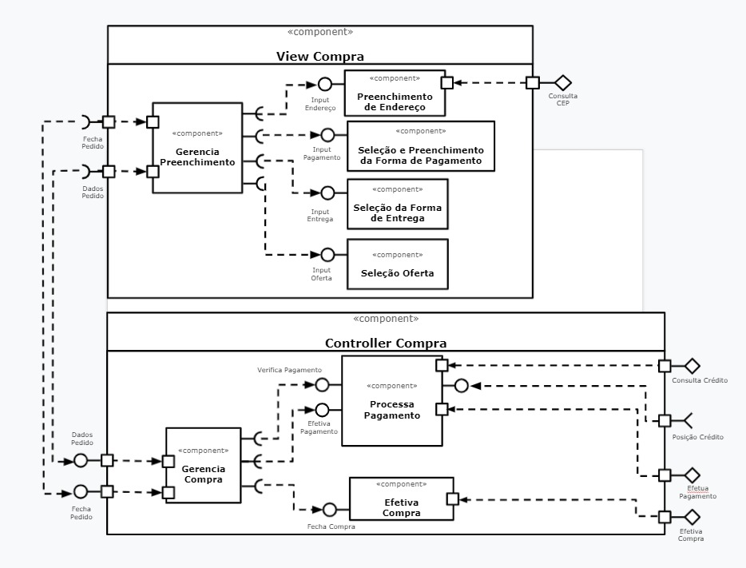
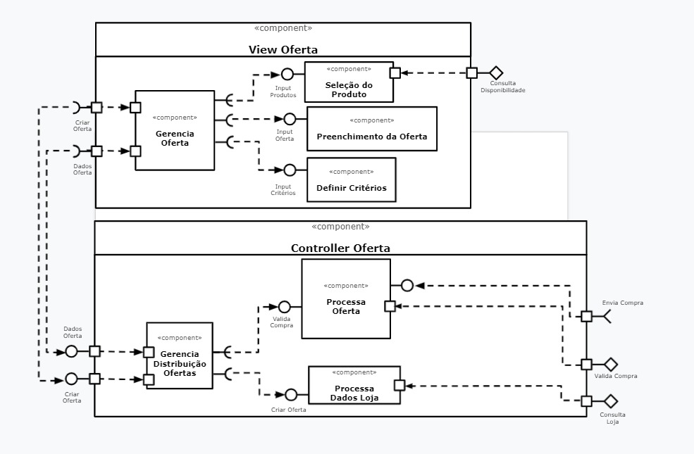
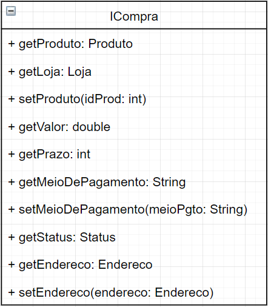

# Equipe 02
* Gustavo Henrique Souza Silva Doll 
* Isadora Mendonça de Oliveira
* Maximiliano Pires
* Ronaldo Monteiro Lopes

# Nível 1

## Diagrama Geral do Nível 1

### Detalhamento da interação de componentes

* O(s) componente(s) `Loja` iniciam a oferta publicando no barramento a mensagem de tópico tópico "`oferta/{ofertaId}/start`" através da interface `OfertaStart`, iniciando o processo de criação e publicação de uma oferta.
* O componente `Servico de distribuicao de ofertas` assina no barramento mensagens de tópico "`oferta/+/start`" através da interface `GetOferta` e após recebê-la, processa essa oferta e envia para o cliente através da interface IOferta.
* O cliente por sua vez seleciona o produto da oferta enviada e efetua sua compra através da interface ICompra. Após isso o componente `Compra` recebe essa interface e processa essa compra retornando seu status para o componente `Servico de distribuição de ofertas`.
* Uma vez com o status em mãos o componente `Servico de distribuicao de ofertas` publica no barramento uma mensagem com o tópico "`send/{id}/compra`". Assim o(s) componente(s) `Loja` assina no barramento mensagens do tipo "`send/+/compra`" finalizando assim o fluxo e validando se foi ou não efetuada a compra com sucesso.

## Componente `Servico de distribuicao de ofertas`
* Tem como principal função gerenciar as ofertas, assim como oferecer formas de validá-las, critérios de aceitação e formas de se adquiri-las. Ele também é responsável por dar o feedback para o componente `Loja` sobre a compra efetuada para aquela oferta.

## Componente `Assinantes`
* Componente básico para representar o usuario, tem como objetivo escolher uma oferta e "popular" a interface responsável pela compra (ICompra).

## Componente `Compra`
* Componente responsável por efetuar a compra em si, validar o método de pagamento e dar um retorno se aquele cliente já efetuou o pagamento ou não (tratativa realizada por uma variável na interface ICompra).

## Componente `Loja`
* Representa a Loja que está realizando a oferta, ela se comunica pelo barramento com o `Servico de distribuicao de ofertas` a fim de enviar a oferta criada e também receber um status sobre a compra realizada para então dar baixa ou não no estoque e realizar o procedimento de entrega do produto.

## Detalhamento das Interfaces

* As interfaces presentes no diagrama anterior foram necessárias para realizar a comunicação entre os principais componentes do diagrama `Compra` e `Servico de distribuicao de ofertas`, com elas conseguimos pegar os dados das ofertas e mostrá-los para os cliente, assim conseguimos obter os dados das compras feitas e enviá-los para as lojas para que elas possam realizar as tarefas necessárias para entrega e afins com os clientes.

> 

> 

> 

# Nível 2

## Diagrama do Nível 2

> 

### Detalhamento da interação de componentes **Fluxo Compra**

* O componente `Gerencia Preenchimento` dentro da view Compra fica responsável por validar se os outros 4 componentes foram preenchidos de acordo com os critérios desejados, sendo `Preenchimento de endereco` o único que necessita de uma comunicação externa da view para consultar CEP.
Após isso, ele se comunica com a Controller Compra que publica no barramento uma mensagem "`send/{id}/compra`" assinada pela view Compra. Depois dessa interação o componente `Gerencia Compra` fica responsável por validar o pagamento daquele cliente, sendo possível somente através do componente `Processa pagamento`,
que por sua vez necessita de acesso externo ao da controller para validar créditos do cliente. Após receber uma resposta, o componente `Gerencia Compra` fecha o pedido e o processa dentro do componente `Efetiva Compra`, que solicita acesso externo ao da controller para realizar essa operação, assim, finalizando o fluxo.

> 

### Detalhamento da interação de componentes **Fluxo Oferta**

* O componente `Gerencia Oferta` dentro da view Oferta, fica responsável por se comunicar com os outros 3 componentes passando os dados a serem preenchidos da oferta, isso so e possivel pois o componente `Gerencia Distribuicao de Oferta` publica a mensagem com tópico "`oferta/{id}/start`". Também deve-se ressaltar que o componente `Selecao de produto` necessita de acesso externo ao da view para validar se aquele produto encontra-se disponível.
Chegando na controller o componente `Gerencia distribuição de ofertas` nos fornece os dados das ofertas e cria ofertas com a loja através da comunicação com o componente `Processa dados Loja` que por sua vez necessita de acesso externo ao da controller para consultar a loja desejada. Outra funcionalidade também é a de validar a compra, sendo possível somente se comunicando com o componente `Processa Oferta` que por sua vez necessita de acesso externo ao da controller para
enviar a compra para a loja ou validar se foi processada ou não essa compra.

## Detalhamento das Interfaces

### Interface `ICompra`

> Interface responsavel por fornecer todos os dados da compra

Método | Objetivo
-------| --------
`getProduto` | `obter os produtos que estao sendo comprados (produtos no carrinho)`
`getLoja` | `obter a loja que esta vendendo o produto`
`setProduto` | `guardar os produtos escolhidos`
`getValor` | `calcular o valor da compra`
`getPrazo` | `retorna o prazo necessario de entrega`
`getMeioDePagamento` | `retorna os tipos de pagamento disponiveis`
`setMeioDePagamento` | `envia o meio de pagamento escolhido pelo cliente`
`getStatus` | `retorna o status daquela compra`
`getEndereco` | `retorna o endereco preenchido para entrega`
`setEndereco` | `envia o endereco preenchido pelo cliente`

### Interface `IOferta`

> Interface responsavel por fornecer todos os dados da oferta

Método | Objetivo
-------| --------
`getProduto` | `obter os produtos em ofertas`
`setProduto` | `guardar os produtos que vao estar em oferta`
`setNomeOferta` | `salvar o nome da oferta`
`setQtdProduto` | `colocar qual a quantidade disponivel daquele produto para oferta`
`setValor` | `colocar valor antigo e valor atual (oferta) daquele produto`
`setDataDeExpiracao` | `colocar a data limite para a oferta`
`getLoja` | `obter a loja`

## Diagrama do Nível 3

> Apresente uma imagem com a captura de tela de seu protótipo feito no MIT App Inventor, conforme modelo a seguir:

> Apresente o diagrama referente ao protótipo conforme o modelo a seguir:

### Detalhamento da interação de componentes

> O detalhamento deve seguir o mesmo formato usado no Nível 2.
