# Projeto `MarketCamp`

# Equipe

* Carlos Nihelton Santana de Oliveira ex150295
* Leonardo Martins de Oliveira 		  ex150339
* Paulo Gabriel S.A. Carvalho		  ex150341
* Paulo Sérgio do Nascimento          ex150352

# Nível 1

## Diagrama Geral do Nível 1

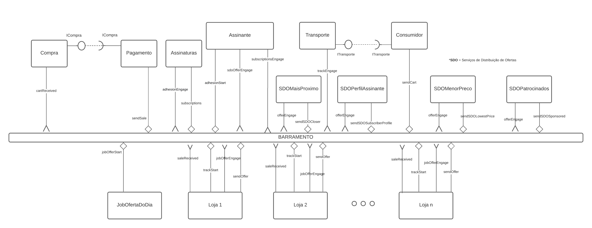

### Detalhamento da interação de componentes

* O componente `JobOfertaDoDia` periodicamente dispara uma mensagem de tópico "`offer/{offerId}/start`" através da interface `OfferStart`, iniciando a
  coreografia das ofertas.
* As lojas assinam o tópico "`offer/+/start`" e reagem a ele emitindo mensagens de ofertas exclusivas, de tópico "`offer/{offerId}/myOffer`", contendo dados da
  loja, produtos e preços ofertados através da interface `SendOffer`.
  
* Diversos Serviços de Distribuição de Ofertas (SDO) se conectam ao barramento, assinando mensagens de tópico "`offer/+/myOffer`" e realizando processamentos
  específicos sobre elas, finalmente selecionando quais ofertas serão enviadas ao assinante, através da interface `OfferDistService`.
* As ofertas filtradas pelos SDO são emitidas no barramento na forma de tópicos "`offer/{offerId}/sdo/#`", em que o *wildcard* representa uma das terminações de
  tópico específicas para os diferentes tipos de SDO existentes (no momento deste relatório existem os serviços: `closer`, `type/{typeId}`, `lowestPrice`, `sponsored`).

* O componente `Assinante` escuta a mensagem no tópico `subscriptions/listall` emitido por `Assinatura` para obter a lista de tipos de assinaturas disponíveis para apreciação.
* O componente `Assinante` envia mensagem no tópico `adhesion/{subscriptionId}/{user}` para se cadastrar em um plano de assinatura que por sua vez é escutado pelo componente `Assinatura`.
* O componente `Assinante` escuta mensagens no tópico `offer/{offerId}/sdo/type/{typeId}` emitido pelo componente `SDOPerfilAssinante` para obter ofertas
  específicas personalizadas de acordo com o gosto pessoal e outros critérios aplicados por esse serviço de distribuição de ofertas.
* O componente `Assinante` escuta mensagens no tópico `offer/{offerId}/sdo/+` emitido pelos demais componentes `SDO` para obter ofertas filtradas por estes serviços.
* O componente `Consumidor` envia a mensagem no tópico `order/{cart}` para que seja realizado a compra do produto escolhido pelo cliente.
* O componente `Compra` escuta a mensagem no tópico `order/{cart}` emitido por `Consumidor` e então realiza a comunicação com o pagamento. O componente `Compra` provém para o pagamento a interface `ICompra`.
* O componente `Pagamento` por requerer uma interface `ICompra`, ao obtê-la realiza todos os processamentos necessários com o carrinho de compras do consumidor.
* O Pagamento então dispara, com o pedido feito, dispara uma mensagem no tópico `order/{sale}/{storeId}` contendo as informações da venda e o id da loja.
* O componente de lojas escutam o tópico `order/{sale}/{storeId}` e obtém os dados da venda realizada para o cliente.
* A loja então, emite uma mensagem no tópico `ship/{sale}/{shipId}`.
* O componente `Transporte` recebe a mensagem presente no tópico `ship/{sale}/{shipId}` e então a processa, para que então o componente do Consumidor possa requerer os dados do transporte através da interface
  `ITransporte`

## Componente `Compra`
 
> Este componente tem como objetivo realizar o controle da compra de uma mercadoria no marketplace. Oferece como serviço o envio da compra realizada para o pagamento através da interface `ICompra` e o recebimento do carrinho de compras através da interface `cartReceived`.
 
> Diagrama do componente

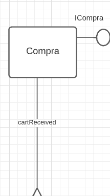
 
**Interfaces**
> - ICompra
> - cartReceived
 
## Componente `Pagamento`
 
> Este componente tem como objetivo realizar o pagamento do carrinho de compras. Tem como serviço requerer o pedido da compra, através da interface `ICompra` e realizar o envio do pagamento após a efetivação, através da interface `sendSale`.
 
> Diagrama do componente

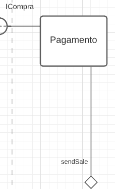
 
**Interfaces**
> - ICompra
> - sendSale
 
## Componente `JobOfertaDoDia`
 
> Este componente tem como objetivo realizar o disparo do processo de gerar as ofertas do dia corrente. Basicamente o serviço dele é, obter os produtos internamente e realizar o disparo das ofertas dos produtos escolhidos através da interface jobOfferStart.
 
> Diagrama do componente

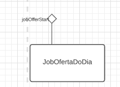
 
**Interfaces**
> - jobOfferStart
 
## Componente `Loja`
 
> Este componente visa representar os processos realizados internamente por uma loja de um marketplace. No contexto do nosso marketplace, possui como serviços receber as vendas, enviar informações para rastreamento, entrar em ofertas e enviar ofertas aos clientes. A ideia desse componente é permitir a integração de várias lojas ao sistema sem que haja necessidade de reescrever códigos fontes.
 
> Diagrama do componente

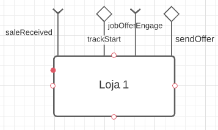
 
**Interfaces**
> - saleReceived
> - trackStart
> - jobOfferEngage
> - sendOffer
 
## Componente `Assinatura`
> O componente assinatura representa todos os processos e serviços inerentes à assinatura. O componente oferece o serviço de listar (envia mensagem no tópico) os tipos de assinatura disponíveis para serem aderidos pelo consumidor através da interface ‘subscriptions’. Além disso, oferece também a interface adhesionEngage (subscribe) receber pedidos de adesões em assinaturas disponíveis.
 
> Diagrama do componente
 
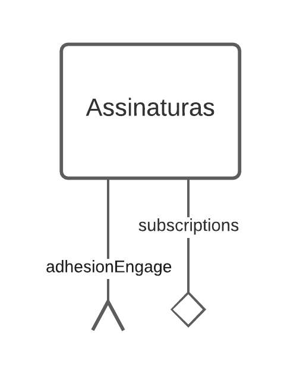
 
**Interfaces**
> - subscriptions
> - adhesionEngage
 
## Componente `Assinante`
> O componente assinante engloba todos os processos e requisitos que representam a ideia de assinante. Ele possui a interface ‘subscriptionsEngage’ para escutar os tipos de assinatura disponíveis pelo marketplace. Possui também a interface ‘sdoOfferEngage’ para receber as ofertas de acordo com o seu perfil e demais tipos de ofertas disponibilizadas pelos SDO’s (serviço de distribuição de ofertas). O componente assinante ainda possui a interface de comunicação para solicitar a inscrição em um plano de assinatura chamada de ‘adhesionStart’.
 
> Diagrama do componente
 
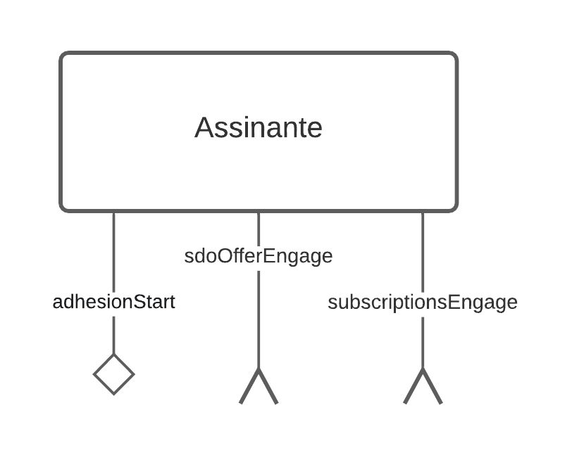
 
**Interfaces**
> - subscriptionsEngage
> - sdoOfferEngage
> - adhesionStart
 
 
## Componente `Consumidor`
> O componente consumidor é responsável por atribuir serviços e interfaces que representam toda a função de consumidor. Possui a interface provida sendCart para enviar o pedido do carrinho de compras para pagamento. Possui também a interface ITransporte requerida para verificar o rastreio do pedido do carrinho.
> Diagrama do componente
 
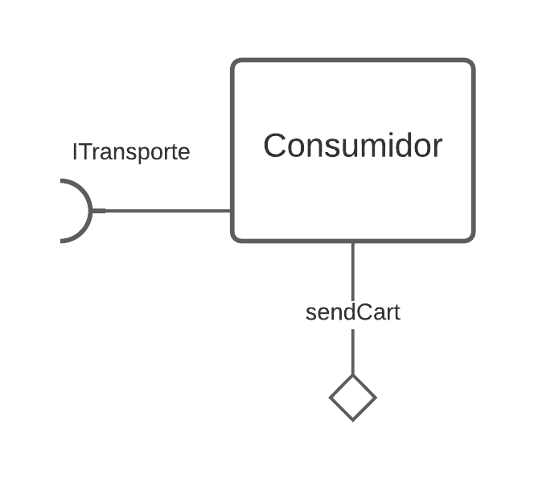

**Interfaces**
> - ITransporte
> - sendCart
 
 
## Componente `Transporte`
> Este componente é responsável por prover informações sobre o transporte de uma determinada compra através da interface provida Itransporte. Possui também a interface de comunicação assíncrona para escutar no barramento informações sobre o rastreio do compra através de trackEngage.
 
> Diagrama do componente
 
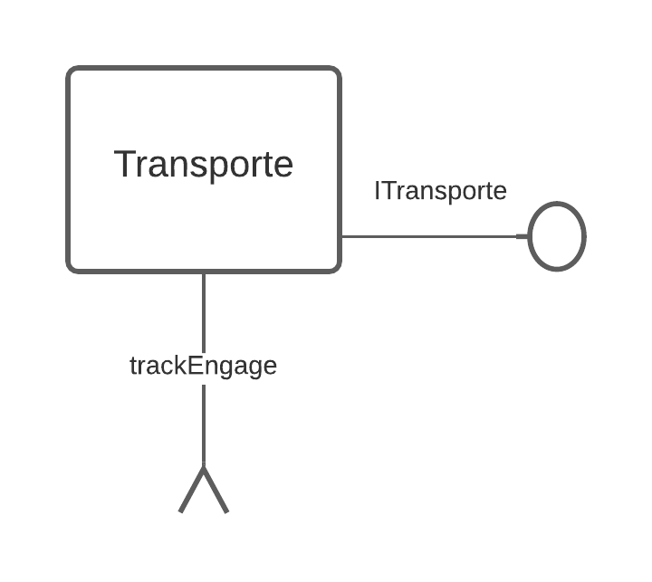

**Interfaces**
> - ITransporte
> - trackEngage
 
 
**Interfaces**
> Listagem das interfaces do componente.
 
 
As interfaces listadas são detalhadas a seguir:
 
## Componente `SDOMaisProximo`
 
> Os componentes nomeados com o prefixo “`SDO`” são serviços de distribuição de ofertas que escutam no barramento todas as ofertas divulgadas pelas lojas e aplicam algum filtro segundo sua modelagem interna para então enviar novamente ao barramento mensagens dos tópicos esperados pelos assinantes.
> O componente `SDOMaisProximo` seleciona ofertas divulgadas pelas lojas no barramento segundo a localização do assinante.
 
> Diagrama do componente:
 
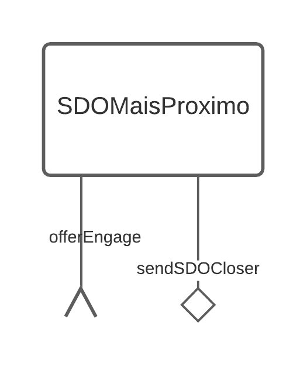
 
**Interfaces**
* JobOfferEngage
* sendSDOCloser
 
## Componente `SDOPerfilAssinante`
 
> Este serviço de distribuição de ofertas seleciona ofertas filtradas por algoritmos inteligentes (*machine learning*) para oferecer ao assinante descontos em produtos relevantes para aquele tipo de perfil de consumidor.
 
> Diagrama do componente:
 
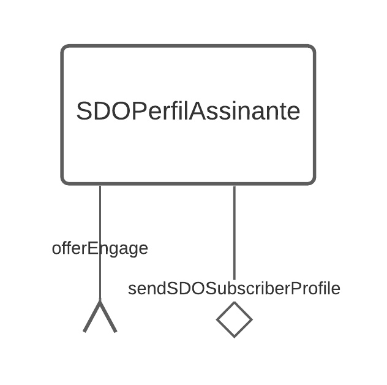
 
**Interfaces**
* JobOfferEngage.
* sendSDOSubscriberProfile
 
## Componente `SDOMenorPreco`
 
> Este serviço de distribuição de ofertas seleciona fielmente os produtos em oferta com menores preços e distribui a todos os assinantes sem nenhum outro filtro especial.
 
> Diagrama do componente:
 
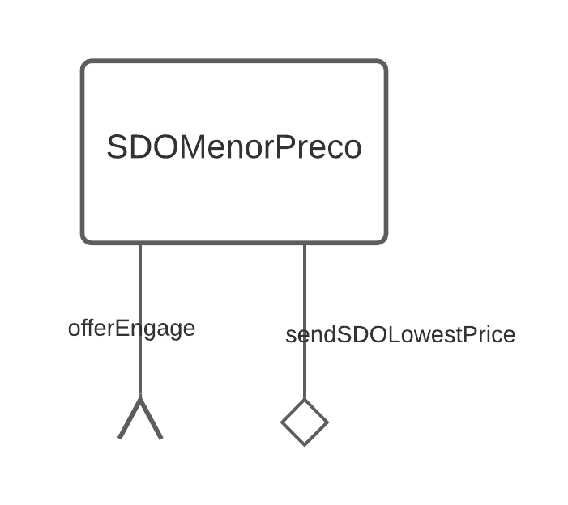
 
**Interfaces**
* JobOfferEngage.
* sendSDOLowestPrice
 
## Componente `SDOPatrocinados`
 
> Este serviço de distribuição de ofertas seleciona fielmente os produtos em oferta que são parte integrante da lista de produtos patrocinados pelo Marketplace. De tempos em tempos o Marketplace aplica estratégias junto a lojas e fornecedores para patrocinar determinados produtos. As lojas oferecem seus descontos do dia sem levar esse aspecto necessariamente em consideração, cabendo ao componente `SDOPatrocinados` realizar o tratamento especial desses produtos na divulgação aos assinantes.
 
> Diagrama do componente:
 
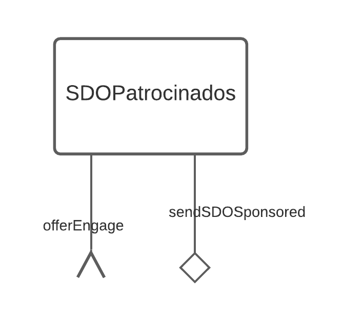
 
**Interfaces**
* JobOfferEngage.
* sendSDOSponsored.
 
## Detalhamento das Interfaces
 
### Interface `adhesionStart`
> A interface *adhesionStart* é responsável por receber solicitações de adesões em tipos de assinatura. Trata-se de uma comunicação assíncrona.
 
* Type: `source`
* Topic: `adhesion/{subscriptionId}/{user}`
* Message type: `Adhesion`
 
### Interface `adhesionEngage`
> A interface *adhesionEngage* é responsável por receber solicitações de adesões em tipos de assinatura. Trata-se de uma comunicação assíncrona.
 
* Type: `sink`
* Topic: `adhesion/+/+`
* Message type: `Adhesion`
 
Diagrama em formato JSON do message type `Adhesion`:
~~~json
{
 user: {
   id: number,
   name: string,
   email: string
 },
 subscriptionId: number 
}
~~~
 
### Interface `subscriptions`
> A interface *subscriptions* é responsável por disponibilizar os tipos de assinatura disponíveis. Trata-se de uma comunicação assíncrona.
 
* Type: `source`
* Topic: `subscriptions/listall`
* Message type: `Subscriptions`
 
### Interface `subscriptionsEngage`
> A interface *subscriptionsEngage* é responsável por receber de forma assíncrona os tipos de assinaturas disponíveis no marketplace.
 
* Type: `sink`
* Topic: `subscriptions/listall`
* Message type: `Subscriptions`
 
> Diagrama em formato JSON do message type `Subscriptions`:
 
~~~json
{
 subscriptions: [
   {
     id: number,
     name: string,
     description: string,
     price: float,
     period: string,
     type: number,
    },
   {
     id: number,
     name: string,
     description: string,
     price: float,
     period: string,
     type: number,
   },
   {
     id: number,
     name: string,
     description: string,
     price: float,
     period: string,
     type: number,
   },
 ]
}
~~~
 
### Interface `sendSDOCloser`
> A interface *sendSDOCloser* é responsável por realizar o processamento da jobOffer e enviar para o barramento as informações dos produtos que estão em promoção ao consumidores mais proximos das lojas
 
* Type: `source`
* Topic: `offer/{offerId}/closer`
* Message type: `Offer`
### Interface `sendSDOSubscriberProfile`
> A interface *sendSDOSubscriberProfile* é responsável por realizar o processamento da jobOffer e enviar para o barramento as informações dos produtos que estão em promoção aos consumidores que possuem algum determinado perfil de assinante.
 
* Type: `source`
* Topic: `offer/{offerId}/type/{typeId}`
* Message type: `Offer`
 
### Interface `sendSDOLowestPrice`
> A interface *sendSDOLowestPrice* é responsável por realizar o processamento da jobOffer e enviar para o barramento as informações dos produtos que estão em promoção com menor preço aos consumidores.
 
* Type: `source`
* Topic: `offer/{offerId}/lowestPrice`
* Message type: `Offer`
 
### Interface `sendSDOSponsored`
> A interface *sendSDOSponsored* é responsável por realizar o processamento da jobOffer e enviar para o barramento as informações dos produtos patrocinados que estão em promoção aos consumidores.
 
* Type: `source`
* Topic: `offer/{offerId}/sponsored`
* Message type: `Offer`
 
### Interface `sdoOfferEngage`
> A interface *sdoOfferEngage* é responsável por receber de forma assíncrona todos tipos de ofertas existentes dentro do marketplace.
 
* Type: `sink`
* Topic: `offer/{offerId}/#`
* Message type: `Offer`
 
### Interface `sendOffer`
> Essa interface corresponde ao lançamento de oferta de um produto no barramento por parte das lojas.
 
* Type: `source`
* Topic: `offer/{offerId}/myOffer`
* Message type: `Offer`
 
 
### Interface `offerEngage`
> Essa interface implementada nos serviços de distribuição de ofertas escuta no barramento de forma coreografada as mensagens de ofertas das lojas.
 
* Type: `sink`
* Topic: `offer/+/myOffer`
* Message type: `Offer`
 
> Diagrama em formato JSON da mensagem `Offer`:
~~~json
{
  id: number,
  startDate: Date,
  endDate: Date,
  price: float,
  product:
    {
       id: number,
       name: string,
       category: array,
       description: string,
       type: string,
       rating: float,
    }
}
~~~
 
### Interface `sendCart`
> A interface *sendCart* é responsável por enviar para o barramento as informações do carrinho de compras selecionado pelo consumidor.
 
* Type: `source`
* Topic: `order/{cart}`
* Message type: `order`
 
### Interface `cartReceived`
> A interface *cartReceived* é responsável por receber do barramento as informações do carrinho de compras selecionado pelo consumidor.
 
* Type: `sink`
* Topic: `order/{cart}`
* Message type: `order`
 
> Diagrama em formato JSON do message type order.
~~~json
{
  id: number,
  customerid: number,
  sellDate: Date,
  totalPrice: float,
  discount: float,
  cart: 
  [
		{
		   id: number,
		   shopId: number,
		   productName: string,
		   price: float,
		   quantity: float,
		   stocklocation: string
		}
	]
}
~~~
 
### Interface `sendSale`
> A interface de comunicação assíncrona *sendSale* é responsável por enviar as informações da compra. 
 
* Type: `source`
* Topic: `order/{sale}/{storeId}`
* Message type: `Sale`
 
### Interface `saleReceived`
> A interface de comunicação assíncrona *saleReceived* é responsável por receber as informações da compra. 
 
* Type: `sink`
* Topic: `order/+/+`
* Message type: `Sale`
 
> Diagrama em formato JSON do message type `Sale`:
~~~json
{
  storeId: number,
  id: number,
  customerid: number,
  sellDate: Date,
  totalPrice: float,
  product: [
    {
       id: number,
       name: string,
       price: float,
		quantity: float,
    }
  ]
}
~~~
 
### Interface `trackEngage`
> A interface *trackEngage* é responsável por receber solicitações de compra. Trata-se de uma comunicação assíncrona.
 
* Type: `sink`
* Topic: `track/+/+`
* Message type: `track`
 
Diagrama em formato JSON do message type `track`:
~~~json
{
 
 order: {
   id: number
 }
}
~~~
 
### Interface `jobOfferStart`
> Essa interface inicia a coreografia do lançamento e distribuição das ofertas. Ela é implementada por um componente JobOfertaDoDia.
 
* Type: `source`
* Topic: `offer/{offerId}/start`
* Message type: `OfferStart`
 
### Interface `jobOfferEngage`
> Essa interface reage à mensagem de início da coreografia de lançamento e distribuição de ofertas, engajando as lojas a lançar suas ofertas no barramento.
 
* Type: `sink`
* Topic: `offer/+/start`
* Message type: `OfferStart`
 
 
Diagrama em formato JSON da mensagem `OfferStart`:
~~~json
{
 offer: {
   offerId: number
 }
}
~~~

# Nível 2

## Diagrama do Nível 2
> 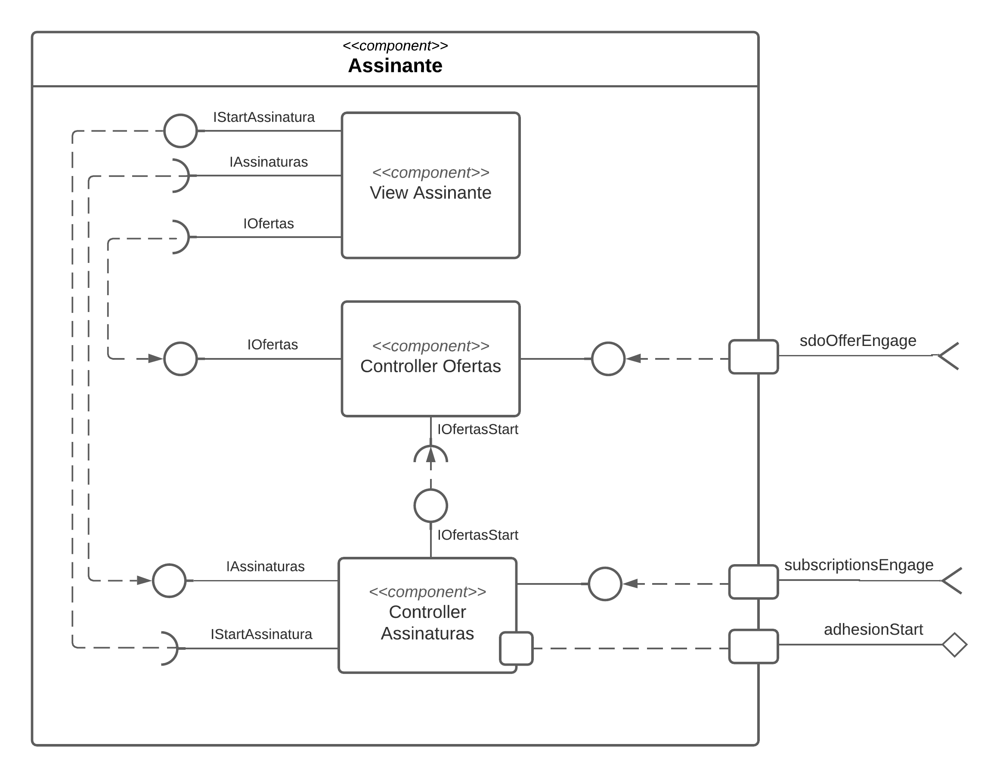

### Detalhamento da interação de componentes

* O componente `Controller Assinaturas` ao receber uma mensagem de tópico "`subscriptions/all`", provê para a view a listagem de tipos de assinaturas disponíveis através da interface `IAssinaturas`.
* O componente `Controller Assinaturas` ao receber do componente viewAssinatura uma mensagem através da interface `IStartAssinatura`, dispara no tópico "`adhesion/{subscritionId}/{user}`" a solicitação de adesão a um plano de assinatura pela interface adhesionStart.
* O componente `Controller Ofertas` ao receber uma mensagens nos tópicos referentes "`offer/+/+`", provê para a viewAssinatura a listagem de ofertas de produtos utilizando a iterface `IOfertas`.
* O componente `View Assinante` é o responsável por exibir graficamente as mensagens trocadas com o barramento. Ele possui a interface provida `IStartAssinatura` onde é possível o usuário solicitar a adesão em algum plano de assinatura. Possui também a interface requerida `IAssinaturas` onde recebe um conjunto de tipos de planos de assinatura para exibí-los na interface. Paralelamente a isso, possui também a interface requerida `IOfertas` onde recebe uma lista de ofertas para serem disponibilizadas para o assinante.

## Componente `ViewAssinante`

> Este componente tem como objetivo realizar a renderização dos dados em tela. Ela recebe dados de assinaturas e ofertas. Como serviço, oferece a opção de “startar” uma assinatura atráves da interface `IStartAssinatura`
 
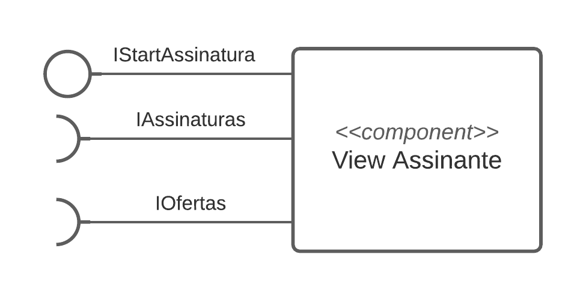

**Interfaces**
> - IStartAssinatura
> - IAssinaturas
> - IOfertas
 
## Componente `Controller Ofertas`
 
> Este componente tem como objetivo ser uma controladora do componente maior, focando em ofertas. Neste caso, ele pega o que foi “escutado” no barramento pela interface sdoOfferEngage e provém para a view, através da interface IOfertas as informações das ofertas obtidas. Possui uma interface requerida IOfertasStart onde recebe do controller Assinaturas o comando para exibir as ofertas referente ao plano do assinante.
 
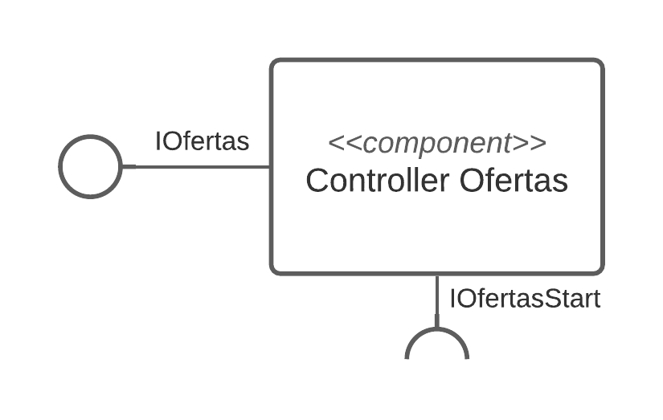
 
**Interfaces**
> - IOfertas
> - IOfertasStart
 
## Componente `Controller Assinaturas`

> Este componente tem como objetivo ser uma controladora do componente maior, focando em assinaturas. Neste caso, ele pega o que foi “escutado” no barramento pela interface subscritionsEngage e provém para a view, através da interface IASSinaturas as informações das ofertas obtidas. Esse componente, também é responsável por iniciar uma adesão de uma assinatura. Isso é possível, pois ele requer uma interface IStartAssinatura, a qual é provida pela ViewAssinante. Ao obter o “start” da assinatura, a mesma sai do componente maior e é enviado para o barramento através da interface adhesionStart. Possui uma interface IOfertasStart para ao seu iniciado, verifica se o usuário é um assinante e envia o comando para o controller ofertas para ser exibidos as ofertas.
 
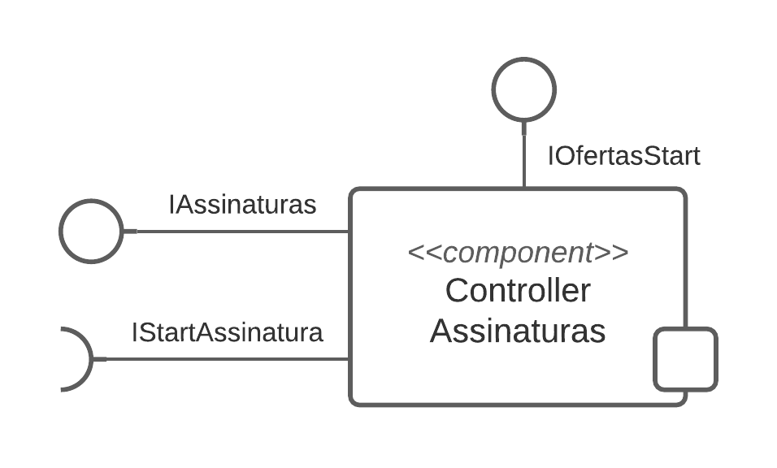

**Interfaces**
> - IAssinaturas
> - IStartAssinatura
> - IOfertasStart

As interfaces listadas são detalhadas a seguir:

## Detalhamento das Interfaces

### Interface `IStartAssinatura`

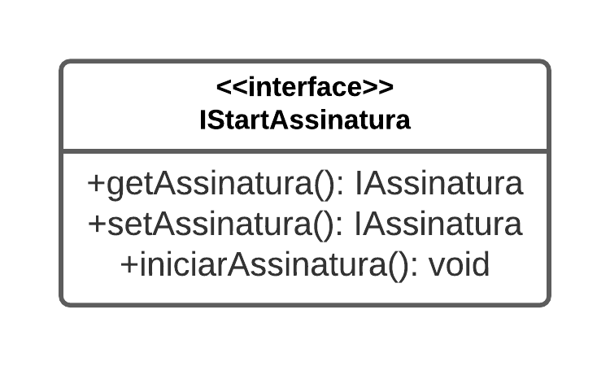

Interface responsável por dar o inicio a uma assinatura, ou seja, o consumidor virar de fato um assinante.

Método | Objetivo
-------| --------
`getAssinatura` | Retorna a assinatura que foi escolhida pelo consumidor através da view.
`setAssinatura` | Define a assinatura que o consumidor escolheu.
`iniciarAssinatura` | Através do getAssinatura, obtém a assinatura escolhida pelo consumidor e faz com que o consumidor se torne de fato um assinante do marketplace.

### Interface `IAssinaturas`

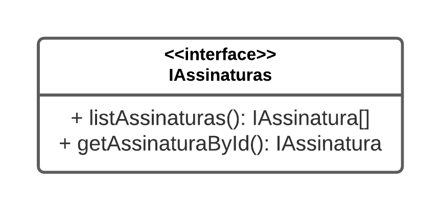

Responsável por realizar a listagem das assinaturas disponiveis para o consumidor.

Método | Objetivo
-------| --------
`listAssinaturas` | Retorno todas as assinaturas que é possível adquirir.
`getAssinaturaById` | Retorna uma unica assinatura de acordo com o ID. Utilizado para filtrar uma assinatura em específico.

### Interface `IOfertas`

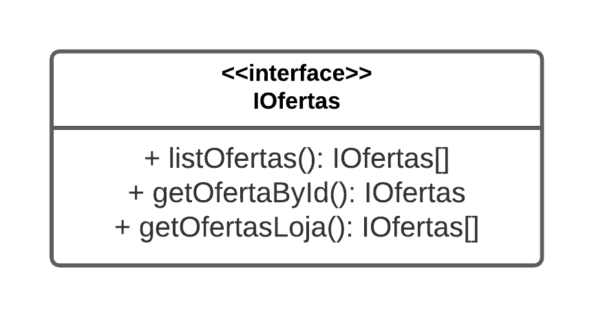

Responsável por realizar a listagem das ofertas disponiveis para o consumidor.

Método | Objetivo
-------| --------
`listOfertas` | Retorno todas as ofertas processadas pelos SDOs.
`getOfertaById` | Retorna uma unica oferta de acordo com o ID. Utilizado para filtrar uma oferta em específico.
`getOfertasLoja` | Retorna as ofertas de uma loja. Utilizado durante a filtragem na view do consumidor, pesquisando por lojas.

### Interface `IOfertasStart`

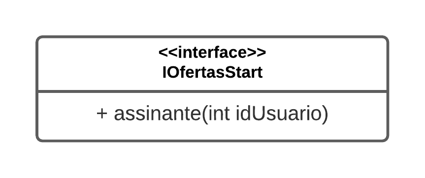

Responsável por comunicar se o usuário é assinante e iniciar as exibição das ofertas.

Método | Objetivo
-------| --------
`assinante` | Chama o componente ofertas passando o id o assinante/usuário

## Diagrama do Nível 3

Uma captura de tela da proposta de design da tela de início do assinante contendo as recomendações
filtradas pelos SDO pode ser vista na imagem a seguir:

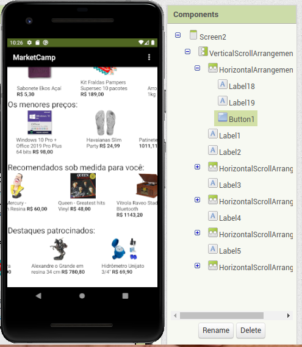

O diagrama mostrando a interação dos subcomponentes da View Ofertas por meio de eventos
com os Controllers Assinante e Ofertas pode ser visto na imagem seguinte:

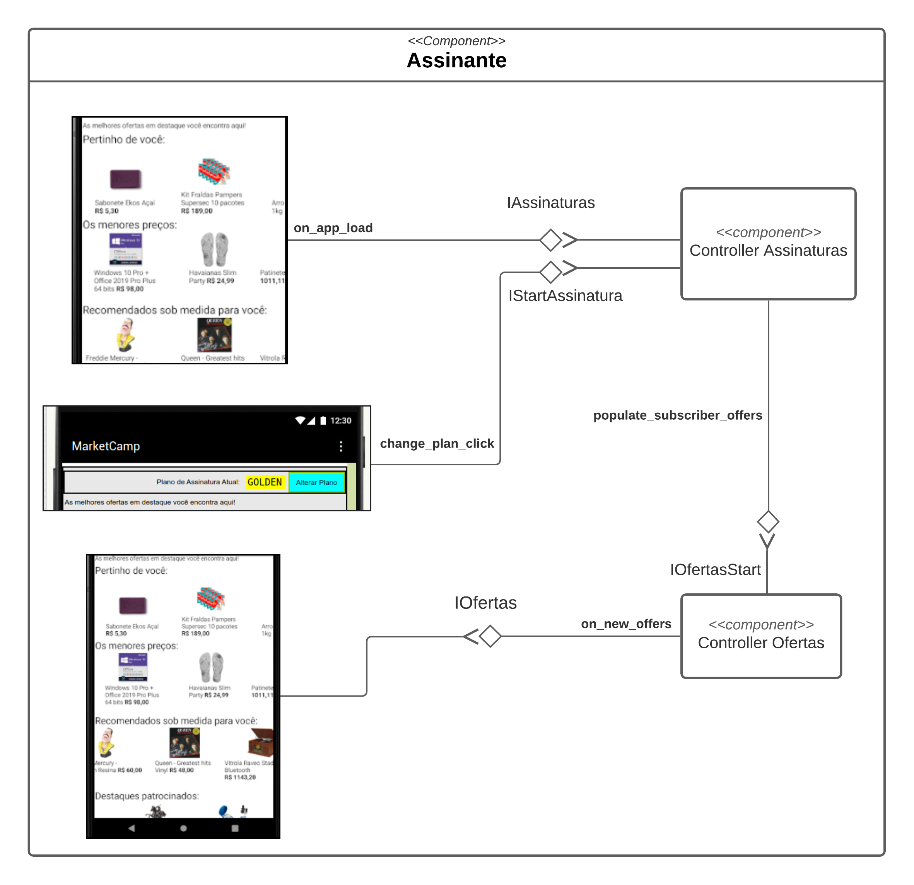

### Detalhamento da interação de componentes

* Ao carregar o app, o Controller Assinaturas é notificado do usuário ativo para verificar se este
é um assinante. 

* Validada essa informação o Controller Ofertas é acionado pelo evento
`populate_subscriber_offers` emitido pelo Controller Assinaturas para popular parte da tela
inicial do assinante com as ofertas filtradas pelos serviços de distribuição de ofertas
quais foram publicadas anteriormente no barramento durante a coreografia disparada pelo
JobOfertaDoDia e realizada pelas lojas e pelos componentes SDO.

* Uma lista de produtos em oferta segregados pelas 4 naturezas de ofertas consideradas
neste protótipo é então passada do Controller Ofertas para a View. As referidas 4 naturezas
são as modeladas pelos 4 SDO previamente apresentados (SDOMaisProximo, SDOMenorPreco,
SDOPerfilAssinante, SDOPatrocinados).

---
[Link](https://github.com/LeoMartinsBDS/TrabalhoEquipe5_INF331) do projeto no github a parte (histórico).