# Apresentação da Equipe e Relatório do Projeto

# Projeto `Final`

# Equipe
* `André Fagundes Carvalho`
* `Carolina Gonçalves Mira`
* `Érmiston Luiz Reis Tavares`
* `Gabriel Rodrigues Modesto`
* `Luciano Sávio de Oliveira`
* `Vinicius Del Padre`

# Nível 1

> Este projeto descreve o detalhamento da modelagem baseada em componentes referente ao tema: "Evolução do Marketplace".
Para o primeiro nível foram descritas as interações com destaque no Processo de Lançamento e Distribuição de Ofertas, considerando um maior nível de granularidade dos módulos do sistema.
Foram representados o diagrama do processo, o detalhamento dos componentes e das interfaces/mensagens, e a interação de um processo de compra completo.

## Diagrama Geral do Nível 1 -  Processo de distribuição de ofertas

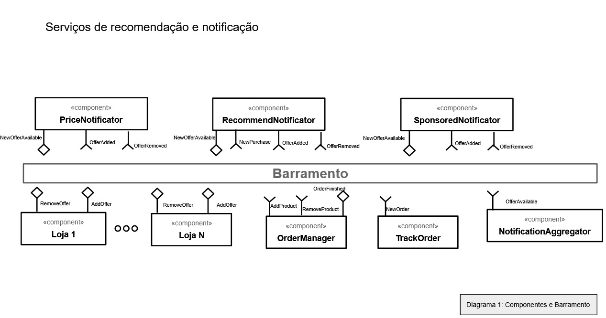

### Detalhamento da interação de componentes

* Os componentes Loja indicam uma atualização na oferta por meio da mensagem Offer. Quando novo(s) produto(s) é(são) disponibilizado(s), é enviado uma mensagem offer/added/{storedId}. Da mesma forma, quando este não está disponível mais, uma mensagem offer/removed/{storeId} é enviada.
* Todos os componentes de Notification (Price, Recommendation, Sponsored) escutam essas mensagens para saber os produtos disponíveis para oferta.
* Além disso, o componente Recommendation escuta todas as contas efetuadas através do tópico “purchase/clientId/+”. Dessa forma, o componente consegue criar recomendações personalizadas para cada cliente de acordo com o histórico de compras.
* Com cada componente de sugestão de produtos envia uma mensagem:
  * O componente Price publica mensagens com o tópico notification/price/clientId
  * O componente Recommendation publica mensagens com o tópico notification/recommendation/clientId
  * O componente Sponsored publica mensagens com o tópico notification/sponsored/clientId
* O componente NotificationAggregator escuta os seguintes os tópicos na seguinte forma “notification/#”. Assim, o agregador consegue juntar todas as recomendações dos 3 componentes e enviar as notificações para os clientes. Com as notificações e sugestões recebidas pelo cliente, ele pode escolher produtos para serem adicionados. 
* O componente OrderManager escuta modificações no pedido pelas interfaces AddProduct (product/add/{orderId}/#) e RemoveProduct (product/remove/{orderId}/#). Após a finalização do pedido, uma mensagem é gerada através da interface OrderFinished com o tópico order/finished/{clientId}/{orderId}. Dois componentes escutam essas mensagens: RecommendNotificator e TrackOrder, com o tópico order/finished/#. O componente RecommendNotificator utiliza essas informações para gerar recomendações de produtos para cada cliente. Já o TrackOrder utiliza esse novo pedido para fazer o rastreio do pedido.

## Componente `PriceNotificator`

> Identifica uma nova oferta realiza recomendações de acordo com o preço buscado pelo cliente.

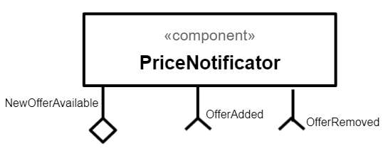

## Componente `RecommendNotificator`

> Identifica uma nova oferta e realiza recomendações de acordo com compras anteriores registradas no histórico. 

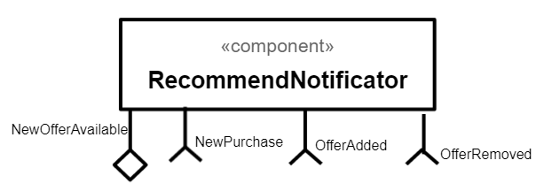

## Componente `SponsoredNotificator`

> Identifica uma nova oferta e realiza recomendações que foram patrocinadas por lojas parceiras.

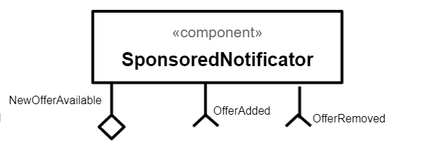

## Componente `Loja`

> Representa a empresa/loja e adiciona ou remove ofertas.

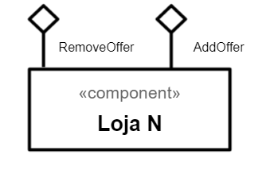

## Componente `OrderManager`

> Adiciona ou remove produtos desejados e finaliza o pedido.

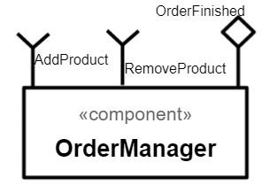

## Componente `TrackOrder`

> Recebe uma identificação de pedido e informa o cliente sobre o rastreio.

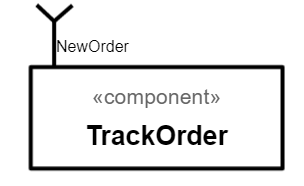

## Componente `NotificationAggregator`

> Executa a união das recomendações feitas pelos componentes PriceNotificator, RecommendNotificator e SponsoredNotificator e envia ao cliente.

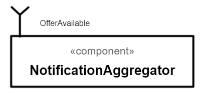

**Interfaces**
> Listagem das interfaces do componente.

As interfaces listadas são detalhadas a seguir:

## Detalhamento das Interfaces

### Interface `AddOffer`

> Resumo do papel da interface.

Tipo | Objetivo
-------| --------
`source` | Adiciona uma oferta ao barramento de comunicação.

### Interface `OfferAdded`

> Resumo do papel da interface.

Tipo | Objetivo
-------| --------
`sink` | Recebe uma ação de oferta adicionada.

### Interface `RemoveOffer`

> Resumo do papel da interface.

Tipo | Objetivo
-------| --------
`source` | Remove uma oferta antes adicionada ao barramento de comunicação.

### Interface `OfferRemoved`

> Resumo do papel da interface.

Tipo | Objetivo
-------| --------
`sink` | Recebe uma ação de oferta removida.

### Interface `NewPriceAvailable`

> Resumo do papel da interface.

Tipo | Objetivo
-------| --------
`source` | Notifica a existência de um novo preço de produto.

### Interface `NewRecommendationAvailable`

> Resumo do papel da interface.

Tipo | Objetivo
-------| --------
`source` | Notifica a existência de uma nova recomendação de produto.

### Interface `NewSponsoredAvailable`

> Resumo do papel da interface.

Tipo | Objetivo
-------| --------
`source` | Notifica a existência de uma nova recomendação patrocinada de produto.

### Interface `NotificationToSend`

> Resumo do papel da interface.

Tipo | Objetivo
-------| --------
`sink` | Recepciona as notificações emitidas pelos componentes de recomendação.

### Interface `OrderFinished`

> Resumo do papel da interface.

Tipo | Objetivo
-------| --------
`source` | Indica que um pedido foi finalizado.

### Interface `NewPurchase`

> Resumo do papel da interface.

Tipo | Objetivo
-------| --------
`sink` | Recebe o evento de uma compra realizada para referência de histórico de compras.

### Interface `NewOrder`

> Resumo do papel da interface.

Tipo | Objetivo
-------| --------
`sink` | Recebe o evento de uma compra realizada para rastreio.

> Interfaces:

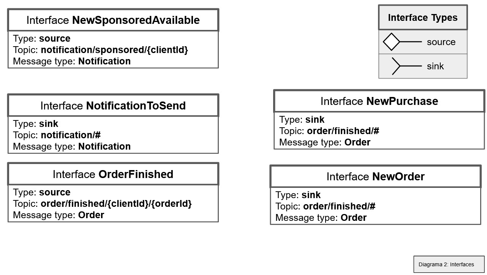

> Mensagens JSON utilizadas nas interfaces:

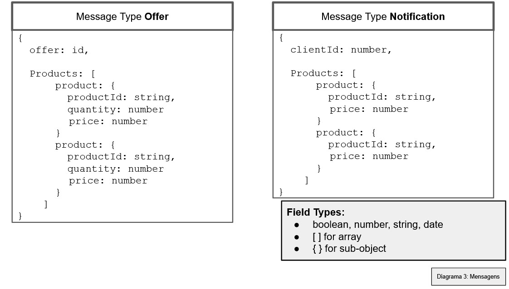

# Nível 2

## Diagrama do Nível 2

> 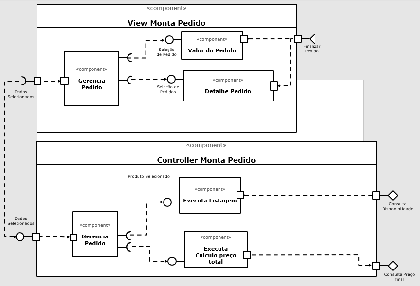

### Detalhamento da interação de componentes

* O componente `Gerencia Pedido` envia a quantidade de produtos selecionados com seus respectivos valores para o componente `Valor do Pedido`. Este por sua vez envia o tópico "`produto`" para a interface `Finalizar Pedido`. Ao receber uma mensagem de tópico "`produto`", são listados a disponibilidade e preço final dos produtos.
* O componente `Detalhe Pedido` recebe os produtos selecionados da interface `Finalizar Pedido` e retorna para o componente `Gerencia Pedido`, confirmando assim os produtos selecionados. 
* O componeten `Gerencia Pedido` envia os dados para o componente `Executa Listagem`. Este por sua vez executa a consulta de disponibilidade através da interface `Consulta Disponibilidade`.
* Estando disponível os produtos, o componente `Gerencia Pedido` realiza a interação através do comunicador `Dados Selecionados` e envia os dados para o componente `Executa Calculo preço total`. Este por sua vez calcula o preço total através da interface `Consulta Preço final`.

## Componente `Gerencia Pedido View`

> Envia quantidade e valores de produtos selecionados.

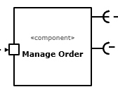

## Componente `Valor do Pedido`

> Envia o tópico "`produto`" para a interface `Finalizar Pedido`.

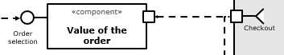

## Componente `Detalhe do Pedido`

> Recebe os produtos selecionados da interface `Finalizar Pedido` e retorna para o componente `Gerencia Pedido`.

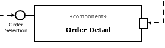

## Componente `Gerencia Pedido Controller`

> Envia os dados para o componente `Executa Listagem`.
> Envia os dados para o componente `Executa Calculo preço total`.

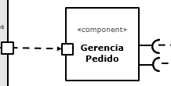

## Componente `Executa Listagem`

> Executa a consulta de disponibilidade através da interface `Consulta Disponibilidade`.

## Componente `Executa Calculo Preço Total`

> Calcula o preço total através da interface `Consulta Preço final`.

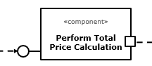

**Interfaces**
> Listagem das interfaces do componente.

As interfaces listadas são detalhadas a seguir:

## Detalhamento das Interfaces

### Interface `ConsultarDisponibilidade`

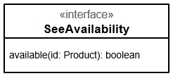

> Resumo do papel da interface.

Método | Objetivo
-------| --------
`disponivel` | Retorna um booleano que indica se o produto em questão está disponível ou não, tendo como parâmetro o identificador `id` do produto

### Interface `ConsultarPrecoFinal`

> Resumo do papel da interface.

Método | Objetivo
-------| --------
`calculoFrete` | Retorna o valor total do custo referente ao frete, tendo como parâmetro a entidade produto
`calculoUnitario` | Retorna o valor total da unidade do produto, tendo como parâmetro a entidade produto

### Interface `FinalizarPedido`

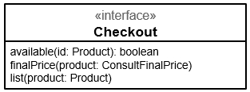

> Resumo do papel da interface.

Método | Objetivo
-------| --------
`disponivel` | Retorna um booleano que indica se o produto em questão está disponível ou não, tendo como parâmetro o identificador `id` do produto
`precoFinal` | Retorno o preco final do produto conforme consulta do preco final do produto
`listagem` | Retorna a listagem de produtos tendo como parâmetro a entidade produto

## Diagrama do Nível 3

> Apresente uma imagem com a captura de tela de seu protótipo feito no MIT App Inventor, conforme modelo a seguir:

> Apresente o diagrama referente ao protótipo conforme o modelo a seguir:

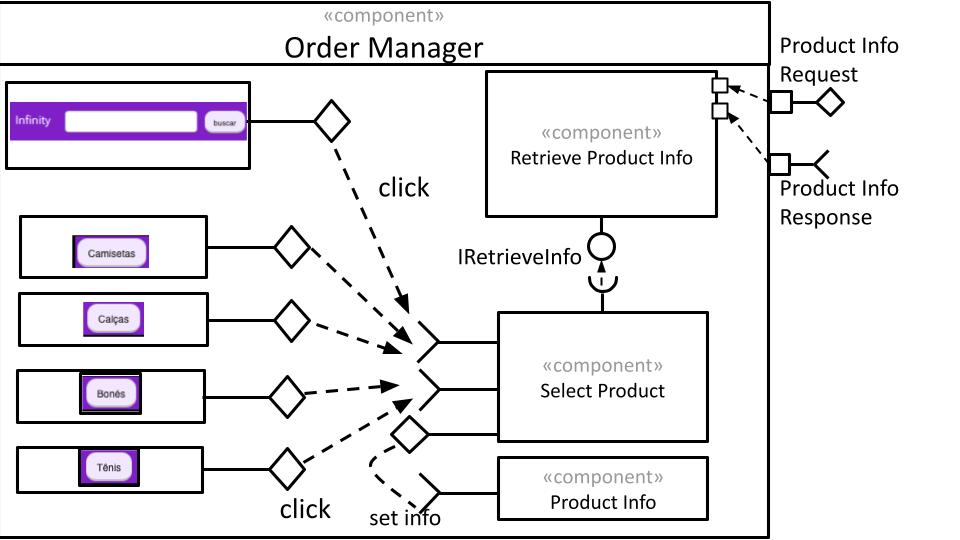
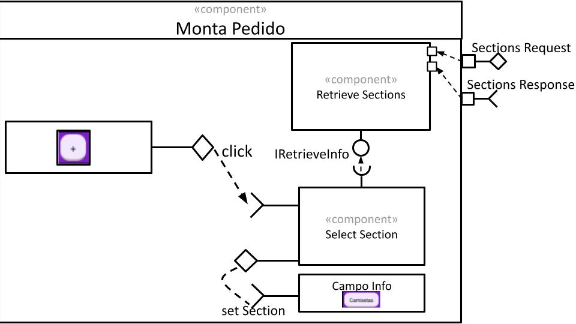
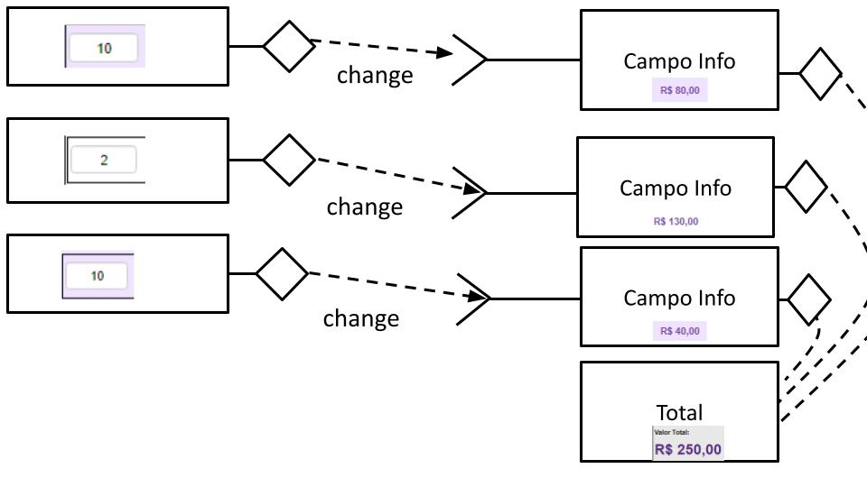

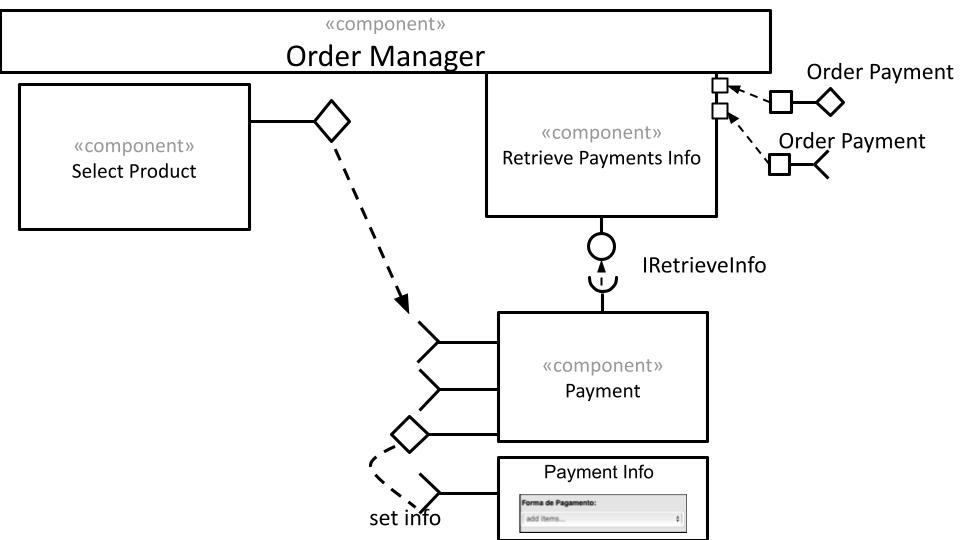
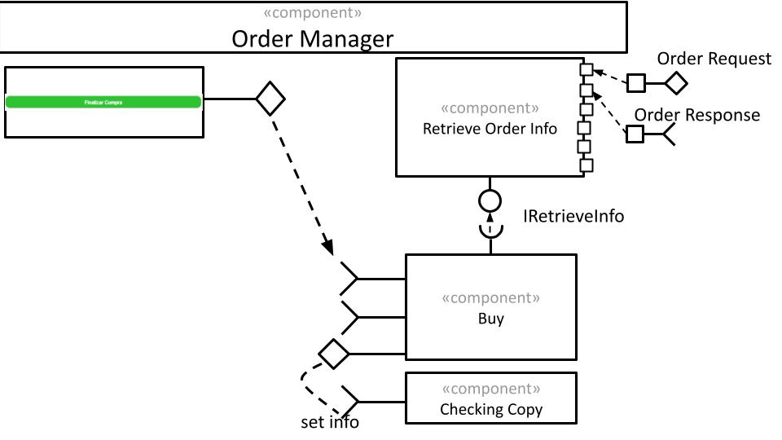

### Detalhamento da interação de componentes

> A renderização da tela começa com o carregamento das formas de pagamento, que são provenientes do servidor, representados na [imagem 005](images/nivel3/005.jpg). 
> Após a construção da tela, o usuário interage mudando a quantidade dos produtos, conforme [imagem 003](images/nivel3/003.jpg), que acarreta na alteração do valor agregado do produto, além da atualização do total da compra.
> Caso o usuário deseje remover algum produto, é disparado o fluxo representado pela [imagem 004](images/nivel3/004.jpg) que acarreta na atualização no valor final da compra.
> Ainda é possível adicionar mais produtos, clicando nas seções disponíveis ou pode buscar textualmente, conforme [imagem 001](images/nivel3/001.jpg) e [imagem 002](images/nivel3/002.jpg). As  informações do produto será buscado no servidor e ao retornar as informações, a aplicação irá redirecionar para o componente relacionado ao produto escolhido.
> Quando a compra estiver pronta, o cliente pode iniciar o fluxo de finalização, seguindo a [imagem 006](images/nivel3/006.jpg). As informações de compra será enviada para o servidor e ao retornar a confirmação, o aplicativo irá redirecionar para o componente de compra realizada.

> [Infinity](resources/Infinity.aia)