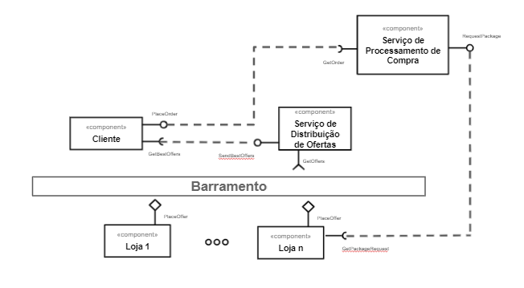
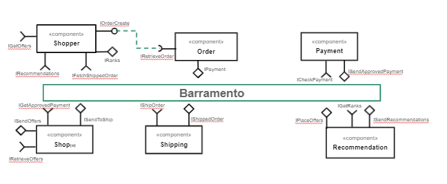
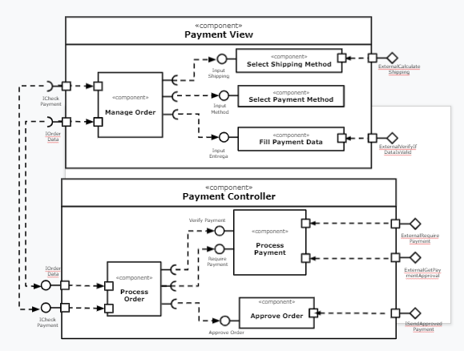
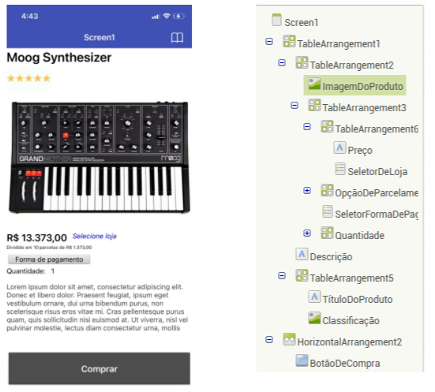
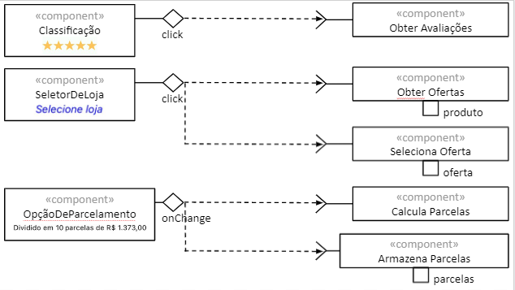
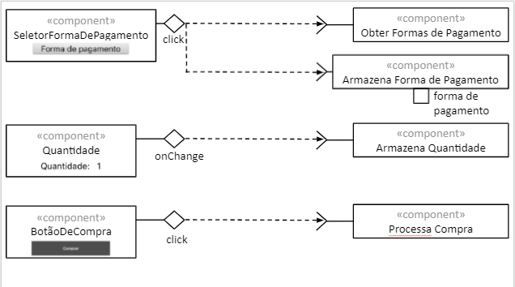

# Projeto `marketplace`
# Equipe 6

Integrantes

- Altieres S. Netto
- Byron Alejandro Acuña Acurio 
- Gustavo Gini 
- Juliana Cardoso Malton 
- Sophia Carvalho Lancini

# Nível 1

## Diagrama Geral do Nível 1

> Diagramas descritivos da visão geral do sistema

### Detalhamento da interação de componentes

#### Processo de compra
- O componente Cliente faz o pedido de compra pela interface PlaceOrder enviando os dados da compra Order
- O componente Serviço de Processamento de Compra recebe Order pela interface GetOrder
- O Serviço de Processamento de Compra por sua vez envia uma mensagem contendo PackageInfo pela interface RequestPackage
- O componente Loja recebe essa mensagem pela interface GetPackageRequest

#### Processo de lançamento e distribuição de ofertas
- O componente Loja envia suas ofertas para o tópico offer através da interface PlaceOffer.
- O Serviço de Distribuição de Ofertas por sua vez recebe essas ofertas com a interface GetOffers.

- O processo de compra inicia através do componente SHOPPER que cria um pedido através da interface IOrderCreate.
- O componente ORDER recebe o pedido, ele cria um novo pedido e posta através da interface ICheckPayment no tópico /payment/order/<orderId>/approved caso a compra tenha sido aprovada ou no tópico /payment/order/<orderId>/denied. 
- No caso da compra aprovada o loja, componente SHOP, posta uma mensagem para envio da mercadoria para o componente Shipping 
- Os componentes SHOP publicam no barramento as mensagens de tópico “offer/<offer_id>/place” através da interface ISendOffers.
- O componente RECOMENDATION assina o barramento as mensagens de tópico “offer/<offer_id>/place” através da interface IPlaceOffers.
- O componente RECOMENDATION assina o barramento as mensagens de tópico “recommendations/<rcm_type>/get” através da interface IGetRanks.
- O componente RECOMENDATION publica no barramento as mensagens de tópico “recommendations/<rcm_type>/get” através da interface ISendRecommendation.
- O componente SHOPPER publica no barramento as mensagens de tópico “ranks/<rnk_type>/send” através da interface IRanks.
- O componente SHOPPER assina o barramento as mensagens de tópico “recommendation/<rcm_type>/get” através da interface IRecommendations.
- O componente SHOPPER assina o barramento as mensagens de tópico “ship/<order_id>/<order_status>/track” através da interface IFetchShippedOrdes.
- O componente SHOP assina o barramento as mensagens de tópico “payment/<order_id>/<status>/send” através da interface IGetApprovedPayment.
- Os componentes SHOP publica no barramento as mensagens de tópico “ship/<order_id>/<order_status>/update” através da interface ISendToShips.
- O componente SHIPPING assina o barramento as mensagens de tópico “ship/<order_id>/<order_status>/update” através da interface IShipOrder.
- O componente SHIPPING publica no barramento as mensagens de tópico “ship/<order_id>/<order_status>/track” através da interface IShippingOrder.
- O componente PAYMENT assina o barramento as mensagens de tópico “payment/<order_id>/verify” através da interface ICheckPayment.
- O componente PAYMENT publica no barramento as mensagens de tópico “payment/<order_id>/<status>/send” através da interface ISendApprovedPayment.
- O componente ORDER publica no barramento as mensagens de tópico “payment/<order_id>/<status>/send” através da interface IPayment.
- O componente ORDER solicita a ordem criada diretamente ao componente SHOPPER através da interface IRetrieveOrder.

## Componente `Shopper`

O componente Shopper é responsável por gerenciar todas as funcionalidades do comprador.
Seus serviços disponíveis são: 
* Criar um pedido;
* Iniciar o ranqueamento de recomendações de compra.

**Interfaces**
> Listagem das interfaces do componente.

* IRanks
* IRecommendations
* IOrderCreate
* IFetchShippedOrder

## Detalhamento das Interfaces

### Interface `IRanks`

A interface IRanks posta mensagens no barramento com o objetivo de iniciar o ranqueamento de recomendações de compra para o serviço.

* Type: `source`
* Topic: `ranks/<rnk_type>/send`
* Message type: `Ranks`

~~~json
{
  rnk_type: string,
  total: number,
  items: [
	{
   	itemid: string,
   	quantity: number,
    price: number
	}
  ]
}
~~~

### Interface `IRecommendations`

A interface IRecommendations consume mensagens no barramento com o objetivo de devolver ao comprador os produtos que foram selecionador por ele de acordo com as suas recomendações.

* Type: `sink`
* Topic: `recommendation/<rcm_type>/get`
* Message type: `Recommendation`

~~~json
{
  rcm_type: string,
  total: number,
  items: [
	{
   	itemid: string,
   	quantity: number,
    price: number
	}
  ]
}
~~~

### Interface `IOrderCreate`

A interface IOrderCreate envia um pedido a ser criado.

* Type: `source`
* Topic: `order/<order_id>/place`
* Message type: `Order`

~~~json
{
  orderId: string,
  orderDate: date,
  total: double,
  shippingCost: double,
  items: [
	{
   	itemid: string,
   	quantity: number,
    price: number
	}],
  buyerUserId: string,
  shippingAddress: {
    address: string,
    city: string,
    state: string,
    country: string,
    cep: string
  } 
}
~~~

### Interface `IFetchShippedOrder`

A interface IFetchShippedOrder consome o status do despacho da mercadoria.

* Type: `sink`
* Topic: `package/<order_id>/get`
* Message type: `PackageInfo`

~~~json
{
  order_id: number,
  order_status: string,
  shipping_method: string,
  total_value: decimal(2),
  items: [
	{
   	  itemid: string,
   	  quantity: number,
  price: number
	}
  ]
}

~~~

## Componente `Order`

O componente Order é responsável por gerenciar todas as funcionalidades para realizar um pedido.
Seus serviços disponíveis são: 
* Criar um pedido;
* E enviar/verificar o pagamento.

**Interfaces**
> Listagem das interfaces do componente.

* IRetrieveOrder
* IPayment

## Detalhamento das Interfaces

### Interface `IRetrieveOrder`

A interface IRetrieveOrder recebe os disparos para a criação de um novo pedido.

* Type: `sink`
* Topic: `offers/<offer_id>/get`
* Message type: `Offers`

~~~json
{
  orderId: string,
  orderDate: data,
  total: double,
  shippingCost: double,
  items: [
	{
   	itemid: string,
   	quantity: number,
    price: number
	}],
  buyerUserId: string,
  shippingAddress: {
    address: string,
    city: string,
    state: string,
    country: string,
    cep: string
  } 
}
~~~

### Interface `IPayment`

A interface IPayment posta no barramento para validar os dados de pagamento do comprador.

* Type: `sink`
* Topic: `payment/<order_id>/verify`
* Message type: `Payment`

~~~json
{
  order_id: number,
  order_status: enum,
  payment_id: string,
  payment_type: string,
  total_value: double,
  updated_at: datetime,
  created_at: datetime
}
~~~

## Componente `Order`

O componente Order é responsável por gerenciar todas as funcionalidades para realizar um pedido.
Seus serviços disponíveis são: 
* Criar um pedido;
* E enviar/verificar o pagamento.

**Interfaces**
> Listagem das interfaces do componente.

* IRetrieveOrder
* IPayment

## Detalhamento das Interfaces

### Interface `IRetrieveOrder`

A interface IRetrieveOrder recebe os disparos para a criação de um novo pedido.

* Type: `sink`
* Topic: `order/<order_id>/get`
* Message type: `Order`

~~~json
{
  orderId: string,
  orderDate: data,
  total: double,
  shippingCost: double,
  items: [
	{
   	itemid: string,
   	quantity: number,
    price: number
  }],
  buyerUserId: string,
  shippingAddress: {
    address: string,
    city: string,
    state: string,
    country: string,
    cep: string
  } 
}
~~~

### Interface `IPayment`

A interface IPayment posta no barramento para validar os dados de pagamento do comprador.

* Type: `sink`
* Topic: `payment/<order_id>/verify`
* Message type: `Payment`

~~~json
{
  order_id: number,
  order_status: enum,
  payment_id: string,
  payment_type: string,
  total_value: double,
  updated_at: datetime,
  created_at: datetime
}
~~~

## Componente `Payment`

O componente Payment é responsável por gerenciar todas as funcionalidades para realizar pagamento.
Seus serviços disponíveis são: 
* Verificar os dados do pagamento;
* E enviar os pagamentos aprovados.

**Interfaces**
> Listagem das interfaces do componente.

* ICheckPayment
* ISendApprovedPayment

## Detalhamento das Interfaces

### Interface `ICheckPayment`

A interface ICheckPayment recebe os disparos para a validação dos dados do pagamento.

* Type: `sink`
* Topic: `payment/<order_id>/verify`
* Message type: `Payment`

~~~json
{
  updated_at: datetime,
  created_at: datetime,
  order : {
    order_id: number,
    order_status: enum,
  }, 
  payment: [{
    payment_id: string,
    payment_type: string,
    total_value: double,
  }]  
}
~~~

### Interface `ISendApprovedPayment`

A interface IPayment posta no barramento somente os pagamentos aprovados

* Type: `source`
* Topic: `payment/<order_id>/<status>/send`
* Message type: `Payment`

~~~json
{
  updated_at: datetime,
  created_at: datetime,
  order : {
    order_id: number,
    order_status: enum
  }, 
  payment: [{
    payment_id: string,
    payment_type: string,
    total_value: double,
    status: enum
  }]  
}
~~~

## Componente `Shipping`

O componente Shipping é responsável por gerenciar todas as funcionalidades para realizar a entrega do produto.
Seus serviços disponíveis são: 
* Verificar os dados para o despacho;
* E realizar o envio do pedido.

**Interfaces**
> Listagem das interfaces do componente.

* IShipOrder
* IShippedOrder

## Detalhamento das Interfaces

### Interface `IShipOrder`

A interface IShipOrder recebe os disparos para a validação dos dados de despacho.

* Type: `source`
* Topic: `ship/<order_id>/<order_status>/update`
* Message type: `Ship`

~~~json
{
  order_id: number,
  order_status: string,
  shipping_method: string,
  location: {
    zipcode: string,
    address: string,
    state: string,
    city: string
  }
}
~~~

### Interface `IShippedOrder`

A interface IShippedOrder posta no barramento o andamento da entrega.

* Type: `sink`
* Topic: `ship/<order_id>/<order_status>/track`
* Message type: `Ship`

~~~json
{
  order_id: number,
  order_status: string,
  shipping_method: string,
  shipping_status: enum,
  location: {
    zipcode: string,
    address: string,
    state: string,
    city: string
  }
}
~~~

## Componente `Shop`

O componente Shop é responsável por gerenciar todas as funcionalidades para as lojas serem capazes de atender aos pedidos.
Seus serviços disponíveis são: 
* Enviar o pedido para despacho;
* E devolver as ofertas de acordo com as recomendações do comprador.

**Interfaces**
> Listagem das interfaces do componente.

* IRetrieveOffers
* ISendOffers
* IGetApprovedPayment
* ISendToShip

## Detalhamento das Interfaces

### Interface `IRetrieveOffers`

A interface IRetrieveOffers recebe os disparos .

* Type: `sink`
* Topic: `offers/<offer_id>/get`
* Message type: `Offers`

~~~json
{
  items: [
    {
		itemid: string,
		offerType: string,
    		offer: Offer
	}
  ]
}
~~~

### Interface `ISendOffers`

A interface ISendOffers posta no barramento a melhor oferta do lojista.

* Type: `source`
* Topic: `offers/<offer_id>/send`
* Message type: `Offers`

~~~json
{
  items: [
    {
		itemid: string,
		offerType: string,
    		offer: Offer
	}
  ]
}
~~~

### Interface `IGetApprovedPayment`

A interface IGetApprovedPayment consome no barramento os pedidos que tem pagamentos aprovados.

* Type: `source`
* Topic: `payment/<order_id>/<status>/send`
* Message type: `Payment`

~~~json
{
  updatedAt: datetime,
  createdAt: datetime,
  order : {
    orderId: number,
    orderStatus: enum
  }, 
  payment: [{
    paymentId: string,
    paymentType: string,
    totalValue: double,
    status: enum
  }]  
}
~~~

### Interface `ISendToShip`

A interface ISendToShip posta no barramento os pedidos aprovados que estão prontos para despacho.

* Type: `source`
* Topic: `package/<order_id>/request`
* Message type: `PackageInfo`

~~~json
{
  order_id: number,
  order_status: string,
  shipping_method: string,
  shipping_status: enum,
  location: {
    zipcode: string,
    address: string,
    state: string,
    city: string
  }
}
~~~

## Componente `Recommendation`

O componente Recommendation é responsável por gerenciar todas as funcionalidades para disparar as recomendações do pedido para os lojistas e devolver as ofertas para o comprador conforme seus critérios de ranqueamento
Seus serviços disponíveis são: 
* Enviar as ofertas para os lojistas;
* E enviar as ofertas para os compradores.

**Interfaces**
> Listagem das interfaces do componente.

* IGetOffers
* IPlaceOffers
* IGetRanks
* ISendRecommendations

## Detalhamento das Interfaces

### Interface `IGetOffers`

A interface IGetOffers recebe as ofertas dos lojistas.

* Type: `sink`
* Topic: `offer/<offer_id>/get`
* Message type: `Offer`

~~~json
{
  store: {
    storeId: string,
    location: {
      country: string,
      state: string,
      city: string,
      address: string,
      cep: string
  	}
  },
  product: {
    productId: string,
    quantityAvailable: number,
    unitaryPrice: number,
    availableQuantity: number,
  }
}
~~~

### Interface `IPlaceOffers`

A interface ISendOffers posta no barramento os critérios para as ofertas.

* Type: `source`
* Topic: `offer/<offer_id>/place`
* Message type: `Offer`

~~~json
{
  items: [
    {
		itemid: string,
		offerType: string,
    		offer: Offer
	}
  ]
}
~~~

### Interface `IGetRanks`

A interface IGetRanks consome no barramento os critérios de ranqueamento de recomendações de ofertas.

* Type: `source`
* Topic: `ranks/<rnk_type>/send`
* Message type: `Ranks`

~~~json
{
  rnk_type: string,
  total: number,
  items: [{
   	itemid: string,
   	quantity: number,
    price: number
	}]
}
~~~

### Interface `ISendRecommendations`

A interface ISendRecommendations posta no barramento as recomendações para o comprador.

* Type: `sink`
* Topic: `recommendation/<rcm_type>/send`
* Message type: `Recommendation`

~~~json
{
  rcm_type: string,
  total: number,
  items: [
	{
   	itemid: string,
   	quantity: number,
    price: number
	}]
}
~~~

# Nível 2

> Apresente aqui o detalhamento do Nível 2 conforme detalhado na especificação com, no mínimo, as seguintes subseções:

## Diagrama do Nível 2

> Apresente um diagrama conforme o modelo a seguir:

> 

### Detalhamento da interação de componentes

> O detalhamento deve seguir um formato de acordo com o exemplo a seguir:

- O componente PAYMENT assina o barramento mensagens de tópico “payment/<order_id>/verify”, através da interface ICheckPayment e dispara o gerenciamento do pagamento.
- Internamento o evento é atendido pelo componente Manage Order, que possui a responsabilidade requisitar informações de outras interfaces.
- O componente ManageOrder solicita o método de envio do componente Select Shipping Method através da interface Input Shipping.
- O componente ManageOrder solicita o método de pagamento do componente Select Payment Method através da interface Input Method.
- O componente ManageOrder solicita o método de preenchimento de dados do componente Fill Payment Data  através da interface Input Entrega.
- O componente Select Shipping Method assina o barramento mensagens, através da interface ExternalCalculateShipping  e dispara o cálculo do envio.
- O componente Fill Payment Data assina o barramento mensagens, através da interface ExternalVerifyIfDataIsValid  e dispara o cálculo do envio.\
- O componente PAYMENT assina o barramento mensagens de tópico “payment/<order_id>/verify”, através da interface ICheckPayment e dispara o processamento da ordem através do componente Process Order.
- Internamento o evento é atendido pelo componente Process Order, que possui a responsabilidade requisitar informações de outras interfaces.
- O componente Process Order solicita verificação do pagamento do componente Process Payment através da interface Verify Payment.
- O componente Process Order solicita o pagamento do componente Process Payment através da interface Require Payment.
- O componente Process Order solicita aprovação da ordem de pagamento do componente Approve Order através da interface Approve Order.
- O componente Process Payment solicita externamente  aprovação de pagamento e requisição de pagamento através das interfaces ExternalRequirePayment e ExternalGetPaymentApproval.
- O componente Approve Order envia externamente  aprovação de pagamento através da interface ISendApprovedPayment.

## Diagrama do Nível 3

> Apresente uma imagem com a captura de tela de seu protótipo feito no MIT App Inventor, conforme modelo a seguir:

> Apresente o diagrama referente ao protótipo conforme o modelo a seguir:

### Detalhamento da interação de componentes

- O componente Classificação ao receber um evento de clique, envia informações ao componente Obter Avaliações.
- O componente SeletorDeLoja ao receber um evento de clique, envia informações a dois componentes ObterOfertas que é relacionada a produtos e componente SelecionaOferta que é relacionado à recomendação de ofertas
- O componente OpçãoDeParcelamento ao receber um evento de mudança,  envia informações a dois componentes CalcullParcelas e componente ArmazenaParcela.
- O componente SeletorFormaDePagamento ao receber um evento de clique, envia informações a dois componentes ObterFormaDePagamento e o componente ArmazenaFormaDePagamento.
- O componente Quantidade ao receber um evento de mudança envia informações ao componente ArmazenaQuantidade.
- O componente BotãoDeCompra ao rebecer um evento de clique, envia informações ao componente ProcessaCompra.

