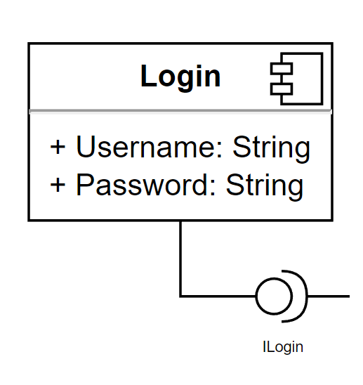
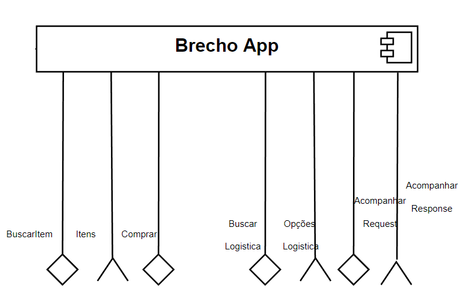
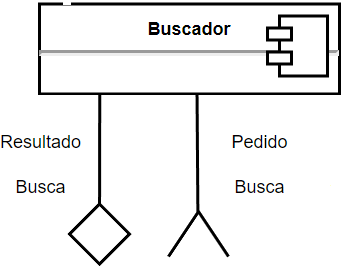
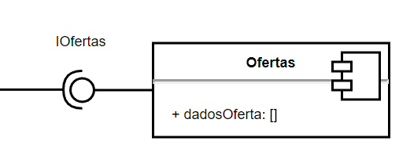
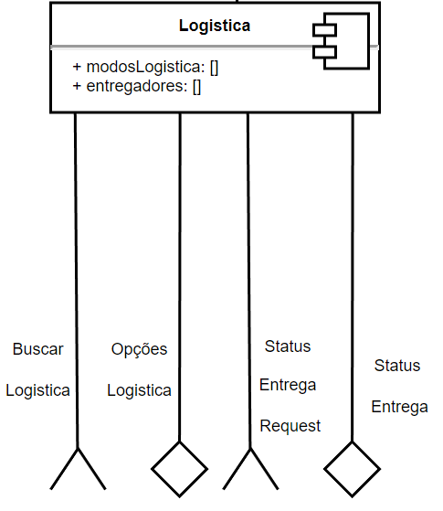
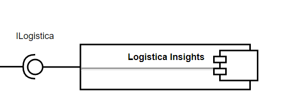
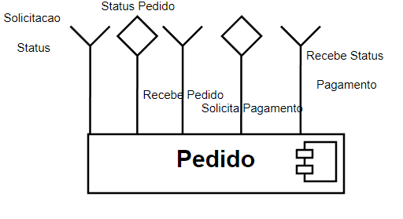
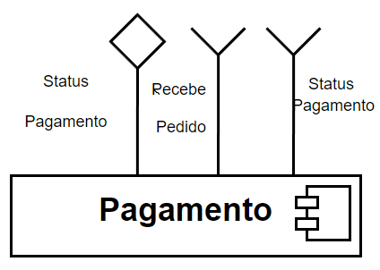
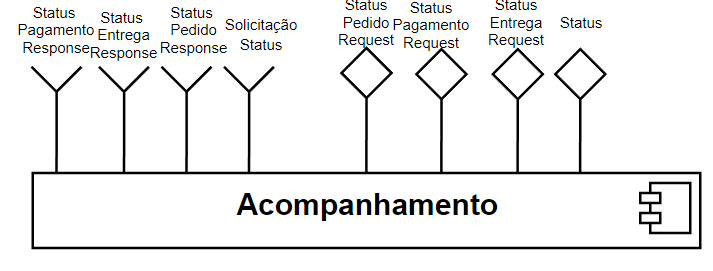

# Projeto Final

# Estrutura de Arquivos e Pastas

~~~
├── README.md  <- arquivo com o relatório do projeto
│
├── images     <- arquivos de imagens usadas no documento
│
└── app        <- aplicativo feito no MIT Inventor
~~~

# Relatório do Projeto

# Projeto `Brechó Online - Equipe 7`

# Equipe
* `Rafael Gonçalves Vastag`
# Nível 1

## Diagrama Geral do Nível 1

### Detalhamento da interação de componentes

* O componente `Login` recebe os atributos `Username` e `Password` para realizar a autenticação do usuário com sua conta no `BrechoApp`.

* O componente `BrechoApp` interage com `Login` através da interface `ILogin` para a autenticação do usuário. Esse é o componente central do sistema e é responsável por iniciar o fluxo de busca publicando uma mensagem no tópico `buscar/{userId}/request` através da interface `BuscarItem` e recebendo como resposta a mensagem publicada com `items/{userId}` por meio da interface `Itens`, nessa mensagem constará a lista de itens referentes a busca feita pelo usuário agregado com as ofertas disponíveis. Caso o usuário realize a compra de um desses itens será enviada uma mensagem no tópico  `pedido/{userId}/request` com os dados da compra. Este componente também é responsável por solicitar as opções de logistica disponíveis para o cliente publicando uma mensagem no tópico `entrega/{userId}/request` através da interface `BuscarLogistica` e recebendo como resposta a mensagem publicada com `entrega/{userId}/opcoes` por meio da interface `OpcoesLogistica`. O componente também solicita ao barramento através da interface `AcompanharRequest` e mensagem `status/{userId}/{pedidoId}` os status do pedido, recebendo esses dados como mensagem do tópico `status/{userId}/{pedidoId}/status/response`.
  
* O componente `Buscador` recebe uma mensagem `buscar/{userId}/request` da interface `PedidoBusca`, iniciando o processo de busca dos produtos. Esse componente interage com o componente `Ofertas` através da interface `IOfertas`, recebendo deste as ofertas relacionadas com a busca feita, em seguida posta no barramento uma mensagem em `items/{userId}` por meio da interface `ResultadoBusca` com os itens resultantes desta busca. 

* O componente `Logistica` recebe uma mensagem `entrega/{userId}/request` da interface `BuscarLogistica`, iniciando o processo de busca dos produtos. Esse componente interage com o componente `LogisticaInsights` através da interface `ILogistica`, recebendo deste as melhores opções de logistica para este cliente, em seguida posta no barramento uma mensagem em `entrega/{userId}/opcoes` por meio da interface `OpcoesLogistica` com os itens resultantes desta busca. Este componente também responde a solicitação do status da logistica recebendo uma mensagem postada no tópico `logistica/{userId}/{pedidoId}/status/request` através da interface `StatusEntregaRequest` e postando o status no tópico `logistica/{userId}/{pedidoId}/status` usando a interface `statusEntrega`. Esse componente possui dois parâmetros de entrada, modos de logistica e entregadores que alimentarão a inteligência responsável por selecionar as melhores opções de entrega e retornar ao solicitante. 

* O componente `Pedido` é responsável por processar o pedido e fazer a devolução do status do mesmo quando solicitado. O pedido é recebido através do tópico `pedido/{userId}/request` e interface de entrada `ReceberPedido` e status devolvido no tópico `pedido/{pedidoId}/{userId}/status/response` através da interface `StatusPedido`, o componente possui outra interface de saída para solicitação do pagamento, essa interface `SolicitaPagamento` posta uma mensagem no tópico `pagamento/{pedidoId}` e recebe como resposta na interface de entrada `RecebeStatusPagamento` os dados publicados no tópico `pagamento/{pedidoId}/status`. Além disso o pedido também recebe uma solicitação de indicação de status no tópico `pedido/{pedidoId}/{userId}/status` com a interface SolicitacaoStatus

* O componente `Pagamento` recebe dois tipos de mensagens de entrada através das interfaces `StatusPagamento` e `StatusPagamento`  e sempre retorna uma mensagem no tópico `pagamento/{pedidoId}/status` usando a interface de saída `StatusPagamento`. As mensagens de entrada são publicadas em `pagamento/{pedidoId}` e `pagamento/{pedidoId}/status` respectivamente.

* O componente `Acompanhamento` realiza o processo de agregação e consolidação dos status de entrega, pagamento e do pedido como um todo. Este componente possui as saídas que solicitam os dados de status para as respectivas estruturas postando as mensagens no tópicos de entrada que respondem o status, citados anteriormente. O componente de acompanhamento possui uma interface de entrada chamada `SolicitacaoStatus` que é responsável por disparar o processo de recuperação dos status, respondendo à uma mensagem publicada no tópico `status/{userId}/{pedidoId}` e publicando a resposta com os status consolidados por meio da interface `Status` no tópico  `status/{userId}/{pedidoId}/status/response`

## Componente `Login`

> Este componente responsável por realizar a autenticação do usuário.

**Interfaces**
> ILogin

**Parâmetros**
> Username

> Password

## Componente `BrechoApp`

> Este componente é responsável pelos fluxos principais do Brechó Online.

**Interfaces**
> BuscarItem

> Itens

> Comprar

> BuscarLogistica

> OpcoesLogistica

> AcompanharRequest

> ResultadoBusca

## Detalhamento das Interfaces

### Interface `BuscarItem`

> É responsável por enviar a solicitação de busca.

Dados da interface:
* Type: `source`
* Topic: `buscar/{userId}/request`
* Message type: `FindProductRequest`

Esquema das mensagens JSON:
~~~json
{
    userId: string,
    categoryId: string,
    key: string,
    typeId: number
}
~~~

### Interface `Itens`

> É responsável por receber a lista de itens referentes a busca feita

Dados da interface:
* Type: `sink`
* Topic: `items/{userId}`
* Message type: `FindProductResponse`

Esquema das mensagens JSON:
~~~json
{
    userId: string,
    key: string,
    categoryId: string,
    items: [
        {
            categoryId: string,
            productId: string,
            preco: number,
            quantidade: number,
            descricao: string,
            typeId: string
        }
    ]
}
~~~

### Interface `Comprar`

> É responsável por enviar os dados do pedido.

Dados da interface:
* Type: `source`
* Topic: `pedido/{userId}/request`
* Message type: `CompraRequest`

Esquema das mensagens JSON:
~~~json
{
    userId: string,
    pedido: [
        {
            categoryId: string,
            productId: string,
            preco: number,
            quantidade: number
        }
    ]
}
~~~

### Interface `BuscarLogistica`

> É responsável solicitar as opções de logística indicadas.

Dados da interface:
* Type: `source`
* Topic: `entrega/{userId}/request`
* Message type: `LogisticaResquest`

Esquema das mensagens JSON:
~~~json
{
    userId: string,
}
~~~

### Interface `OpcoesLogistica`

> É responsável por receber a lista de produtos recomendados.

Dados da interface:
* Type: `sink`
* Topic: `entrega/{userId}/opcoes`
* Message type: `LogisticaOpcoesResponse`

Esquema das mensagens JSON:
~~~json
{
    userId: string,
    logistica: [
        {
            logisticaId: string,
            descricao: string,
            price: number
        }
    ]
}
~~~

### Interface `AcompanharRequest`

> É responsável solicitar o consolidade dos status do pedido.

Dados da interface:
* Type: `source`
* Topic: `status/{userId}/{pedidoId}`
* Message type: `StatusRequest`

Esquema das mensagens JSON:
~~~json
{
    userId: string,
    pedidoId: string,
    paymentId: string
}
~~~

### Interface `ResultadoBusca`

> É responsável por receber a lista de produtos recomendados.

Dados da interface:
* Type: `sink`
* Topic: `status/{userId}/{pedidoId}/status/response`
* Message type: `StatusResponse`

Esquema das mensagens JSON:
~~~json
{
    userId: string,
    categoryId: string,
    key: string,
    typeId: number
}
~~~

## Componente `Buscador`

> Este componente é responsável pela busca de itens

**Interfaces**
> PedidoBusca

> ResultadoBusca

### Interface `PedidoBusca`

> É responsável por receber a mensagem com os dados para realizar a busca.

Dados da interface:
* Type: `sink`
* Topic: `buscar/{userId}/request`
* Message type: `FindProductRequest`

Esquema das mensagens JSON:
~~~json
{
    userId: string,
    categoryId: string,
    key: string,
    typeId: number
}
~~~

### Interface `ResultadoBusca`

> É responsável por retornar os itens buscados.

Dados da interface:
* Type: `source`
* Topic: `items/{userId}`
* Message type: `FindProductResponse`

Esquema das mensagens JSON:
~~~json
{
    userId: string,
    key: string,
    categoryId: string,
    items: [
        {
            categoryId: string,
            productId: string,
            preco: number,
            quantidade: number,
            descricao: string,
            typeId: string
        }
    ]
}
~~~

## Componente `Ofertas`

> Este componente responsável por realizar a busca de ofertas para o usuário.

**Interfaces**
> IOfertas

## Componente `Logística`

> Este componente é responsável por realizar a busca de opções de logistica.

**Interfaces**
> OpcoesLogistica

> BuscarLogistica

> StatusEntregaRequest

> StatusEntrega

**Parâmetros**
> modosLogistica

> entregadores

### Interface `BuscarLogistica`

> É responsável por receber a solicitação das opções de logística disponíveis.

Dados da interface:
* Type: `sink`
* Topic: `entrega/{userId}/request`
* Message type: `LogisticaResquest`

Esquema das mensagens JSON:
~~~json
{
    userId: string,
}
~~~

### Interface `OpçoesLogistica`

> É responsável por enviar o resultado das opções de logística disponíveis.

Dados da interface:
* Type: `source`
* Topic: `entrega/{userId}/opcoes`
* Message type: `LogisticaOpcoesResponse`

Esquema das mensagens JSON:
~~~json
{
    userId: string,
    logistica: [
        {
            logisticaId: string,
            descricao: string,
            price: number
        }
    ]
}
~~~

### Interface `StatusEntregaRequest`

> É responsável por receber a solicitação do status da entrega.

Dados da interface:
* Type: `sink`
* Topic: `logistica/{userId}/{pedidoId}/status/request`
* Message type: `StatusEntregaRequest`

Esquema das mensagens JSON:
~~~json
{

    userId: string
    pedidoId: string
}
~~~

### Interface `StatusEntrega`

> É responsável por retornar o status da entrega.

Dados da interface:
* Type: `source`
* Topic: `logistica/{userId}/{pedidoId}/status`
* Message type: `StatusEntregaResponse`

Esquema das mensagens JSON:
~~~json
{

    userId: string,
    pedidoId: string,
    status: number
}
~~~

## Componente `Logistica Insights`

> Este componente responsável por realizar a busca inteligente da melhor opção de logística.

**Interfaces**
> ILogistica

## Componente `Pedido`

> Este componente é responsável por registrar a compra/pedido efetuado.

**Interfaces**
> StatusPedido

> RecebePedido

> SolicitaPagamento

> RecebeStatusPagamento

> SolicitacaoStatus

### Interface `StatusPedido`

> É responsável por retornar o status do pedido.

Dados da interface:
* Type: `source`
* Topic: `pedido/{pedidoId}/{userId}/status/response`
* Message type: `StatusPedidoResponse`

Esquema das mensagens JSON:
~~~json
{
    userId: string,
    pedidoId: string,
    status: number
}
~~~

### Interface `SolicitacaoStatus`

> É responsável por receber o pedido de retorno do status dos pedidos.

Dados da interface:
* Type: `sink`
* Topic: `pedido/{pedidoId}/{userId}/status`
* Message type: `StatusPedidoRequest`

Esquema das mensagens JSON:
~~~json
{
    userId: string,
    pedidoId: string,
}
~~~

### Interface `RecebePedido`

> É responsável por receber o pedido de compra.

Dados da interface:
* Type: `sink`
* Topic: `pedido/{userId}/request`
* Message type: `FazerPedidoResquest`

Esquema das mensagens JSON:
~~~json
{
    userId: string,
    pedido: [
        {
            categoryId: string,
            productId: string,
            preco: number,
            quantidade: number
        }
    ]
}
~~~

### Interface `SolicitaPagamento`

> É responsável por enviar a requisição de pagamento.

Dados da interface:
* Type: `source`
* Topic: `pagamento/{pedidoId}`
* Message type: `PayRequest`

Esquema das mensagens JSON:
~~~json
{
    userId: string,
    value: number,
    card: number,
    code: number,
    securityCode: number
}
~~~

### Interface `RecebeStatusPagamento`

> É responsável por receber o status de pagamento.

Dados da interface:
* Type: `sink`
* Topic:`pagamento/{pedidoId}/status`
* Message type: `PayStatusResponse`

Esquema das mensagens JSON:
~~~json
{
    userId: string,
    paymentId: string,
    pedidoId: string
    status: number
}
~~~

## Componente `Pagamento`

> Este componente é responsável pelo pagamento do pedido.

**Interfaces**
> StatusPagamento

> RecebePedido

> StatusPagamento

### Interface `StatusPagamento`

> É responsável por informar o status do pagamento.

Dados da interface:
* Type: `source`
* Topic: `pagamento/{pedidoId}/status`
* Message type: `PayStatusResponse`

Esquema das mensagens JSON:
~~~json
{
    userId: string,
    paymentId: string,
    pedidoId: string
    status: number
}
~~~

### Interface `RecebePedido`

> É responsável por receber a solicitação de pagamento para o pedido.

Dados da interface:
* Type: `source`
* Topic: `pagamento/{pedidoId}`
* Message type: `PayRequest`

Esquema das mensagens JSON:
~~~json
{
    userId: string,
    value: number,
    card: number,
    code: number,
    securityCode: number
}
~~~

### Interface `StatusPagamento`

> É responsável por receber a solicitação de indicação do status do pagamento.

Dados da interface:
* Type: `sink`
* Topic: `pagamento/{pedidoId}/status`
* Message type: `PayStatusResponse`

Esquema das mensagens JSON:
~~~json
{
    userId: string,
    paymentId: string,
    pedidoId: string
}
~~~

## Componente `Acompanhamento`

> Este componente é responsável por consolidar os status de pedido, pagamento e entrega e retornar ao solicitante.

**Interfaces**
> StatusPagamentoResponse

> StatusEntregaResponse

> StatusPedidoResponse

> SolicitaçãoStatus

> StatusPedidoRequest

> StatusPagamentoRequest

> StatusEntregaRequest

> StatusRequest

### Interface `StatusPagamentoRequest`

> É responsável por receber a solicitação de indicação do status do pagamento.

Dados da interface:
* Type: `source`
* Topic: `pagamento/{pedidoId}/status`
* Message type: `PayStatusResponse`

Esquema das mensagens JSON:
~~~json
{
    userId: string,
    paymentId: string,
    pedidoId: string
}
~~~

### Interface `StatusPagamentoResponse`

> É responsável por receber o status do pagamento.

Dados da interface:
* Type: `sink`
* Topic: `pagamento/{pedidoId}/status`
* Message type: `PayStatusResponse`

Esquema das mensagens JSON:
~~~json
{
    userId: string,
    paymentId: string,
    pedidoId: string
    status: number
}
~~~

### Interface `StatusEntregaResponse`

> É responsável por receber o do status da entrega.

Dados da interface:
* Type: `sink`
* Topic: `logistica/{userId}/{pedidoId}/status/request`
* Message type: `StatusEntregaRequest`

Esquema das mensagens JSON:
~~~json
{
    userId: string,
    pedidoId: string,
    status: number
}
~~~

### Interface `StatusEntregaRequest`

> É responsável por solicitar o status da entrega.

Dados da interface:
* Type: `source`
* Topic: `logistica/{userId}/{pedidoId}/status`
* Message type: `StatusEntregaResponse`

Esquema das mensagens JSON:
~~~json
{
    userId: string,
    pedidoId: string
}
~~~

### Interface `StatusPedidoRequest`

> É responsável por solicitar o status do pedido.

Dados da interface:
* Type: `source`
* Topic: `pedido/{userId}/status`
* Message type: `StatusPedidoRequest`

Esquema das mensagens JSON:
~~~json
{
    userId: string,
    pedidoId: string,
}
~~~

### Interface `StatusPedidoResponse`

> É responsável por receber o status do pedido.

Dados da interface:
* Type: `sink`
* Topic: `pedido/{pedidoId}/{userId}/status/response`
* Message type: `StatusPedidoResponse`

Esquema das mensagens JSON:
~~~json
{
    userId: string,
    pedidoId: string,
    status: number
}
~~~

### Interface `SolicitaçãoStatus`

> É responsável por receber a solicitação de status do pedido.

Dados da interface:
* Type: `sink`
* Topic: `status/{userId}/{pedidoId}`
* Message type: `StatusRequest`

Esquema das mensagens JSON:
~~~json
{
    userId: string,
    pedidoId: string,
    paymentId: string
}
~~~

### Interface `Status`

> É indicar o status do pedido.

Dados da interface:
* Type: `source`
* Topic: `status/{userId}/{pedidoId}/status/response`
* Message type: `StatusResponse`

Esquema das mensagens JSON:
~~~json
{
    userId: string,
    pedidoId: string,
    paymentId: string
    pedidoStatus: number,
    pagamentoStatus: number
    entregaStatus: number
}
~~~