# Template para a Entrega do Projeto Final

# Projeto `Brechó Online - Grupo 1`

# Equipe

- `Allan Fonseca`
- `Edivilson França`
- `Estevan Luis Gregori`
- `Julia Giorgi Martin`
- `Thiago Silva de Souza`

# Nível 1

## Diagrama Geral do Nível 1

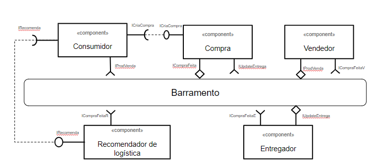

### Detalhamento da interação de componentes

Vendedor > barramento (IProdVenda) <br>
Consumidor (IRecomenda) > Recomendador <br>
Consumidor (ICriaCompra) > Compra <br>
Compra (ICompraFeita) > Entregador | Vendedor <br>
Entregador (ICriaEntrega) > Entrega <br>
Entrega (IUpdateEntrega) > Consumidor | Vendedor <br>

- O fluxo se inicia com o `Consumidor` buscando os produtos disponíveis para venda que foram previamente cadastrados pelo `Vendedor` e são consumidos pela interface `IProdVenda`.
- Quando o consumidor visualiza os detalhes do produto, realiza uma busca das melhores sugestões de entregas no componente `Recomendador de Logística` através da interface `IRecomenda`.
- O `Consumidor` cria seu pedido de compra selecionando a melhor opção de entrega e passa para o componente `Compra` através da interface `ICriaCompra`.
- Ao finalizar a compra o componente `Compra` envia a mensagem com os dados do pedido para o barramento através da interface `ICompraFeita`.
- O componente `Vendedor` consome as mensagens de compras efetuadas através da interface `ICompraFeita` para iniciar o processo de separação e preparação do envio do pedido.
- O componente `Entregador` consome as mensagens de compras efetuadas através de interface `ICompraFeita` para iniciar o processo de planejamento de entregas. Além disso, esse componente publica informações da situação de entrega cada vez que a mesma acontecer através da interface `IUpdateEntrega`.
- O componente `Recomendador` de Logística consome as mensagens de compras efetuadas através de interface `ICompraFeita` para alimentar sua estrutura de cálculo de sugestões de logistíca.

## Componente `Consumidor`

**Interfaces**

- `IRocomenda`
- `IProdVenda`
- `ICriaCompra`

## Detalhamento das Interfaces

### Interface `IRocomenda`

- Type: `source`
- Topic: `recomenda/{idConsumidor}`
- Message type: `RecomendaDTO`

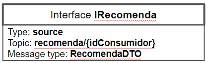

```json
{
  idProduto: string,
  idVendedor: string,
  enderecoorigem: string,
  enderecoDestino: string,
  entregadores: [
    {
      idEntregador: string,
      valorEntrega: number
    }
  ]
}
```

### Interface `IProdVenda`

- Type: `sink`
- Topic: `produto/{idProdVenda}`
- Message type: `ProdutoDTO`

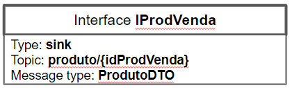

```json
{
  idProduto: string,
  idVendedor: string,
  preco: number,
  desc : string
}
```

### Interface `ICriaCompra`

- Type: `source`
- Topic: `compra/info`
- Message type: `CompraDTO`


```json
{
  idCompra: string,
  idComprador: string,
  idVendedor: string,
  idEntregador: string
  origem : string,
  destino : string,
  data: date,
  total: number,
  frete: number,
  itens: [
	{
   	  itemid: string,
       preco : number,
   	  quant: number
	}
  ]
}
```

## Componente `Compra`

**Interfaces**

- `ICriaCompra`
- `ICompraFeita`
- `IUpdateEntrega`

### Interface `ICriaCompra`

- Type: `sink`
- Topic: `compra/info`
- Message type: `CompraDTO`

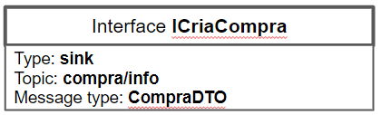

```json
{
  idCompra: string,
  idComprador: string,
  idVendedor: string,
  idEntregador: string
  origem : string,
  destino : string,
  data: date,
  total: number,
  frete: number,
  itens: [
	{
   	  itemid: string,
       preco : number,
   	  quant: number
	}
  ]
}
```

### Interface `ICompraFeita`

- Type: `source`
- Topic: `compra/{VendedorID}/{EntregadorID}`
- Message type: `CompraDTO`

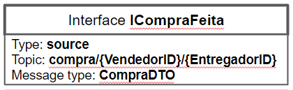

```json
{
  idCompra: string,
  idComprador: string,
  idVendedor: string,
  idEntregador: string
  origem : string,
  destino : string,
  data: date,
  total: number,
  frete: number,
  itens: [
	{
   	  itemid: string,
       preco : number,
   	  quant: number
	}
  ]
}
```

### Interface `IUpdateEntrega`

- Type: `sink`
- Topic: ` entrega/{CompraID}`
- Message type: `StatusDTO`

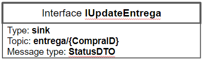

```json
{
  idCompra: string,
  idComprador: string,
  idVendedor: string,
  origem : string,
  destino : string,
  data: date,
  statusEntrega: status
}
```

## Componente `Vendedor`

**Interfaces**

- `IProdVenda`
- `ICompraFeitaV`

### Interface `IProdVenda`

- Type: `source`
- Topic: `produto/{idProdVenda}`
- Message type: `ProdutoDTO`

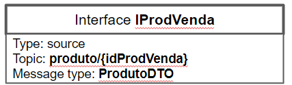

```json
{
  idProduto: string,
  idVendedor: string,
  preco: number,
  desc : string
}
```

### Interface `ICompraFeitaV`

- Type: `sink`
- Topic: `compra/{VendedorID}/+`
- Message type: `CompraDTO`


```json
{
  idCompra: string,
  idComprador: string,
  idVendedor: string,
  idEntregador: string
  origem : string,
  destino : string,
  data: date,
  total: number,
  frete: number,
  itens: [
	{
   	  itemid: string,
       preco : number,
   	  quant: number
	}
  ]
}
```

## Componente `Recomendador de Logística`

**Interfaces**

- `ICompraFeitaR`
- `IRecomenda`

### Interface `ICompraFeitaR`

- Type: `sink`
- Topic: `compra/#`
- Message type: `CompraDTO`

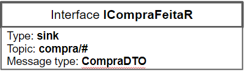

```json
{
  idCompra: string,
  idComprador: string,
  idVendedor: string,
  idEntregador: string
  origem : string,
  destino : string,
  data: date,
  total: number,
  frete: number,
  itens: [
	{
   	  itemid: string,
       preco : number,
   	  quant: number
	}
  ]
}
```

### Interface `IRecomenda`

- Type: `sink`
- Topic: `produto/{idProdVenda}`
- Message type: `ProdutoDTO`

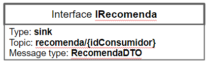

```json
{
  idProduto: string,
  idVendedor: string,
  preco: number,
  desc : string
}
```

## Componente `Entregador`

**Interfaces**

- `ICompraFeitaE`
- `IUpdateEntrega`

### Interface `ICompraFeitaE`

- Type: `sink`
- Topic: `compra/info`
- Message type: `CompraDTO`

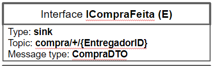

```json
{
  idCompra: string,
  idComprador: string,
  idVendedor: string,
  idEntregador: string
  origem : string,
  destino : string,
  data: date,
  total: number,
  frete: number,
  itens: [
	{
   	  itemid: string,
       preco : number,
   	  quant: number
	}
  ]
}
```

### Interface `IUpdateEntrega`

- Type: `source`
- Topic: `compra/info`
- Message type: `CompraDTO`

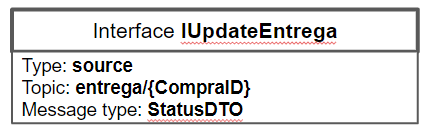

```json
{
  idCompra: string,
  idComprador: string,
  idVendedor: string,
  idEntregador: string
  origem : string,
  destino : string,
  data: date,
  total: number,
  frete: number,
  itens: [
	{
   	  itemid: string,
       preco : number,
   	  quant: number
	}
  ]
}
```

# Nível 2

## Diagrama do Nível 2

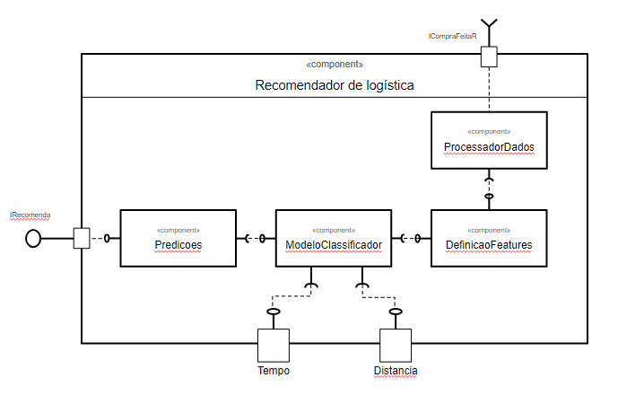

- O componente `Recomendador de Logística` assina o barramento de mensagens através da interface `ICompraFeitaR` pelo tópico `compra/{VendaId}`.
- As informações da compra, como por exemplo as informações do produto, entregador e forma de pagamento, são processadas e armazenadas.
- As informações são categorizadas e filtradas para serem utilizadas por um modelo classificador utilizando como parâmetros a distância e o tempo previsto de entrega de todos os entregadores disponíveis.
- Com as predições feitas, as informações são disponibilizadas para o barramento através da interface `IRecomenda` utilizando o tópico `compra/{VendedorID}/{EntregadorID}`

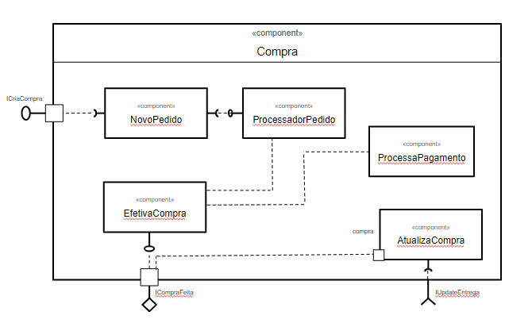

- O componente `Compra` assina o barramento de mensagens pelo tópico `compra/info` utilizando a interface `ICriaCompra`.
- Internamente o evento é atendido pelo componente `NovoPedido`, que cria as informações iniciais da venda e dispara um evento para o componente `ProcessadorPedido`.
- No componente `ProcessadorPedido` é realizada a validação das informações e cálculo do valor total da compra, esse componente dispara um evento para o `EfetivaCompra`.
- No componente `EfetivaCompra` é disparado um evento para o componente de `ProcessaPagamento` que, após realizar o processamento e efetivação do pagamento, retorna as informações que são coletadas e processadas novamente pelo componente `EfetivaCompra`.
- As informações da compra são disponibilizadas no barramento através do tópico `compra/{VendedorID}/{EntregadorID}` pela interface `ICompraFeita`
- O componente `Compra` assina o barramento de mensagens pelo tópico `entrega/{CompraID` através da interface `IUpdateEntrega`.
- Internamente a informação é processada pelo componente `AtualizaCompra` que por sua vez atualiza o status da mesma.

# Nível 3

## Diagrama do Nível 3

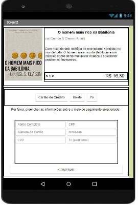


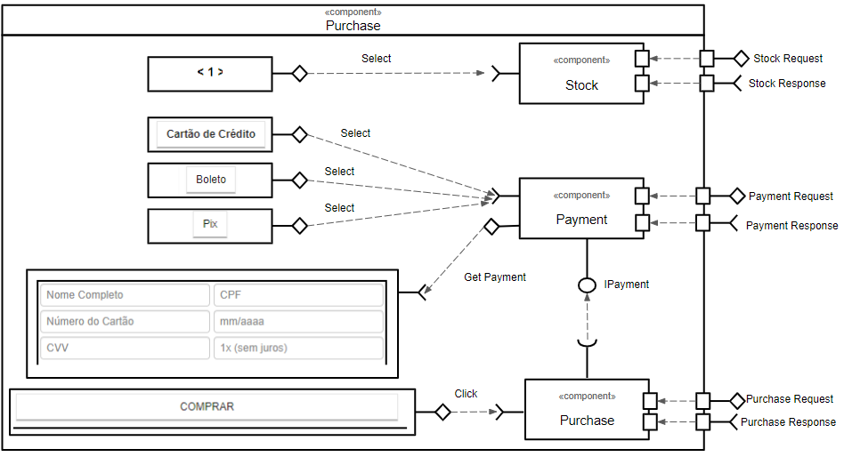

### Detalhamento da interação de componentes

- O fluxo inicia com o `Stock` que recebe uma requisição para a consulta da quantidade de produtos e retorna o valor para a interface.
- Em seguida o `Payment` recebe as informações de qual vai ser o meio de pagamento e retorna os campos necessários para preenchimento.
- Ao preencher as informações solicitadas pelo meio de pagamento, o `Payment` recebe uma requisição para tratar e armazenar os dados.
- Ao clicar no `Purchase`, é utilizada a interface `IPayment` para a consulta dos dados e efetivação da compra.
