# Projeto `Brechó Online - Equipe 03`

# Equipe

* `Daniel Pinheiro Cunha - RG: 46.372.879-8 / RA: EX164437`
* `Alejandro Boidi Rico - RG: 48.062.853-1 / RA: 2022600983 / EX161545`
* `Leonardo Machado Moscardo RG: 37.584.461-2 / RA: EX161698`
* `Caio Volpato - RG: 37.316.625-4 / RA: EX145119`
* `Julio Cesar Souto Filho RG: 48.614.253-X / RA: EX161655`

* [Github Equipe-03, Branch Projeto-2022](https://github.com/leonardomm1/component2learn/tree/projeto-2022/project/2022/solucoes/equipe03)

# Nível 1

## Diagrama Geral do Nível 1

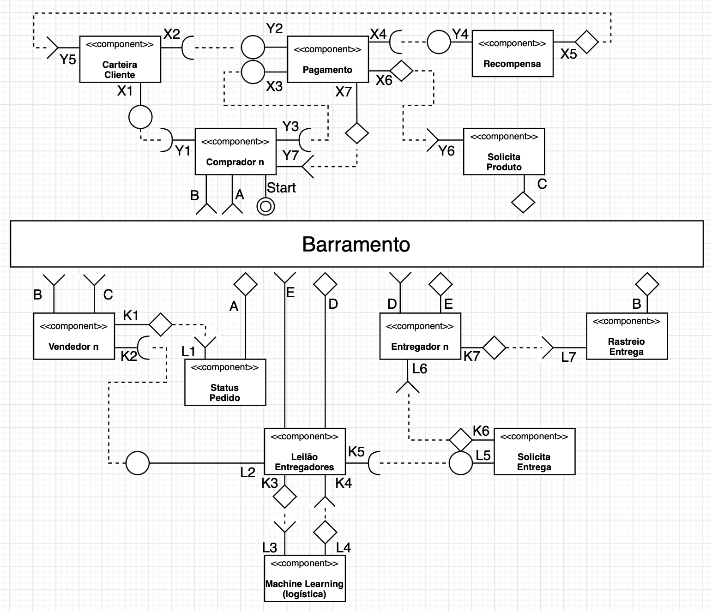

### Detalhamento da interação de componentes

### Interação i - Processo de compra completo relacionando todos os componentes
>
* O componente `Comprador n`, através da interface Y3, inicia o processo enviando uma mensagem síncrona para o Componente `Pagamento`, através da interface X3.
>
* O componente `Comprador n`, através da interface Y1, atualiza informações da carteira como depósitos, saques cadastramentos e descadastramentos de cartões, enviando uma mensagem síncrona para o Componente `Pagamento`, que a recebe através da interface X1.
>
* O componente `Pagamento`, através da interface Y2, faz validação e processamento do pagamento com auxílio de dados do componente `Carteira Cliente`, através da interface X2. Obtendo sucesso, o componente `Pagamento` envia uma mensagem síncrona através da interface X6 para o componente `Solicita Produto`, que a recebe através da interface Y6.
>
* O componente `Pagamento`, através da interface X7 envia um feedback para o Componente `Comprador n` através de mensagem assíncrona, a qual é recebida através da interface Y7.
>
* O componente `Pagamento`, através da interface X4 envia um feedback para o Componente `Recompensa` através de mensagem síncrona, a qual é recebida através da interface Y4.
>
* O componente `Recompensa`, através da interface X5 envia um feedback para o Componente `Carteira Cliente` através de mensagem assíncrona, a qual é recebida através da interface Y5.
>
* O componente `Solicita Produto` envia uma mensagem assíncrona para o barramento através da Interface C, tópico "`pedido/pedidoId/vendedorId/novo`".
>
* O componente `Vendedor n` recebe a mensagem pela Interface C, assinando o tópico "`pedido/pedidoId/vendedorId/novo`", para processar o pedido do produto.

* O componente `Vendedor n`, através da interface K2, envia uma mensagem síncrona para o Componente `Leilão Entregadores`, a qual é recebida pela interface L2, a fim de identificar e selecionar um entregador que atenda a região do comprador pelo melhor preço e prazo.
>
* O componente `Vendedor n`, através da interface K1, envia mensagem assíncrona para o componente `Status Pedido`, a qual é recebida através da interface L1, com atualizações do pedido antes do despacho da mercadoria.
>
* O componente `Status Pedido` envia uma mensagem assíncrona através da Interface A, tópico "`pedido/pedidoId/status`" para o barramento, que é assinada pelo `Comprador n` através da interface A, tópico "`pedido/pedidoId/status`". Mensagens dessa interface têm o objetivo de atualizar o status do pedido, antes do início do processo de despacho e entrega.
>
* O componente `Leilão Entregadores`, solicita via barramento através da interface D e tópico "`pedido/pedidoId/getCotacaoEntrega`", de modo assíncrono, ao Componente `Entregador n`, através da interface D, o qual assina o tópico "`pedido/pedidoId/getCotacaoEntrega`", os valores de entrega para aquela região (caso seja atendida).
>
* O componente `Entregador n`, via interface E, envia através do barramento (tópico "`pedido/pedidoId/entregaOffer`"), se atende a região e se positivo, os valor (oferta), modo assíncrono.
>
* O componente `Leilão Entregadores`, o qual assina o tópico "`pedido/pedidoId/entregaOffer`", através da interface E, de posse das relações Entregadores x regiões atendidas x valores, troca mensagens (envia e recebe) com o Componente de Machine Learning para determinação do entregador de um dado pedido. As interfaces utilizadas aqui são K3, L3, K4 e L4.
>
* O módulo `Leilão Entregadores`, através da interface K5, envia uma mensagem síncrona para o Componente `Solicita Entrega`, a qual é  recebida através da interface L5, com a relação Pedido x Entregador que foi selecionado.
>
* O componente `Solicita Entrega`, através da interface K6, envia uma mensagem assincronamente para o componente `Entregador n`, recebida através da interface L6, efetuando a solicitação de entrega.
>
* Finalmente o Componente `Entregador n`, através da interface K7, faz envio periódico da evolução do status das entregas para o componente `Rastreio Entrega` (interface L7).
>
* O componente `Rastreio Entrega`, periodicamente envia ao barramento via interface B, através do tópico "`pedido/pedidoId/status`" o status do pedido (após o despacho), ou seja, status da entrega. Esse tópico é assinado pelos componentes `Comprador n` e `Vendedor n`, através da interface B.
>

### Interação ii) Processo de Lançamento e Distribuição de Ofertas

Lançamento de uma Oferta:
* O Componente `Entregador n` via interface E, envia através do tópico "`pedido/pedidoId/entregaOffer`", se atende a região e se positivo, o valor (oferta) para entregar nesta região quando a atender. Esta mensagem é enviada de modo assíncrono.
>
* O componente `Leilão Entregadores`, sendo um assinante do tópico "`pedido/pedidoId/entregaOffer`" recebe as ofertas lançadas para compilar as informações de quais vendedores atendem qual região e qual o valor cobrado por cada entrega. 
>
Distribuição de uma Oferta:
* O componente `Leilão Entregadores`, que assina o tópico "`pedido/pedidoId/entregaOffer`", compila a relação Entregadores x regiões atendidas x valores, envia mensagens pela interface K3 ao componente de Machine Learning(M.L.) que as recebe pela interface L3, atuando como um datafeed para o componente de M.L.
>
* O Componente de M.L. recebe os inputs e processa as informações sob a heurística configurada, devolve uma mensagem que é uma lista de Pedidos x Entragadores através da interface L4 para o componente `Leilão Entregadores` que as recebe pela interface K4.
>
* Por meio da Interface K5, o componente `Leilão Entregadores` solicita a entrega aos respectivos entregadores(distribuição das ofertas), conforme sugestão do componente de M.L., as quais são recebidas pelo componente `Solicita Entrega` através da interface L5.
>
* Por fim, o componente `Solicita Entrega`, comunica cada Entregador através do par de interfaces K6/L6 de modo assíncrono, visto que estes podem estar em região de sombra, ou seja, em processo de distribuição de outros pedidos quando o processamento da distribuição for concluído e a mensagem de K6/L6 estiver disponível para ele. 
>

> Para cada componente será apresentado um documento conforme o modelo a seguir:

## Componente `Carteira Cliente`

> Componente responsável por guardar dados financeiros, incluindo transações de cada cliente, além de permitir ou recusar pagamentos, baseado em saldo disponível, método de pagamento, entre outros.

> Diagrama do componente, conforme exemplo a seguir:

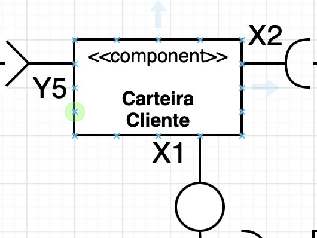

## Componente `Comprador n`

> Componente responsável por oferecer comportamentos esperados por clientes compradores da plataforma. Este componente, pode oferecer funcionalidades de gatilho para outros componentes do sistema.

> Diagrama do componente, conforme exemplo a seguir:

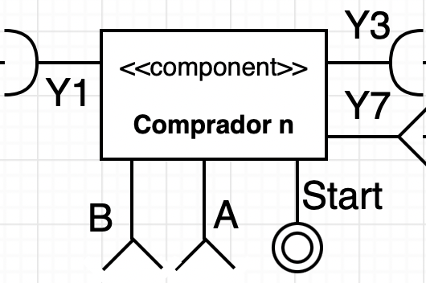

## Componente `Pagamento`

> Componente responsável pela análise de um pedido de cliente versus dados da carteira do cliente e solicitação de pagamento para parceiros como bancos e empresas de cartão de crédito.

> Diagrama do componente, conforme exemplo a seguir:

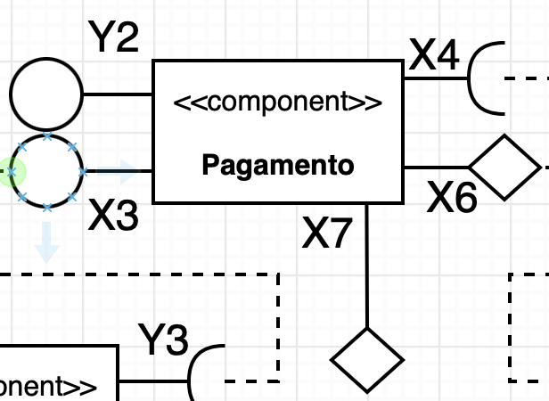

## Componente `Solicita Produto`

> Componente responsável pelo envio de solicitações de produto ao barramento, após aprovação e efetivação do pagamento.

> Diagrama do componente, conforme exemplo a seguir:

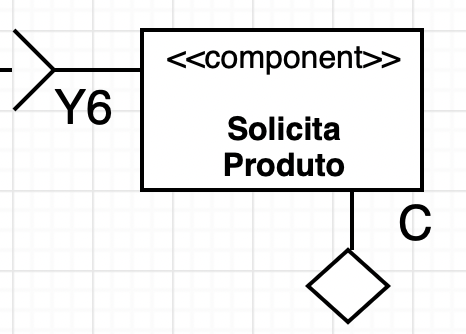

## Componente `Recompensa`

> Componente responsável pelo crédito de recompensas obtidas a partir de cada pedido. Este componente se comunica com outros dois componentes do sistema: Carteira Cliente e Pagamento.

> Diagrama do componente, conforme exemplo a seguir:

## Componente `Vendedor n`

> Componente responsável pelos comportamentos e dados relativos a pedidos e status de pedidos de vendedores, após o recebimento de pedidos feitos por compradores.

> Diagrama do componente, conforme exemplo a seguir:

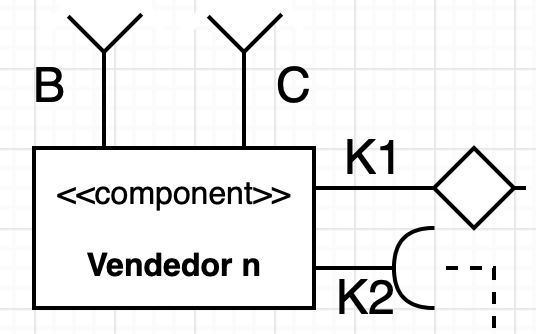

## Componente `Status Pedido`

> Componente responsável por atualizar o barramento com o status atualizado de cada pedido antes do despacho / envio.

> Diagrama do componente, conforme exemplo a seguir:

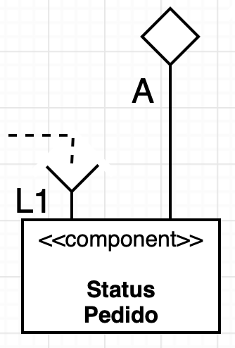

## Componente `Leilão Entregadores`

> Componente responsável por gerenciar a solicitação de cotações de entrega aos entregadores e determinar o melhor método de entrega baseado em aprendizado de máquina (componente Machine Learning (logística)).

> Diagrama do componente, conforme exemplo a seguir:

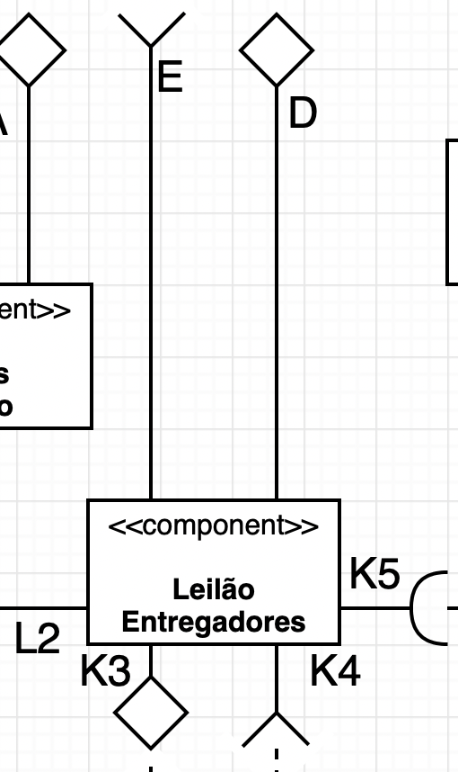

## Componente `Machine Learning (logística)`

> Componente responsável por obter dados de entregadores, regiões, preços, produtos e detalhes de cada pedido e aprender a tomar decisões logísticas de entrega de produtos a partir desses dados e informar o componente Leilão Entregadores a respeito da melhor solução para cada pedido.

> Diagrama do componente, conforme exemplo a seguir:

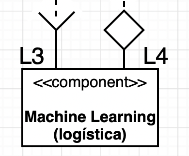

## Componente `Entregador n`

> Componente responsável pelos comportamentos de entregadores (parceiros) cadastrados na plataforma, assim como a comunicação com o barramento e demais componentes contextuais.

> Diagrama do componente, conforme exemplo a seguir:

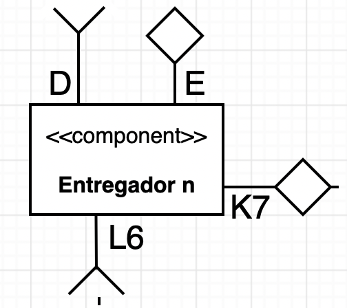

## Componente `Solicita Entrega`

> Componente responsável por Solicitar a entrega de um pedido a um parceiro (entregador), após demanda do componente `Leilão Entregadores`.

> Diagrama do componente, conforme exemplo a seguir:

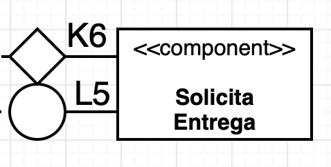

## Componente `Rastreio Entrega`

> Componente responsável por enviar ao barramento, periodicamente, atualizações sobre o pedido, após o despacho do mesmo, até a entrega para o comprador.

> Diagrama do componente, conforme exemplo a seguir:

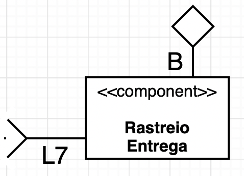

## Interfaces
> Listagem das interfaces do componente.

* As interfaces listadas são detalhadas a seguir:
>
* Interfaces que se comunicam com o Barramento:
>
* A, B, C, D e E
>
* Interfaces cuja comunicação (troca mensagem) ocorre diretamente entre componentes:
>
* Requerida / Provida:
* Y1 / X1
* X2 / Y2
* Y3 / X3
* X4 / Y4
* Y5 / X5
* Y6 / X6
* Y7 / X7
>
* L1 / K1
* K2 / L2
* L3 / K3
* K4 / L4
* K5 / L5
* L6 / K6
* L7 / K7

## Detalhamento das Interfaces

### Interface `A`

> Provida: Comunicar informação referente ao status do Pedido 
> Requerida: Capturar a mensagem no barramento para update dos respectivos componentes (Comprador e Vendedor) e autores a eles associados

* Type: `source/sink`
* Topic: `Order/Info`
* Message type: `Order`

### Interface `B`

> Provida: Comunicar informação referente ao status da entrega do Pedido 
> Requerida: Capturar a mensagem no barramento para update dos respectivos componentes (Comprador e Vendedor) e autores a eles associados

* Type: `source/sink`
* Topic: `Delivery/Status`
* Message type: `Delivery`

### Interface `C`

> Provida: Formalizar a compra de um dado Produto 
> Requerida: Processar o recebimento da intenção de compra

* Type: `source/sink`
* Topic: `Order/Request`
* Message type: `Order`

### Interface `D`

> Provida: Prover entregas disponíveis aos Entregadores para que eles informem seus dados
> Requerida: Receber as entregas disponíveis para os Entregadores

* Type: `source/sink`
* Topic: `Delivery/Offer`
* Message type: `Delivery`

### Interface `E`

> Provida: Informar ao Componente Leilão quais Entregadores podem atender cada oferta de entrega e qual o valor cobrado
> Requerida: Receber as relação de entregadores para cômputo dos valores por oferta

* Type: `source/sink`
* Topic: `Delivery/Attend`
* Message type: `Delivery`

### Interface `X1`

> Receber informações do Cliente referentes a compra, cartões, bitcoins, etc.

* Type: `Source`
* Topic: `Payment/Customer/Data`
* Message type: `Payment`

### Interface `X2`

> Solicita validação dos dados da carteira do cliente para efetivar a compra 

* Type: `Sink`
* Topic: `Payment/Validation`
* Message type: `Payment`

### Interface `X3`

> Provê métodos para cumprir a solicitação do pagamento às instituições financeiras de acordo com a forma de pagamento escolhida

* Type: `Source`
* Topic: `Payment/Lock`
* Message type: `Payment`

### Interface `X4`

> Requisita recompensa após efetivação do pagamento

* Type: `Sink`
* Topic: `Payment/Reward`
* Message type: `Payment`

### Interface `X5`

> Provê métodos para creditar benefícios na carteira do cliente.

* Type: `Source`
* Topic: `Benefits/Grant`
* Message type: `Benefits`

### Interface `X6`

> Provê métodos para confirmar o pagamento e liberar a solicitação do produto ao vendedor

* Type: `Source`
* Topic: `Payment/Release`
* Message type: `Release`

### Interface `X7`

> Provê métodos para informar ao cliente sobre o status do pagamento após solicitação pela interface Y3

* Type: `Source`
* Topic: `Paymeny/Status`
* Message type: `Payment`

### Interface `Y1`

> Solicita as informações disponíveis na carteira do cliente (dados de pagamento já cadastrados, ex.: cartões, etc)

* Type: `Sink`
* Topic: `Payment/Customer/Data`
* Message type: `Order`

### Interface `Y2`

> Provê métodos para validação de dados da carteira do cliente junto às instituições financeiras, saldo, validade cartões, etc.

* Type: `Source`
* Topic: `Payment/Validation`
* Message type: `Payment`

### Interface `Y3`

> Solicita a efetivação do pagamento junto à instituições financeiras por meio do módulo Pagamentos

* Type: `Sink`
* Topic: `Payment/Lock`
* Message type: `Payment`

### Interface `Y4`

> Provê métodos para validação das recompensas disponíveis ao Comprador após efetivação do pagamento.

* Type: `Source`
* Topic: `Payment/Reward`
* Message type: `Payment`

### Interface `Y5`

> Solicita o crédito de benefícios oriundos das compras

* Type: `Sink`
* Topic: `Benefits/Receive`
* Message type: `Benefits`

### Interface `Y6`

> Requisita liberação da solicitação do Pedido ao Vendedor

* Type: `Sink`
* Topic: `Payment/Release/Request`
* Message type: `Payment`

### Interface `Y7`

> Solicitar status do pagamento ao módulo de pagamentos

* Type: `Sink`
* Topic: `Payment/Status`
* Message type: `Payment`

> Resumo do papel da interface.

* Type: `sink`
* Topic: `Payment/Status/Request`
* Message type: `Order`

### Interface `K1`

> Provê métodos para informar o status do pedido.

* Type: `Source`
* Topic: `Order/Status/Provide`
* Message type: `Order`

### Interface `K2`

> Requisita a informação de região e preço

* Type: `Sink`
* Topic: `Order/Status`
* Message type: `Order`

### Interface `K3`

> Provê métodos para informar dados de pedido x preço x entregador

* Type: `Source`
* Topic: `Strategy/Datafeed`
* Message type: `Strategy`

### Interface `K4`

> Requisita a lista de distribuição das entregas

* Type: `Sink`
* Topic: `Strategy/Result`
* Message type: `Strategy`

### Interface `K5`

> Requisita a distribuição de entregas aos Entregadores

* Type: `Sink`
* Topic: `Delivery/Request`
* Message type: `Delivery`

### Interface `K6`

> Provê métodos para informar cada vendedor os dados de entrega.

* Type: `Source`
* Topic: `Delivery/Post/Info`
* Message type: `Delivery`

### Interface `K7`

> Provê dados para informar o módulo de rastreamento de cada entrega

* Type: `Source`
* Topic: `Delivery/Status`
* Message type: `Delivery`

### Interface `L1`

> Requisita status do pedido.

* Type: `sink`
* Topic: `Order/Status/Request`
* Message type: `Order`

### Interface `L2`

> Provê informações de região e preço.

* Type: `sink`
* Topic: `Order/Status/Provide`
* Message type: `Order`

### Interface `L3`

> Requisita dados de pedido x preço x entregador.

* Type: `sink`
* Topic: `Strategy/Datafeed/Request`
* Message type: `Strategy`

### Interface `L4`

> Provê a lista de distribuição das entregas.

* Type: `sink`
* Topic: `Strategy/Result/Provide`
* Message type: `Order`

### Interface `L5`

> Provê métodos da distribuição de entregas aos Entregadores.

* Type: `sink`
* Topic: `Delivery/Provide`
* Message type: `Delivery`

### Interface `L6`

> (Entregador) Requisita informações de entrega 

* Type: `sink`
* Topic: `Delivery/Alocate`
* Message type: `Delivery`

### Interface `L7`

> Requisita dados para fazer o broadcast aos Componentes e Atores relacionados à

* Type: `sink`
* Topic: `Delivery/Status`
* Message type: `Delivery`

> Diagrama representando o esquema das mensagens JSON utilizadas na interface, pode ser em formato texto conforme exemplo:

> Tópico "`pedido/pedidoId/vendedorId/novo`"
~~~json
{
  pedidoId: string,
  vendedorId: string,
  dueDate: date,
  total: number,
  items: [
    {
         itemid: string,
         quantity: number
    }
  ]  
}
~~~

> Tópico "`pedido/pedidoId/status`"
~~~json
{
  pedidoId: string,
  status: string,
}
~~~

> Tópico "`pedido/pedidoId/getCotacaoEntrega`"
~~~json
{
  pedidoId: string,
  totalPedido: float,
  seguro: boolean,
  localidade: {
    cep: string,
    prioridade: boolean,
    logradouro: string,
    numero: integer,
    bairro: string,
    cidade: string,
    estado: string,
    pais: string
  }
}
~~~

> Tópico "`pedido/pedidoId/entregaOffer`"
~~~json
{
  pedidoId: string,
  totalPedido: float,
  seguro: boolean,
  localidade: {
    cep: string,
    prioridade: boolean,
    logradouro: string,
    numero: integer,
    bairro: string,
    cidade: string,
    estado: string,
    pais: string
  },
  valorTransporte: float
}
~~~

# Nível 2

> Apresente aqui o detalhamento do Nível 2 conforme detalhado na especificação com, no mínimo, as seguintes subseções:

## Diagrama do Nível 2

> 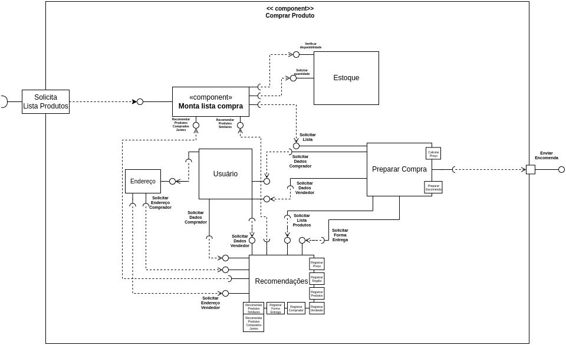

Detalhamento do componente comprar produto

O componente `Comprar produto` recebe como entrada a lista de produtos e o mesmo tem como saída a encomenda enviada.

1. O subcomponente `Monta lista compra` solicita para o subcomponente de `estoque` a quantidade disponível dos itens correntes no carinho de compras. Caso um produto esteja indisponível, isso fica marcado para informar o usuário.
2. O subcomponente `Monta lista compra` solicita o subcomponente de `Recomendações` diversas recomendações baseadas em diversos critérios como itens comprados normalmente juntos, produtos do mesmo vendedor, promoções como entrega grátis. Esse subcomponente utiliza modelos preditivos de aprendizado de maquina (machine learning) alimentado de dados históricos de compras para recomendar os produtos.

Enquanto o usuário adiciona ou retira itens do carrinho de compras os passos 1 e 2 são constantemente executados.

Se o usuário selecionar a opção de finalizar a compra o subcomponente `preparar compra` solicita a lista final de itens para o subcomponente `Monta lista de compras`. Para obter dados da compra o subcomponente `Usuario` é acionado para obter dados do vendedor e comprador como endereço e solicita ao usuário a forma de pagamento.

### Detalhamento da interação de componentes

* subcomponente `Monta lista compra` assina o tópico `monta/compra/+/id`
* subcomponente `Estoque` assina o tópico `estoque/produto/+/id`
* subcomponente `Recomendações` assina os tópicos "recomendacoes/{tipo_recomendacao}/+/id" onde `tipo_recomendacao`pode ser produtos similares, produtos tipicamente comprados juntos, produtos do mesmo vendedor, produtos que geram promoções e etc ...
* subcomponente `Preparar Compra` assina o tópico `prepara/compra/+/id`
* subcomponente `Usuario` assina o tópico `usuario/vendedor/+/id` e `usuario/comprador/+/id`
* subcomponente `Endereço` assina o tópico `endereco/usuario/+/id`

## Componente `Recomendações`

> *Recomendações* é responsável por várias vertentes do Machine Learning, relacionando a compra/venda, produtos, região de entrega e forma de entrega, sendo elas:
> * Registrar Formas de Entrega
> * Registrar Comprador/Vendedor que é um Usuário
> * Registrar Lista de Produtos
> * Registrar Preco total
> * Registrar Região

## Componente `Solicita Lista Produtos`

> Componente responsável em entregar lista de produtos atualizados da compra.

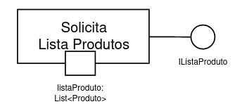

## Componente `Monta Lista Produtos`

> Componente responsável em montar a lista, com o que o usuário provê e as recomendações que são providas durante a constante atualização
> da lista de produtos utilizando as informações como Produtos, Região de entrega, Vendedor, Comprador.

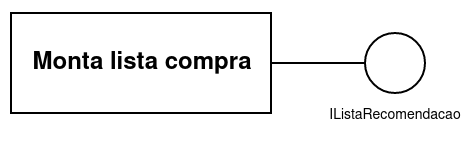

## Componente `Usuário`

> Componente que entrega os dados do Usuario, sendo ele comprador ou vendedor

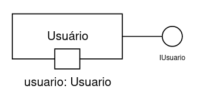

## Componente `Endereço`

> Componente que entrega os endereços, relacionando ao Usuario

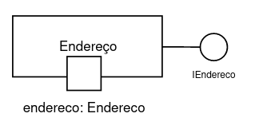

## Componente `Preparar Compra`

> Este componente é responsável em preparar a compra.
> * Preparar recomendações e apresentar ao usuário
> * Preparar envio, relacionando usuário, endereço para entrega
> * Preparar lista de produtos com quantidade
> * Calcular preço total
> * Na confirmação, preparar encomenda.

## Componente `Estoque`

> Controlador de estoque, verificando disponibilidade e quantidade.
> * Verifica disponibilidade de estoque.
> * Verifica quantidade do estoque.

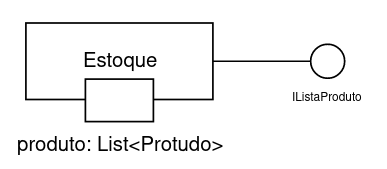

## Componente `Encomenda`

> Prepara todas as informações, produtos, dados para a encomenda.
> * Cria uma encomenda para enviar as compras.

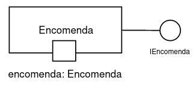

**Interfaces**
> Listagem das interfaces do componente.

* IListaProduto
* IUsuario
* IEndereco
* ILearningMachine
* IEncomenda

## Detalhamento das Interfaces

### Interface `ILearningMachine`

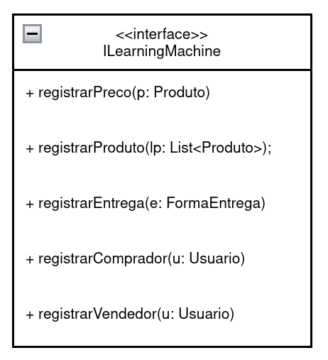

> Sistema que está sempre relacionando informações para criar relações de compra, vendedor
> para criar recomendações.

Método | Objetivo
-------| --------
`registrarPreco` | `Registra preços dos produtos`
`registrarProduto` | `Registra Produtos da compra para relacionar`
`registrarComprador` | `Registrar Comprador e dados`
`registrarVendedor` | `Registrar Vendedor e dados`
`registrarEntrega` | `Registrar forma de entrega da compra`

### Interface `IEncomenda`

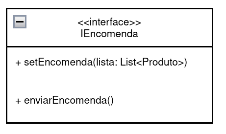

> Expõe funções para criar encomenda e pedir para enviar.

Método | Objetivo
-------| --------
`setEncomenda` | `Cria encomenda com lista de produto e usuário`
`enviaEncomenda` | `Gera a encomenda e cria uma nova encomenda para envio.`

### Interface `IListaProduto`

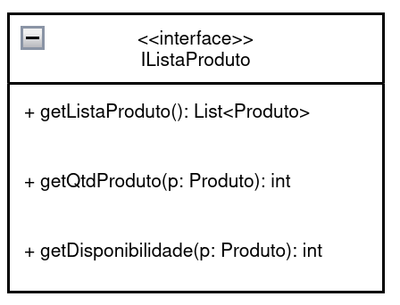

> Expõe funções para lista de produtos.

Método | Objetivo
-------| --------
`getListaProduto` | `retorna lista de produto`
`getQtdProduto` | `retorna quantidade de produtos disponíveis através do Estoque`
`getDisponibilidade` | `retorna disponibilidade do produto através do Estoque`

### Interface `IUsuario`

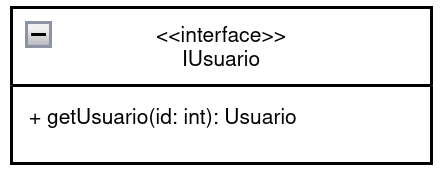

> Retorna Usuario.

Método | Objetivo
-------| --------
`getUsuario` | `Retorna objeto Usuario para a instância`

### Interface `IEndereco`

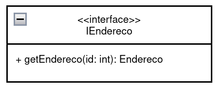

> Responsável em retornar endereço do usuário.

Método | Objetivo
-------| --------
`getEndereco` | `retorna endereço registrado no Usuario`

### UML dos Componentes unificado

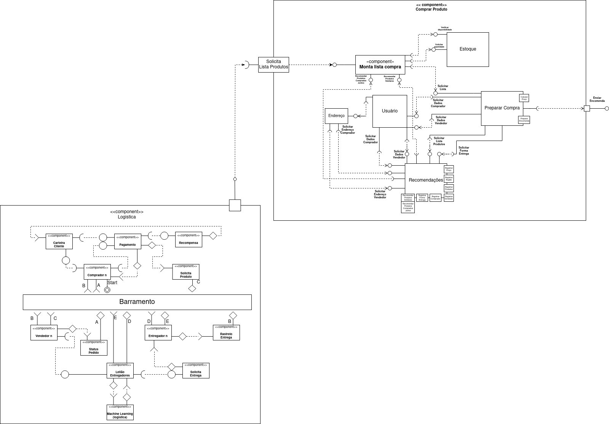

## Diagrama do Nível 3

### Caputura tela de pagamento

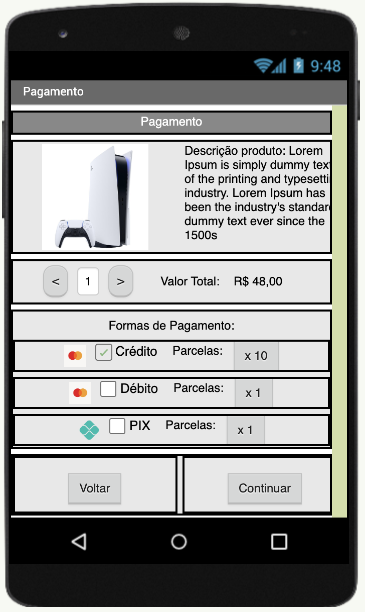

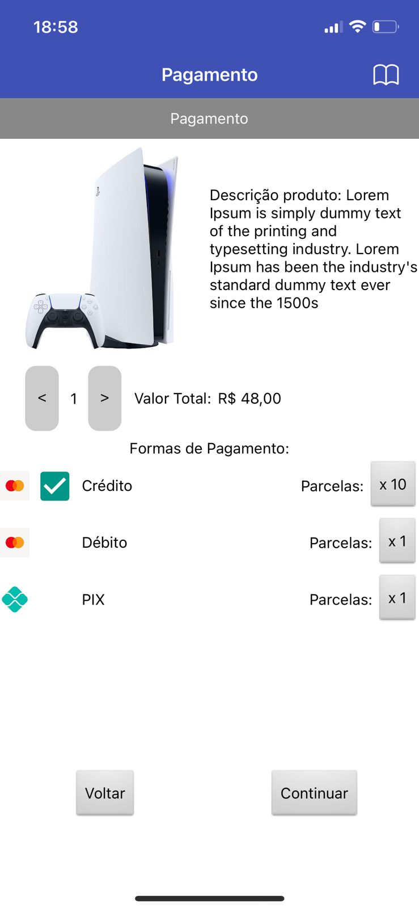

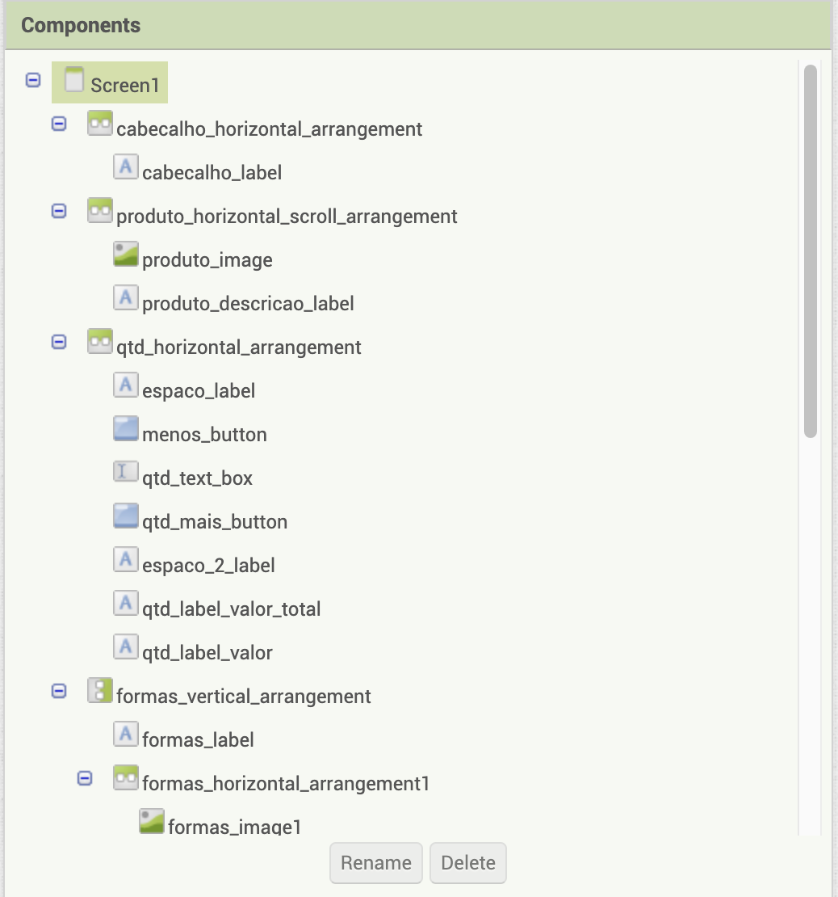

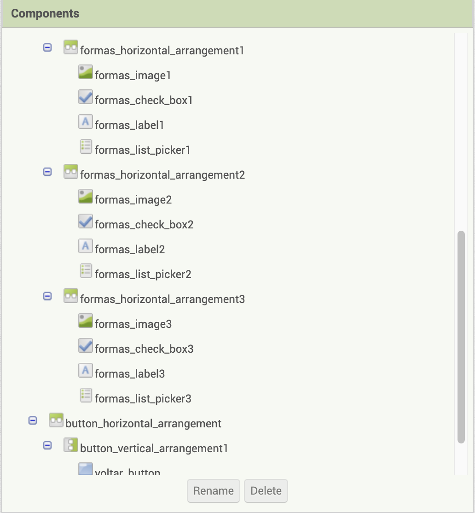

### Caputura tela de entrega

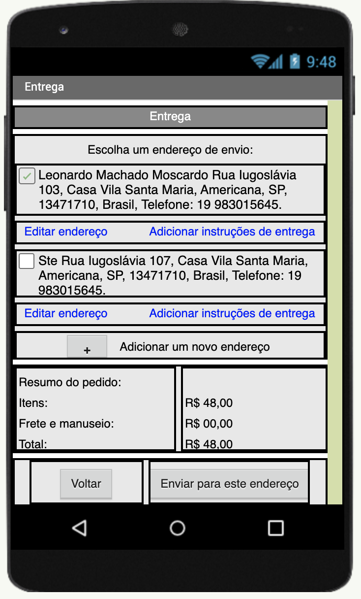

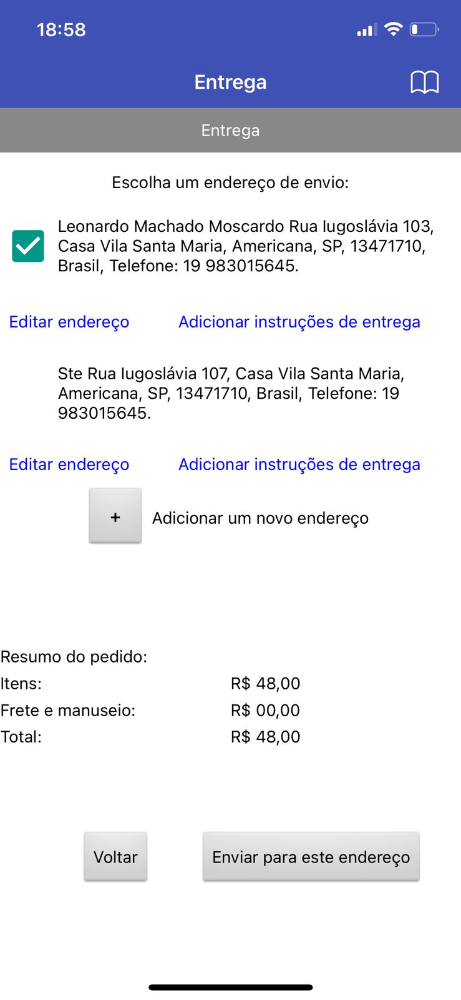

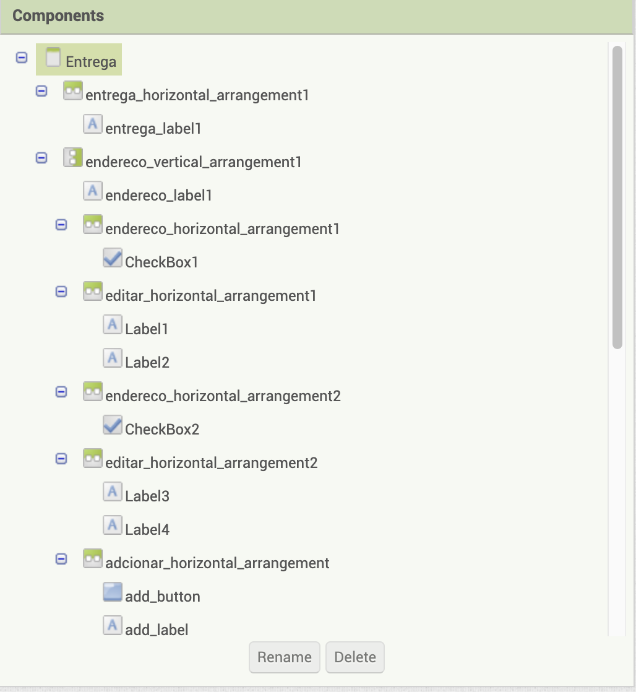

### Caputura tela de diagrama referente ao protótipo

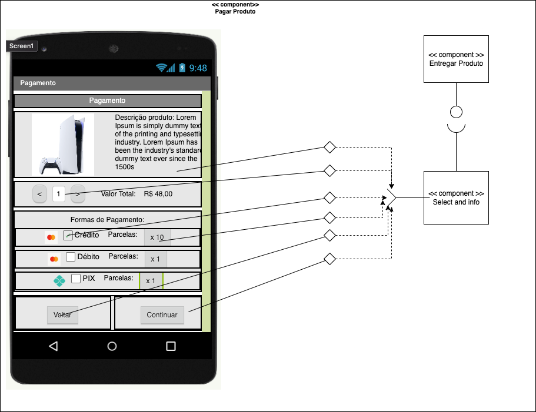

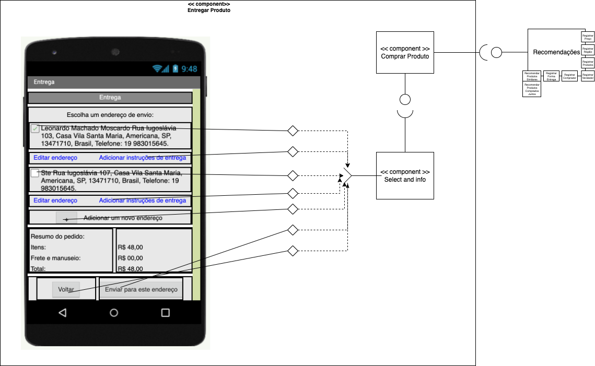

### Detalhamento da interação de componentes

O componente é composto por duas telas, sendo a tela de pagamento como solicitado e a tela de entrega.
Tela de pagamentos: é composta pelos compontes de descrição do produto, quantidade, valor total e forma de pagamento. Esses componentes geram informação para a próxima tela de entrega.
Tela de entrega: é composta pelos endereços já previamente cadastrados, componente de edição de endereço, adição de um novo endereço e finalização da compra. Ao finalizar a compra é enviado as informações de compra para o componente de recomendação, sendo o responsável por alimentar as informações para o aprendizado.
