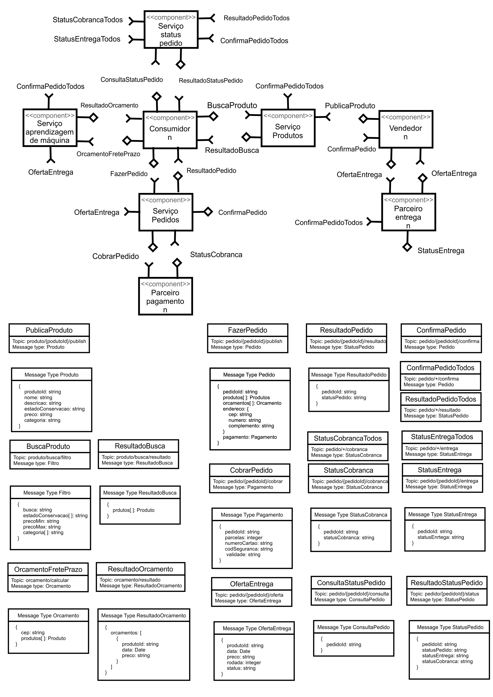
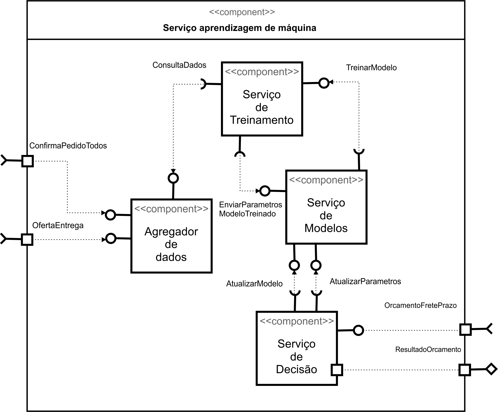
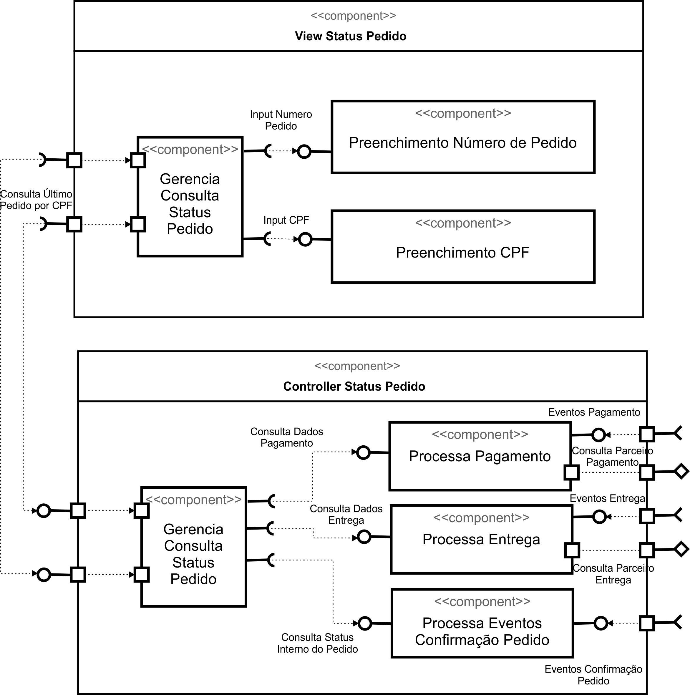
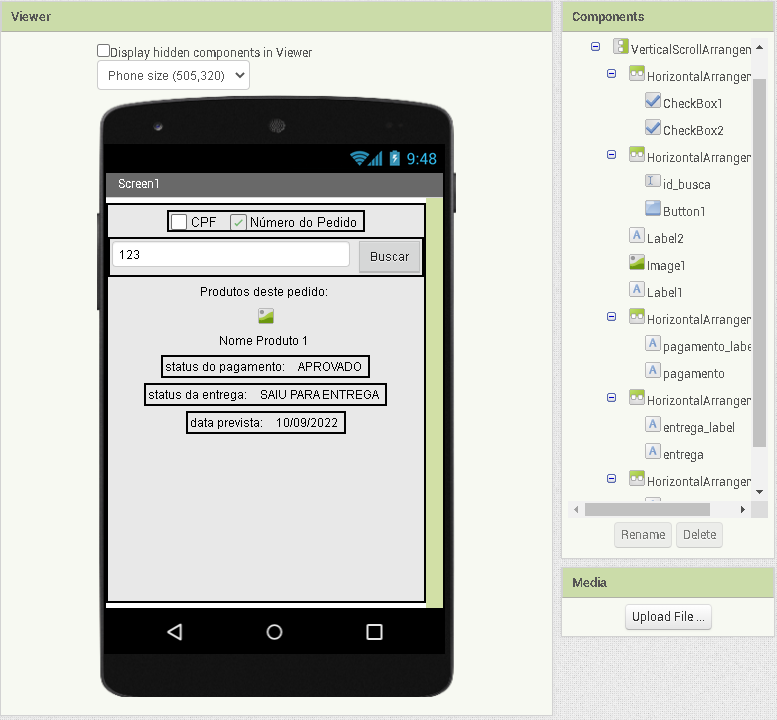
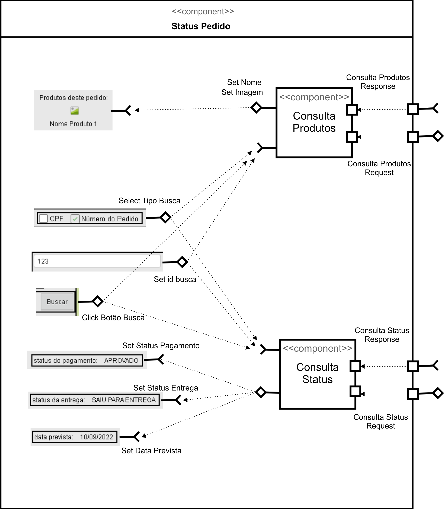
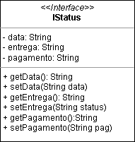
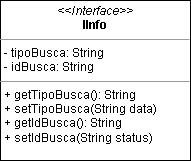

# Projeto `Visões de Componentes de um Sistema de Recommerce`

# Equipe
* `Luís Filipe Mentem Gomes de Soutello - 40009877-5`
* `Richardson Guedes Pinheiro - 25471369-5`
* `João Igor dos Santos Pereira - 7086176`
* `Claudio Augusto Rolim - 16702922001-4`
* `Gabriel T. Callado - 45022276-7`

# Projeto GitHub Original
* `https://github.com/lfsoutello/component2learn/tree/master/`

# Nível 1

## Diagrama Geral do Nível 1

### Detalhamento da interação de componentes

> Neste nível separamos os componentes de mais alto nível do sistema, conforme mostrado na figura abaixo. Segue uma explicação do funcionamento dos eventos:
> * Tudo começa com vendedores publicando produtos. Esse evento é consumido pelo serviço de produtos que inclui esse produto na base e permite ele ser buscado pelos compradores.
> * Os consumidores podem fazer busca de produtos no serviço de produtos passando um filtro. O serviço de produtos faz as consultas e retorna os produtos que satisfazem os critérios do filtro.
> * Os consumidores podem também fazer um orçamento de frete e prazo de entrega por produto por cep. Quem define os preços e prazos é serviço de aprendizagem de máquina que utiliza dados de outros pedidos e negociações.
> * Quando um consumidor decide finalizar uma compra, ele envia um evento de pedido para o serviço de pedidos com dados referentes aos produtos, o orçamento do frete e pagamento.
> * O serviço de pedidos decide internamente qual parceiro de pagamento vai realizar essa transação e tenta fazer a cobrança retornando o resultado para o cliente.
> * Quando a cobrança é realizada com sucesso, o serviço de pedidos envia também um evento de pedido confirmado. Esse evento é consumido pelos vendedores, pelos parceiros de entrega e também pelo serviço de aprendizagem de máquina.
> * O evento de confirmação de pedido inicia uma negociação entre parceiros de entrega e os vendedores. Serão negociados valores e prazo de entrega por produto. A negociação sempre começa pelos parceiros, mas pode ter contraofertas dos vendedores e depois dos próprios parceiros também. Ela só acaba quando as duas partes aceitarem uma oferta. Todos os dados de negociação são enviados também para o serviço de aprendizagem de máquina.

## Componente `Vendedor`

> Esse componente representa os usuários que vendem produtos na plataforma e as ações que eles podem executar incluindo a negociação com os parceiros de entrega.

## Componente `Serviço de Produtos`

> Esse componente gerencia os produtos da plataforma incluindo nome, descrição, categoria, preço e também da a baixa no estoque quando o produto é vendido.

## Componente `Consumidor`

> Esse componente representa os usuários que compram produtos na plataforma e as ações que podem executar como a busca de produtos, orçamento de frete e prazo, fechamento de pedido e consulta de status do pedido.

## Componente `Serviço de Pedidos`

> Esse componente é responsável pelo domínio de pedidos. Ele lida com fechamento de pedidos e com a cobrança com o parceiro de pagamento.

## Componente `Serviço de Aprendizagem de Máquina`

> Esse serviço é responsável por determinar o preço do frete e a data de entrega dos produtos de um pedido. Ele usa como base negociações anteriores de outros pedidos para tomar as decisões

## Componente `Parceiro de Pagamento`

> Componente responsável por fazer a transação financeira da cobrança de um pedido e envia status das transações dos pedidos em cobraças que pode demorar como por exemplo boleto.

## Componente `Parceiro de Entrega`

> Componente que representa um parceiro de entrega que participa da negociação e também envia o sattus das entregas dos pedidos.

## Componente `Serviço de Status do Pedido`

> Componente no qual o consumidor pode consultar o status do pedido: status do pagamento, status da entrega e status da confirmação do pedido.

# Nível 2

## Diagrama do Nível 2

> 

### Detalhamento da interação de componentes

* O componente `Agregador de Dados` assina no barramento mensagens dos tópicos "`pedido/+/entrega`" através da interface `ConfirmaPedidoTodos` e "`pedido/{pedidoId}/oferta`" através da interface `OfertaEntrega`.
  * Ao receber mensagens nesse dois tópicos, o componente apenas armazena os dados podendo estrturalos de outras formas ou não.
* O componente `Serviço de Treinamento` oferece uma interface para que seja pedido um treinamento de um modelo de machine learning e também prove uma interface para devolver um modelo treinado para o serviço de modelos. Para fazer o treinamento, ele consulta dados no agregador de dados.
* O componente `Serviço de Modelos` gerencias os possíveis modelos usados para calcular o frete e o prazo e também pede os treinamentos para o serviço de treinamento. Ele consegue alrerar o modelo que o serviço de decisão está usando e/ou alterar os parâmentros de um modelo já em uso.
* O componente `Serviço de Decisão` atende as requisições de orçamento no tópico OrcamentoFretePrazo de frete e prazo, faz o predição e devolve o resultado no tópico ResultadoOrcamento.

## Componente `Agregador de Dados`

## Detalhamento das Interfaces

### Interface `OfertaEntrega`

Método | Objetivo
-------| --------
`recebeEventoDeOfertadeEntrega` | `Recebe os eventos das negociações entre parceiros de entrega e vendedores`

### Interface `ConfirmaPedidoTodos`

Método | Objetivo
-------| --------
`recebeEventoDeConfirmacaoDePedido` | `Recebe os eventos de pedido confirmado com detalhes dos produtos`

### Interface `ConsultaDados`

Método | Objetivo
-------| --------
`blaa` | `blaa`

### Interface `TreinaModelo`

Método | Objetivo
-------| --------
`blaa` | `blaa`

### Interface `EnviarParametrosModeloTreinado`

Método | Objetivo
-------| --------
`blaa` | `blaa`

### Interface `AtualizarModelo`

Método | Objetivo
-------| --------
`blaa` | `blaa`

### Interface `AtualizarParametros`

Método | Objetivo
-------| --------
`blaa` | `blaa`

### Interface `OrcamentoFretePrazo`

Método | Objetivo
-------| --------
`blaa` | `blaa`

### Interface `ResultadoOrcamento`

Método | Objetivo
-------| --------
`blaa` | `blaa`

> 

### Detalhamento da interação de componentes

> O detalhamento deve seguir um formato de acordo com o exemplo a seguir:

* O componente `Entrega Pedido Compra` assina no barramento mensagens de tópico "`pedido/+/entrega`" através da interface `Solicita Entrega`.
  * Ao receber uma mensagem de tópico "`pedido/+/entrega`", dispara o início da entrega de um conjunto de produtos.
* Os componentes `Solicita Estoque` e `Solicita Compra` se comunicam com componentes externos pelo barramento:
  * Para consultar o estoque, o componente `Solicita Estoque` publica no barramento uma mensagem de tópico "`produto/<id>/estoque/consulta`" através da interface `Consulta Estoque` e assina mensagens de tópico "`produto/<id>/estoque/status`" através da interface `Posição Estoque` que retorna a disponibilidade do produto.

> Para cada componente será apresentado um documento conforme o modelo a seguir:

## Componente `<Nome do Componente>`

> Resumo do papel do componente e serviços que ele oferece.

**Interfaces**
> Listagem das interfaces do componente.

As interfaces listadas são detalhadas a seguir:

## Detalhamento das Interfaces

### Interface `<nome da interface>`

> Resumo do papel da interface.

Método | Objetivo
-------| --------
`<id do método>` | `<objetivo do método e descrição dos parâmetros>`

## Exemplos:

### Interface `ITableProducer`

Interface provida por qualquer fonte de dados que os forneça na forma de uma tabela.

Método | Objetivo
-------| --------
`requestAttributes` | Retorna um vetor com o nome de todos os atributos (colunas) da tabela.
`requestInstances` | Retorna uma matriz em que cada linha representa uma instância e cada coluna o valor do respectivo atributo (a ordem dos atributos é a mesma daquela fornecida por `requestAttributes`.

### Interface `IDataSetProperties`

Define o recurso (usualmente o caminho para um arquivo em disco) que é a fonte de dados.

Método | Objetivo
-------| --------
`getDataSource` | Retorna o caminho da fonte de dados.
`setDataSource` | Define o caminho da fonte de dados, informado através do parâmetro `dataSource`.

## Diagrama do Nível 3

> Diagrama referente:

### Detalhamento da interação de componentes

## Componente `Consulta Produtos`

> O componente "Consulta Produtos" é responsável por trazer informações sobre o produto a partir das informações dadas nos campos, assim como setar a imagem do produto buscado.
>

[//]: 

**Interfaces**
> setNome / setImage
> Select Tipo Busca/ set Id Busca / Click Botão Busca

## Componente `Consulta Status`

> O componente "Consulta Status" é responsável por trazer informações sobre o pedido fechado partir das informações dadas nos campos, trazendo informações como status da entrega, data prevista e status do pagamento.

[//]: 

**Interfaces**
> setStatusPagamento / setStatusEntrega / SetDataPrevista
> selectTipoBusca / setIdBusca / clickBotãoBusca

 
## Detalhamento das Interfaces

### Interface `INameImage (setName/SetImage)`

Método | Objetivo
-------| --------
`setImage` |Seta uma string com a url da imagem do produto.
`setName` | Seta uma string referente ao nome do produto pesquisado.
`getImage` | Retorna uma string com a url da imagem do produto previamente setada pelo setImage ou na criação do objeto.
`getName` | Retorna uma string referente ao nome do produto pesquisado.

### Interface `IStatus (SetStatusPagamento/SetDataEntrega/SetStatusPagamento)`

Método | Objetivo
-------| --------
`setData` |Seta uma string com a data prevista de entrega.
`getData` | Retorna uma string referente a data prevista de entrega.
`setEntrega` | Seta uma String referente ao status de entrega.
`getEntrega` | Retorna uma string referente ao status de entrega.
`setPagamento` | Seta uma String referente ao status de pagamento.
`getPagamento` | Retorna uma string referente ao ao status de pagamento.

### Interface `IInfo (selectTipoBusca/SetIdBusca)`

Método | Objetivo
-------| --------
`setTipoBusca` | Seta uma string com o tipo de busca a ser feita (por CPF ou número de pedido).
`getTipoBusca` | Retorna uma string com o tipo de busca a ser feita (por CPF ou número de pedido).
`setIdBusca` | Seta a String referente à chave a ser buscada, relacionada ao tipo de busca escolhido.
`getIdBusca` | Retorna a String referente à chave a ser buscada, relacionada ao tipo de busca escolhido.

[//]: !https://drive.google.com/file/d/1jmqh3jMjfgb7XnStEIgTu3EmWTkw8qYV/view?usp=sharing