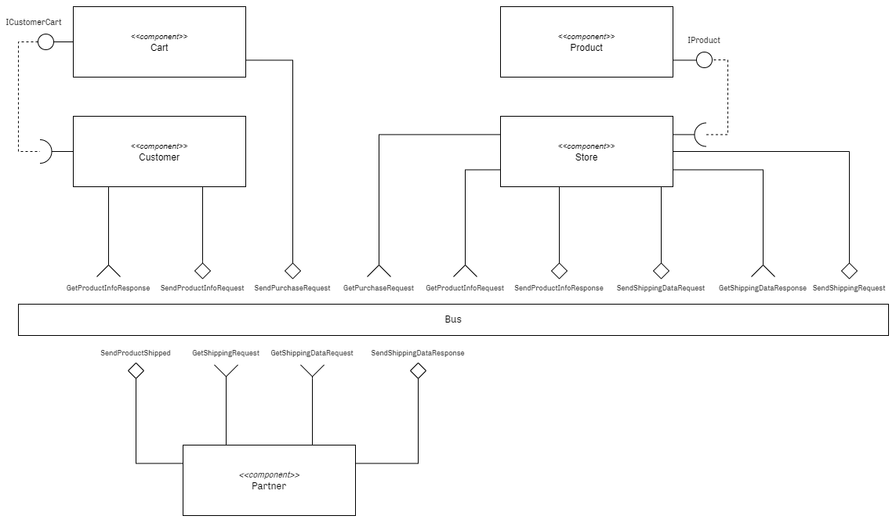
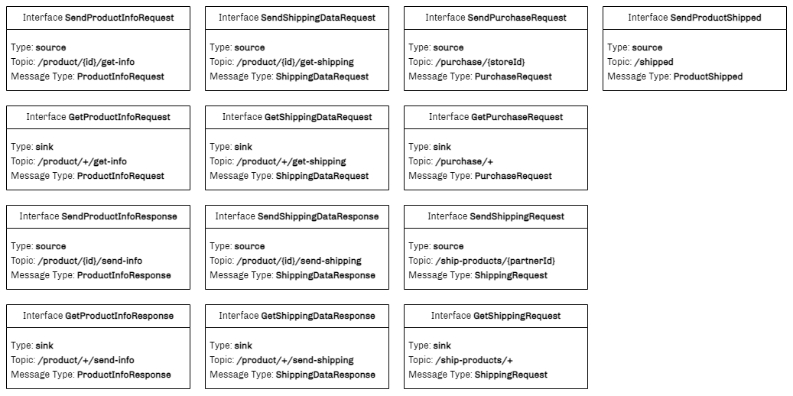
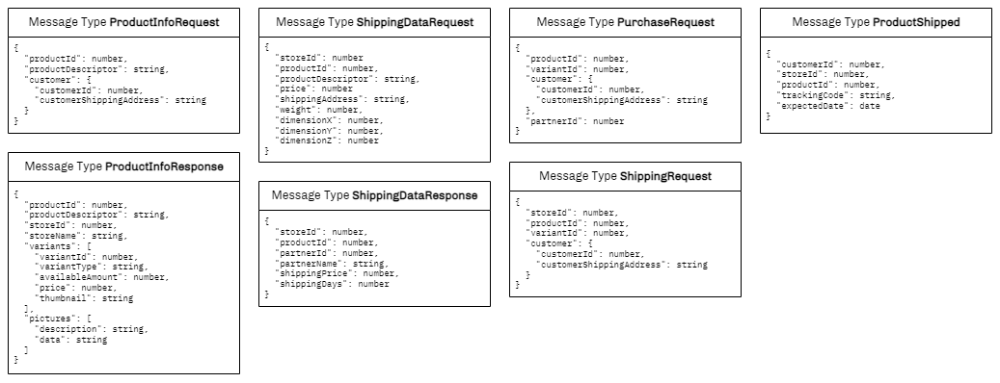
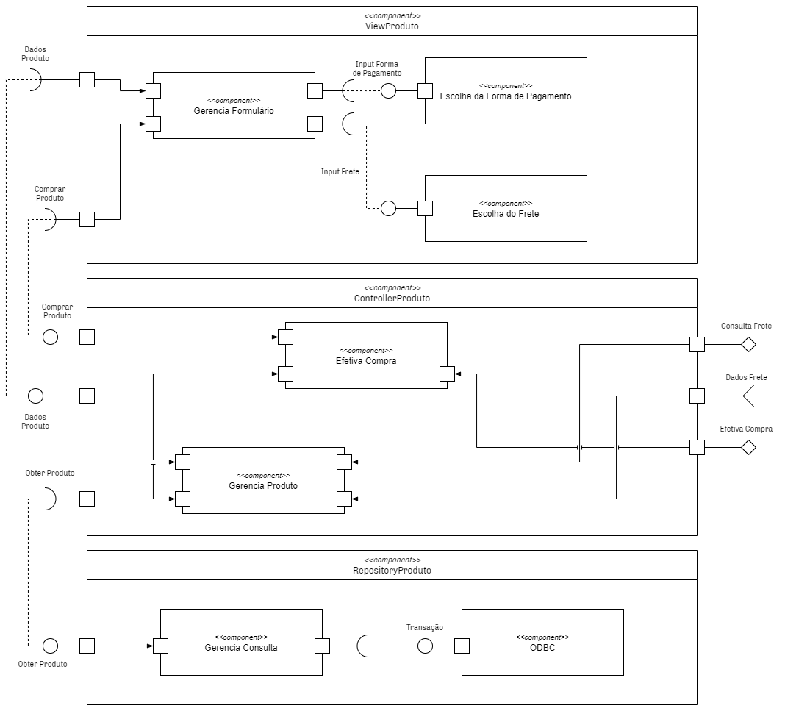
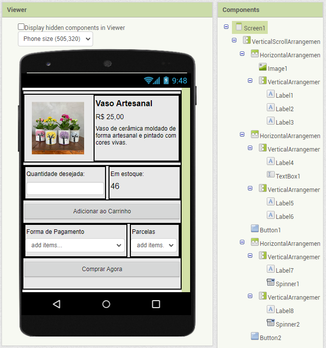
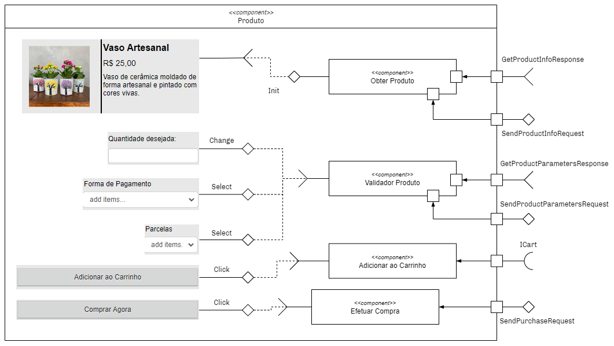

# Projeto

# Equipe

Grupo 06
* Daniel Salgado Costa
* Flavia Machado Vilar
* Gerson Macedo
* Mayara Ferreira Fernandes
* Tulio Bassaco Bustos

# Nível 1

## Diagrama Geral do Nível 1

* O componente _Customer_ inicia a comunicação ao pedir informações sobre um determinado produto, emitindo no barramento uma mensagem de tópico **/product/{id}/get-info**.
* Algum componente _Store_ observa essa requisição, e se ela possui o produto solicitado, emite as informações deste no barramento utilizando o tópico **/product/{id}/send-info**, sendo esta recebida pelo _Customer_.
* Juntamente a esta informação, o componente _Store_ pode também solicitar o cálculo de frete para o endereço do _Customer_, emitindo no barramento com o tópico **/product/{id}/get-shipping**.
* Algum componente _Partner_ observa essa requisição, emitindo de volta as informações de frete e prazo de entrega no barramento, pelo tópico **/product/{id}/send-shipping**.
* Ao concluir a compra, o _Customer_ emite no barramento o pedido de compra através do tópico **/purchase/{storeId}**, que é observado pelo _Store_.
* Com a compra concluída, o componente _Store_ emite no barramento através do tópico **/ship-products/{partnerId}**, concretizando o envio do produto ao _Customer_.
* Conforme necessário, o componente _Store_ pode emitir no barramento as informações de rastreio, utilizando o tópico **/shipped**.

## Componentes

### Customer

Indica um consumidor do brechó. Possui produtos associados a ele. Se comunica com o barramento a partir dos eventos de solicitação de informações de um produto, solicitação do custo e prazo de frete de um produto, concretização de uma compra e envio de produtos ao parceiro logístico.

### Store

Indica um vendedor do brechó. Possui um carrinho de compras para guardar os produtos que possui interesse. Se comunica com o barramento a partir de eventos de solicitação de informações de um produto e concretização de uma compra

### Partner

Indica um parceiro logístico do brechó, responsável por calcular o frete e prazo de entrega de um produto, receber os eventos de solicitação de envio de produtos a um comprador e alimentação de informações de rastreamento.

### Cart

Indica um carrinho de compras associado a um consumidor.

### Product

Indica um produto associado a um vendedor.

## Interfaces

## Mensagens

# Nível 2

## Diagrama Geral do Nível 2

* O Componente _ViewProduto_ exibe ao comprador a interface de detalhamento do produto e o formulário de compra.
* As informações do Produto são obtidas a partir do _ControllerProduto_, que por sua vez encaminha a requisição ao _RepositoryProduto_, componente responsável por obter os dados do DB.
* O componente _ControllerProduto_ também é responsável por obter informações dos parceiros logísticos existentes, através do barramento, pelo tópico **/product/{id}/get-shipping**.
* Ao preencher as informações requeridas (frete e forma de pagamento), o comprador pode solicitar a compra do produto, que também é gerenciado pelo _ControllerProduto_.
* Ao concluir a compra, o _ControllerProduto_ emite no barramento uma mensagem no tópico **/ship-products/{partnerId}**.
* Assume-se que o cadastro de endereço e forma de pagamento já foram realizadas e validadas pelo comprador anteriormente, em seu cadastro.

# Nível 3

* Ao acessar a view de um produto, suas informações são carregadas diretamente pelo componente _Obter Produto_, que emite no barramento tal solicitação e obtém a resposta através das interfaces _SendProductInfoRequest_ e _GetProductInfoResponse_.
* Ao preencher as opções de quantidade, forma de pagamento, e parcelas, o componente _Validador_ é responsável, através de troca de mensagens, verificar se as informações são válidas/aceitas através das interfaces _SendProductParametersRequest_ e _GetProductParametersResponse_.
* Ao clicar no botão adicionar ao carrinho, o produto é adicionado utilizando uma interface requerida, sem troca de mensagens pelo barramento.
* Finalmente, ao clicar em "Comprar Agora", o componente _Efetuar Compra_ é responsável por fazer as verificações finais e emitir a ação no barramento.