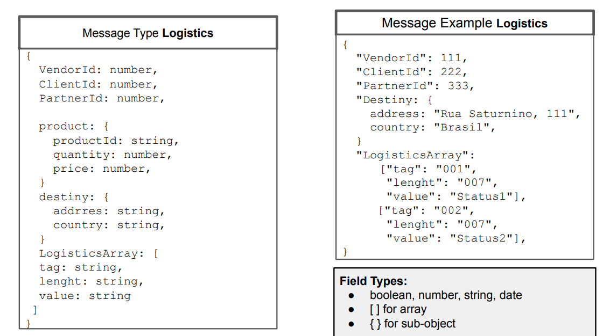
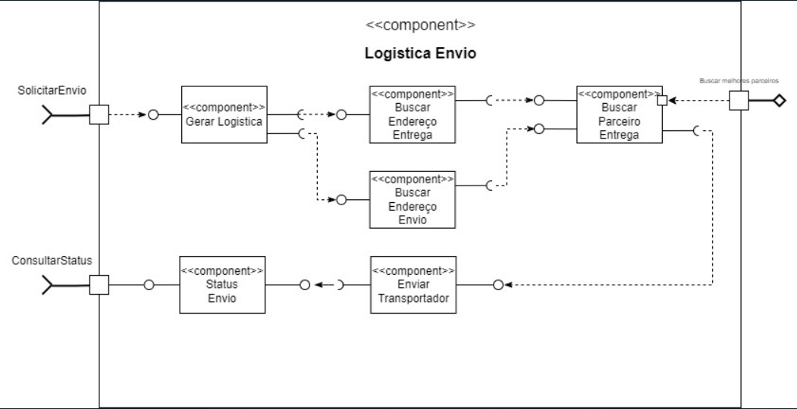
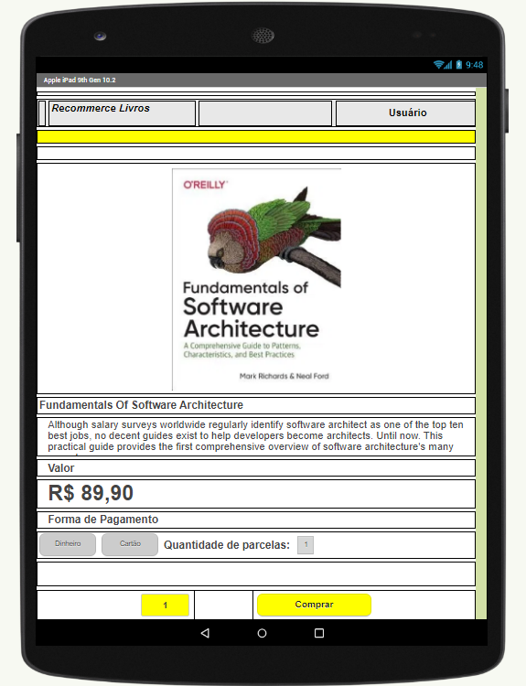
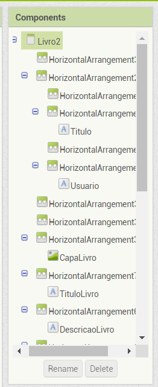
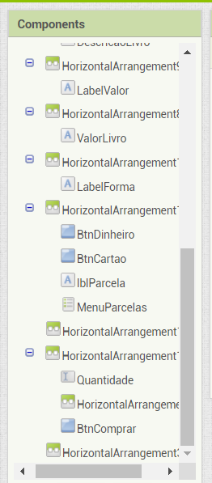

# Projeto `Recommerce Livros`

# Equipe 08
* `Fábio Fernandes Domingues	RG: 45129323-X`
* `Giuliana Cirelli	        RG: 29418252-4`
* `João Paulo Cardoso	      RG: 44863696`
* `Nicole Bertolo Rodrigues	RG: 53991025-9`
* `Ricardo Capovilla	        RG: 45129323-X`

# Nível 1

>Descrição da orquestração entre vendedores, parceiros de entrega e consumidores:

>ClientID, PartnerID e CostumerID, identificam as partes envolvidas na transação de entrega.

>A seguir temps os dados do produto e os dados da entrega.

>Na mensagem JSON, usamos o array de strings LogisticsArray. Este campo é guardado no banco de dados e enviado no barramento no formato TLV (tag-lengh-values), conforme as etapas e informações da entrega acontecem, são inseridos uma nova tag nesse array. LogisticsArray também pode ser usado para mostrar as informações da entrega para o consumidor.

>O uso do formato TLV, permite que o pacote de mensagem (em formato string), possa ser lido e interpretado por qualquer componente do barramento. O final da string (NULL), indica o final da mensagem.

>Com uma tabela pré-determinando o significado de cada  tag e valor, pode-se usar o formato TLV para transmitir qualquer informação ou configuração. 

## Diagrama Geral do Nível 1

# Nível 2

## Diagrama do Nível 2

### Detalhamento da interação de componentes

> O componente `Logistica Envio` contem uma assinatura em `SolicitarEnvio` pelo tópico `compra/{compraId}`.
> As informações da compra solicitada para envio, são recuperadas como local de origem do produto e local de destino.
> Ao serem recuperadas, as mesmas informações são enviadas aos tópicos `endereco/{endereco}/entrega` e `endereco/{endereco}/envio` para consultar o modelo de aprendizagem e escolher qual o melhor parceiro para essa entrega.
> Após escolhido o melhor parceiro para a entrega possível, o componente `BuscarParceiroEntrega` publica no tópico `envio/{compraId}` para enviar ao transportador.
> Ao final, o pedido é enviado e é publicado no tópico `envio/{compraId}/rastreamento/{rastreamentoId}` onde o componente `StatusEnvio` está inscrito para atualizar as informações da entrega.

## Diagrama do Nível 3

