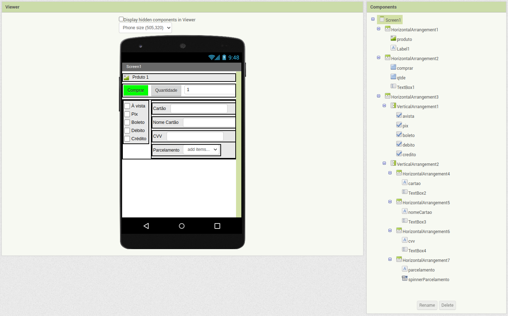

# Template para a Entrega do Projeto Final

# Estrutura de Arquivos e Pastas

A seguir é apresentada a estrutura de pastas esperada para entrega do projeto:

```
├── README.md  <- arquivo com o relatório do projeto
│
├── images     <- arquivos de imagens usadas no documento
│
└── resources  <- outros recursos (se houver)
```

Na raiz deve haver um arquivo de nome `README.md` contendo a apresentação da equipe e relatório do projeto, como detalhado na seção seguinte.

# Modelo para Apresentação da Equipe e Relatório do Projeto

Segue abaixo o modelo de como devem ser documentadas as entregas. Tudo o que for indicado entre `<...>` indica algo que deve ser substituído pelo indicado.

> Além disso, tudo o que aparecer neste modo de citação também se refere algo que deve ser substituído pelo indicado. No modelo são colocados exemplos ilustrativos, que serão substituídos pelos da sua apresentação.

Para a construção dos diagramas, devem ser usados modelos disponíveis em: [Diagramas de Referência do Projeto Final](https://docs.google.com/presentation/d/1HWiTx0HU781sf3A7sdAda_LQeMHqbvIXkh-uSRDo0Js/edit?usp=sharing). Há versões em PPT e ODT no diretório [resources/](resources/).

# Modelo para Apresentação da Equipe e Relatório do Projeto

# Projeto `Trabalho equipe 5`

# Equipe

- `Marcelo Gomes de Vasconcelos`
- `Daniel Francisco Ferreira Lopes`
- `Renato Druzian`
- `Raul Mendes de Souza`
- `Guilherme Abacherli`

# Projeto GitHub Original

- `https://github.com/orgs/INF331Equipe5`

# Nível 1

> Detalhamento do Nível 1 conforme detalhado na especificação com as seguintes subseções:

## Diagrama Geral do Nível 1

> Diagrama nível 1:


### Detalhamento da interação de componentes

- `Vendedor` inicia uma nova oferta através do componente `Oferta`
- `Oferta` recebe a mensagem de oferta do componente `Vendedor` e publica uma nova oferta no barramento
- `Machine Learning Ofertas` assina a publicação de ofertas para determinar quais consumidores devem receber determinada oferta, sugerindo tendências pelo barramento
- `Consumidor` recebe as ofertas sugeridas pelo `Machine Learning Ofertas` e pode realizar uma compra, comunicando-se com `Compra`
- `Compra` recebe a requisição de compra do consumidor e solicita a entrega do produto no componente `Entrega`
- `Entrega` recebe a requisição para a entrega e requisita ao controlador de entrega
- `Controlador Entrega´ recebe a requisição de entrega, publica essa nova entrega e aguarda o retorno de seu aceite através do barramento
- `Parceiro` recebe através do barramento, a requisição de uma nova entrega e envia ao barramento uma requisição de negociação
- `Negociação` recebe através do barramento a requisição de negociação e publica no barramento a negociação para `Vendedor`
- `Vendedor` recebe a mensagem de negociação através do barramento e pública o aceite ou recusa da dessa negociação
- `Machine Learning Entrega` recebe o status da negociação e do aceite de entrega através do barramento, além de receber mensagens de retorno das negociações a fim de coincidir esses dados para aprendizagem de máquina
- `Negociação` publica uma mensagem no barramento indicando que a entrega foi aceita
- `Controlador Entrega` recebe a notificação, que encerra a oportunidade para os parceiros no barramento e notifica Entrega sobre os dados.
- `Entrega` recebe a confirmação de entrega do controlador e notifica Consumidor
- `Consumidor` recebe todos os dados referentes à entrega da sua compra.

## Detalhamento das Interfaces


> Diagrama representando o esquema das mensagens JSON utilizadas na interface:

```json
Oferta
{
  "oferta_id": Long,
  "vendedor_id": Long,
  "ativa": Boolean,
  "preco": Float,
  "expiracao": String,
  "categoria": String,
  "produto": {
    "produto_id": String,
    "titulo": String,
    "cor": String,
    "tamanho": String,
    "descricao": String
  }
}

Pedido
{
  "pedido":{
    "pedido_id": Long,
    "consumidor_id": Long,
    "endereco": String,
      "cep": String,
      "numero": Long
  }
  "oferta": {
    "oferta_id": Long,
    "ativa": Boolean,
    "preco": Float,
    "expiracao": String,
    "categoria": String,
    "produto": {
      "produto_id": Long,
      "titulo": String,
      "cor": String,
      "tamanho": String,
      "descricao": String
  }
}

Insights
{
  "insight":{
    "insight_id": Long,
    "categoria": String,
    "insight": String
}
```

# Nível 2

## Diagrama do Nível 2

>  > 

### Detalhamento da interação de componentes

- O componente `Negociação` assina no barramento mensagens do tópico `“negociacao/+/frete”` através da interface `“vendedor solicita frete”`.
  Assim que recebe uma mensagem no tópico `“negociacao/+/frete”` inicia o processo de análise de valores e prazo dos parceiros.
- Internamente esse evento é atendido por uma interface provida do componente `“monta solicitação”`.
- Esse componente vai preparar a mensagem recebida e enviar para o componente “`Solicita valores e prazos`” através da interface “`solicitação`”
- Esse então envia para o barramento uma solicitação no tópico “`negociacao/frete/solicitacao`” que deve ser recebida pelos parceiros e também pela machine learning.
- O componente “`Solicita valores e prazos`” inicia um processo de espera no componente “`Analisa retorno`” através da interface “`espera`”.
- Esse ficará aguardando por um prazo determinado as respostas dos parceiros no tópico “`negociacao/frete/retorno/+`” e também do componente “`machine learning`” através da interface “`resposta machine`”
- Após análise dos resultados é enviado para o componente “`monta lista ordenada`” que enviará através do tópico “`negociacao/frete/lista/idvendedor`” para análise do vendedor.
- Após o vendedor analisar a lista ele responde através da interface provida “`fim da negociacao`”.
- Quando recebe a confirmação do vendedor enviado ao componente “`monta confirmação ao parceiro`” e “`monta resposta para o barramento`” através da interface “`confirmacao`”
- O componente “`monta confirmação ao parceiro`” envia para o parceiro escolhido a confirmação do pedido.
- O componente “`monta resposta para o barramento`” envia para o tópico “`negociacao/frete/finalizado`” o resultado dessa negociação através da interface “`entrega aceita`”

- O componente `Machine Learning Entrega` assina no barramento mensagens do tópico “`negociacao/frete/retorno/+`”
- Assim que recebe a mensagem no tópico é enviado para o armazenamento através da interface “`armazena aprendizado`” para ser usado em consultas futuras.
- Também é enviado para o componente “`analisa relação custo vs prazo`” que fará a análise das melhores ofertas.
- É acionado o componente “`compara ofertas mais escolhidas`” para que seja feita também essa análise.
- Os dois componentes então enviam suas análises para o componente “`monta lista ordenada`”
- Retorna através da interface “`lista parceiros`” a lista ordenada.

# Nível 3

## Captura de tela do aplicativo



## Diagrama do Nível 3


