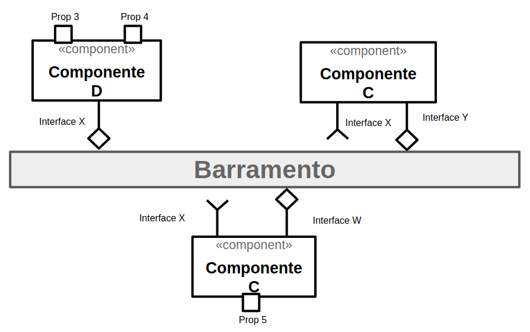

# Estrutura de Arquivos e Pastas

A seguir é apresentada a estrutura de pastas esperada para entrega de laboratórios:

~~~
├── README.md  <- apresentação do aluno
│
├── lab01      <- primeiro lab
│
├── lab02      <- segundo lab
│
├── lab03     <- terceiro lab
│
├── lab04     <- quarto lab
│
├── lab05     <- quinto lab
│
└── lab06    <- sexto lab
~~~

Na raiz deve haver um arquivo de nome `README.md` contendo a apresentação do aluno, como detalhado na seção seguinte.

## `labXX`

Arquivos e diretórios referentes à entrega de um laboratório específico. Cada diretório terá sua configuração detalhada abaixo.

# Modelo para Apresentação do Aluno e Laboratórios

Este vídeo mostra como usar o Github e o Markdown para criar as suas submissões:

Este é um guia de como produzir documentação em Markdown. Para entender como criar documentos em Markdown no Github, veja o material/vídeo:
[Guia de Uso do Markdown](https://github.com/mc-unicamp/oficinas/tree/master/docs).

Vide detalhes sobre o Markdown em: [Mastering Markdown](https://guides.github.com/features/mastering-markdown/).

E mais especificamente sobre tabelas em: [Organizing information with tables](https://help.github.com/en/articles/organizing-information-with-tables)

Segue abaixo o modelo de como devem ser documentadas as entregas.
> Tudo o que aparecer neste modo de citação se refere algo que deve ser substituído pelo indicado. No modelo são colocados exemplos ilustrativos, que serão substituídos pelos da sua apresentação.

Para a construção dos diagramas, devem ser usados modelos disponíveis em: [Diagramas de Classes, Interfaces e Componentes](https://docs.google.com/presentation/d/1ML3WrnDtzh-4wqLmdXN9au1TBIwEqo7TIbMLNOYSMAI/edit?usp=sharing)
# Modelo para Apresentação do Aluno

# Aluno
* `<nome completo>`

# Modelo para Apresentação do Lab01 - Data Flow

Estrutura de pastas:

~~~
├── README.md  <- arquivo apresentando a tarefa
│
├── images     <- arquivos de imagens usadas no documento
│
└── orange     <- arquivos do Orange
~~~

# Projeto Orange / Regras de Associação para Foodmart

## Imagem do Projeto
> Coloque uma imagem da captura de tela com o projeto do Orange.

## Arquivo do Projeto
> Coloque um link para o arquivo em Orange.

# Projeto Orange / Análise de Dados do Google PlayStore

## Imagem do Projeto
> Coloque uma imagem da captura de tela com o projeto do Orange.

## Arquivo do Projeto
> Coloque um link para o arquivo em Orange.

## Gráfico(s) de Análise
> Apresente a seguir o(s) gráfico(s) de análise produzidos (se houver) com legendas.

# Projeto de Composição de Componentes para Recomendação

> Imagem (`PNG`) do diagrama de componentes (veja exemplos abaixo).

# Projeto de Composição de Componentes para Pedido

## Diagrama de Componentes

> Imagem (`PNG`) do diagrama de componentes do pedido de um produto (veja exemplos abaixo).

## Diagrama de Interfaces

> Imagem (`PNG`) do detalhamento de interfaces referentes aos componentes.

## `Exemplos de Diagramas de Componentes`

### `Exemplo 1`

Este é o diagrama compondo componentes para análise:

### `Exemplo 2`

Este é um diagrama inicial do projeto de jogos:

### `Exemplo do Diagrama de Interfaces`

Interfaces associadas a esse componente:

# Modelo para Apresentação do Lab02 - Data Flow & Mensagens

Estrutura de pastas:

~~~
├── README.md  <- arquivo apresentando a tarefa
│
└── notebook   <- arquivo do notebook
~~~

## Tarefa sobre catálogo de componentes

> Coloque um link para o arquivo do notebook com a resolução das seis tarefas. Ele estará dentro da pasta `notebook`.

## Tarefa Web Components 1
> Escreva aqui o código da sua composição de componentes Web, como mostra o exemplo a seguir:
~~~html
<dcc-trigger label="News" action="start/rss">
</dcc-trigger>

<dcc-rss source="https://www.wired.com/category/science/feed">
  <subscribe-dcc topic="start/rss" role="start"></subscribe-dcc>
</dcc-rss>
~~~

## Tarefa Web Components 2
> Escreva aqui o código da sua composição de componentes Web, seguindo a mesma abordagem da tarefa anterior.

# Modelo para Apresentação do Lab03 - Model-View-Controller

Estrutura de pastas:

~~~
├── README.md  <- arquivo apresentando a tarefa
│
├── images     <- arquivos de imagens usadas no documento
│
└── app        <- aplicativo exportado em formato `aia`
~~~

## Tarefa 1
> Coloque a imagem do PRNG do seu diagrama como ilustrado abaixo:
> 
> 

## Tarefa 2
> Coloque a imagem do PNG do seu diagrama como ilustrado abaixo:
>
> 
>
> Nesta tarefa não há um diagrama de atividades. O leilão é um processo que emerge da interação dos componentes. Liste a seguir qual a sequência esperada de ações que emergirá da interação como uma lista. Quando ser referir a uma mensagem, indique o tópico/interface envolvido. Exemplo:
> 1. o componente X posta uma mensagem com o tópico Y;
> 2. os componentes do tipo A que assinam o tópico X fazem Z e postam uma mensagem com o tópico W.

## Tarefa 3
> Coloque as imagens PNG da captura de quatro telas do seu aplicativo:
> * tela 1 - nenhum produto selecionado
> * tela 2 - primeiro produto selecionado
> * tela 3 - segundo produto selecionado
> * tela 4 - compra de um dos produtos efetiva
> * tela 5 - diagrama de blocos do aplicativo
>
> As telas devem ser apresentadas conforme exemplos a seguir.
> 
> Exemplo de uma tela do aplicativo:
>
> 
>
> Exemplo de uma tela do diagrama de blocos:
>
> 
>
> Coloque um link para o arquivo do aplicativo exportado a partir do MIT App Inventor em formato `aia`. Ele estará dentro da pasta `app`.