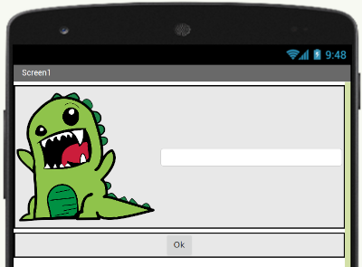
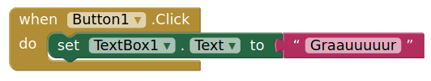

# Modelo para Apresentação do Lab03 - MVC

Estrutura de pastas:

~~~
├── README.md  <- arquivo apresentando a tarefa
│
├── images     <- arquivos de imagens usadas no documento
│
└── app        <- app do MIT App Inventor exportado em formato `aia`
~~~

# Aluno
* `<nome completo>`

# Tarefa 1 - App no MIT App Inventor

> Coloque as imagens PNG da captura de quatro telas do seu aplicativo:
> * tela 1 - captura da tela completa de design de interface
> * tela 2 - nenhum produto selecionado
> * tela 3 - primeiro produto selecionado
> * tela 4 - segundo produto selecionado
> * tela 5 - compra de um dos produtos efetiva
> * tela 6 - diagrama de blocos do aplicativo
>
> As telas devem ser apresentadas conforme exemplos a seguir.
>
> Exemplo de uma tela do aplicativo:
>
> 
>
> Exemplo de uma tela do diagrama de blocos:
>
> 
>
> Coloque um link para o arquivo do aplicativo exportado a partir do MIT App Inventor em formato `aia`. Ele estará dentro da pasta `app`.

# Tarefa 2 - Diagrama de Componentes dirigida a Eventos

> Coloque a imagem PNG do diagrama, conforme exemplo a seguir:
>
> 

## Tarefa 3

Modifique o aplicativo que você fez na tarefa anterior da seguinte maneira:

1. Acrescente um campo que mostre a **Lista de Produtos a Serem Comprados**. Quando o usuário clicar no botão de efetivação de compra:
  * adicione no banco de dados CloudDB o item de compras com o rótulo: “compra”:
    * o item deve ser uma string concatenando os seguintes itens separados por vírgula: nome do produto, quantidade e o valor total a ser pago;
  * apresente o item adicionado no campo de **Lista de Produtos a Serem Comprados**.

2. Sempre que o aplicativo iniciar, verifique se há compras adicionadas no CloudDB com o rótulo “compra” e, se houver, as mostre na **Lista de Produtos a Serem Comprados**.
